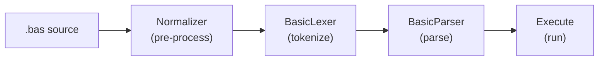
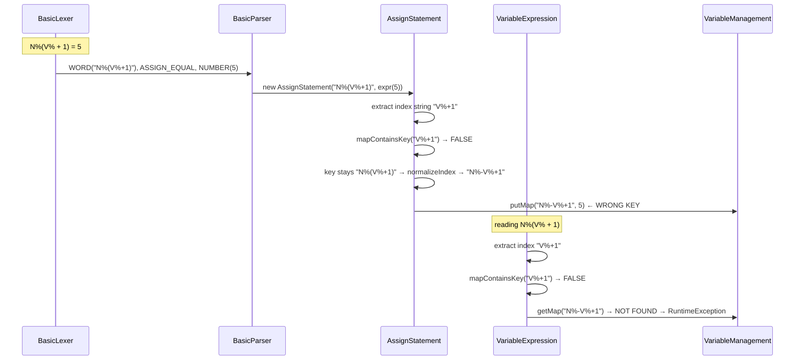
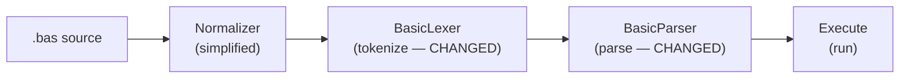
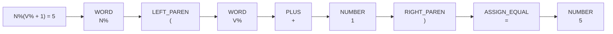
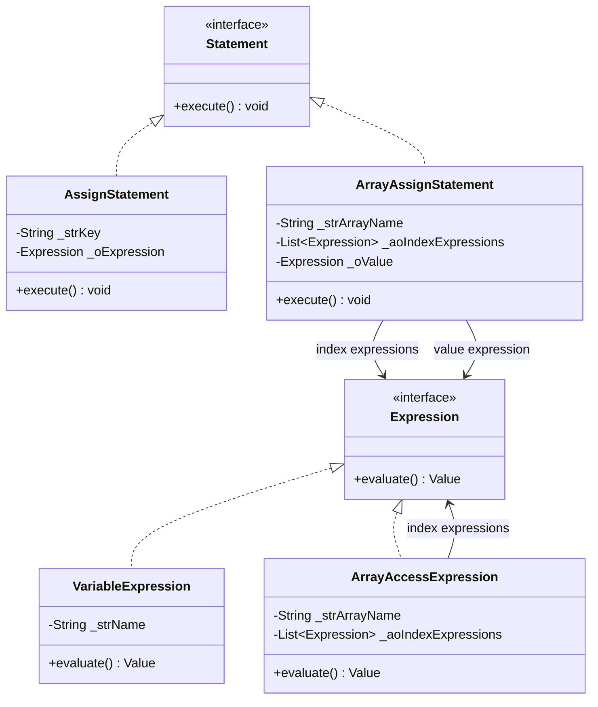
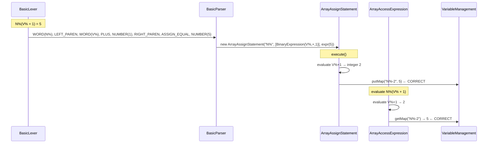
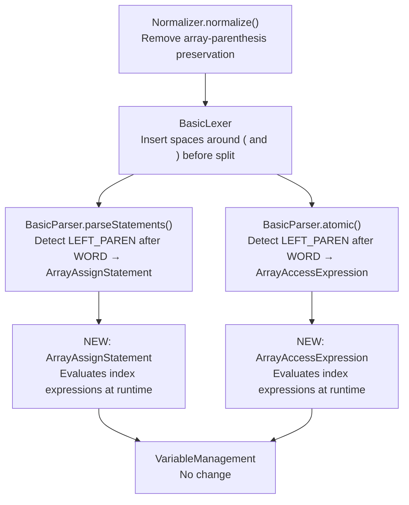

# Array Expression Index — Technical Design

**Feature:** Support mathematical expressions as array indices, e.g. `N%(V% + 1)`  
**Branch:** `array_mgmt`  
**Java version:** 21 (as declared in `pom.xml` → `maven.compiler.source`)  
**Style guide:** `prompts/STYLEGUIDE.md` (Hungarian notation, 4-space indent, max 100 chars/line)

---

## 1. Background and Goal

The interpreter currently handles two forms of array index:

| Form | Example | Works today? |
|---|---|---|
| Literal integer | `N%(1)` | Yes |
| Simple variable | `N%(V%)` | Yes |
| Mathematical expression | `N%(V% + 1)` | **No** |

The goal is to add full expression support for array indices, including multi-dimensional arrays: `M%(I% + 1, J% * 2)`.

---

## 2. Current Architecture

### 2.1 Processing Pipeline



### 2.2 Current Array Index Flow



### 2.3 Root Cause

`BasicLexer` splits on whitespace. When the Normalizer sees a type-suffix (`%`, `$`, etc.) immediately followed by `(`, it **preserves all content inside the parentheses as a single WORD token** — including operators and sub-expressions. Consequently the parser never sees individual tokens for the index expression, so it cannot evaluate it.

---

## 3. Target Architecture

### 3.1 New Processing Pipeline

No pipeline stages are added or removed. Changes are made **inside** the Lexer, Parser, and two Statement classes.



### 3.2 New Token Stream



### 3.3 New Class Model



### 3.4 New Array Index Flow



---

## 4. Detailed Code Changes

### 4.1 Normalizer — `src/main/java/eu/gricom/basic/tokenizer/Normalizer.java`

**What changes and why:**  
`normalize()` currently collapses the content inside array parentheses into a single word so that the Lexer does not break it up. Once the Lexer is changed to tokenize the index separately (Section 4.2), this special treatment must be removed. The static helper `normalizeIndex()` is still used by `VariableManagement` for backward-compatible key formatting; it must not be deleted.

**Change 1 — Remove array-parenthesis preservation in `normalize()`**

Current code (approximately lines 53–82):

```java
// detect type-suffix followed by (
if (strCharArray[i] == '(' && i > 0) {
    char cPrev = strCharArray[i - 1];
    if (cPrev == '$' || cPrev == '#' || cPrev == '!' || cPrev == '%' || cPrev == '&') {
        bArrayParenthenes = true;
    }
}

// while bArrayParenthenes is true, copy characters verbatim (including operators)
if (bArrayParenthenes) {
    strLine.append(strCharArray[i]);
    if (strCharArray[i] == ')') {
        bArrayParenthenes = false;
    }
    continue;
}
```

**Remove** the block above entirely, OR replace it with a simple `continue` that no longer sets `bArrayParenthenes`. After this change, `(`, `)`, `+`, `-`, `*`, `/` inside an array index are treated as ordinary characters and will be separated by the Lexer.

**Change 2 — Remove the `bArrayParenthenes` field and related logic**

Delete:
- The `boolean bArrayParenthenes` variable declaration.
- All `if (bArrayParenthenes)` branches.

**What stays unchanged:**  
`normalizeIndex(String strKey)` — this method converts `"N%(5)"` → `"N%-5"` and is called by `VariableManagement.putMap()` / `getMap()`. It must remain exactly as it is.

---

### 4.2 BasicLexer — `src/main/java/eu/gricom/basic/tokenizer/BasicLexer.java`

**What changes and why:**  
The Lexer receives the output of `Normalizer.normalize()`. After change 4.1, array index content is no longer collapsed. The Lexer must now **split on the parentheses and operators that appear inside an array index**.

The current strategy is to split the line on whitespace and classify each resulting chunk. Parentheses that are not already separated by spaces (e.g., `N%(V%`) end up combined inside a single token. Two targeted fixes are required.

**Change 1 — Insert spaces around `(` and `)` before splitting**

In the method that pre-processes the input line (around line 72), add a step **after** the Normalizer has run but **before** the `split("\\s")` call:

```java
// Separate parentheses from adjacent tokens so the split produces correct individual tokens.
// Only applies to parentheses that are NOT inside string literals.
strLine = strLine.replaceAll("(?<!['\"])(\\()", " ( ");
strLine = strLine.replaceAll("(?<!['\"])(\\))", " ) ");
```

> **Note:** The replacements must not touch parentheses that appear inside string literals.  
> A simpler approach that is safe for this grammar: perform the replacement only when the
> character to the left of `(` / `)` is not `"` or `'`.

**Change 2 — Keep `+` and `-` separated (they are already operators)**

The existing Lexer already handles `PLUS`, `MINUS`, `MULTIPLY`, `DIVIDE` as individual tokens in the classification switch. No additional changes are needed for operators.

**Change 3 — Ensure `%`, `$`, `#`, `&`, `!` at the end of a variable name are retained**

The variable name `N%` must remain a single token after the split. Because the type-suffix is a non-space character that is part of the variable name, the existing split logic already keeps it together. Verify by reviewing lines 104–149: the classification falls through to `WORD` for any token that is not a reserved word, number, string, or boolean. `"N%"` will correctly be classified as `WORD`.

---

### 4.3 BasicParser — `src/main/java/eu/gricom/basic/parser/BasicParser.java`

Two areas of the parser need changes: **statement parsing** (where assignments are recognised) and **expression parsing** (where variable reads are recognised).

#### 4.3.1 Statement Parsing — `parseStatements()` (around lines 623–641)

**Current logic:**

```java
case WORD:
    if (getToken(1).getType() == BasicTokenType.ASSIGN_EQUAL) {
        String strName = getToken(0).getText();
        _iPosition = _iPosition + 2;
        Expression oExpression = expression();
        aoStatements.add(new AssignStatement(iCurrPosition, strName, oExpression));
    }
```

This reads the next token (`getToken(1)`) to decide whether this is an assignment. With the new token stream `N%  (  V%  +  1  )  =  5`, `getToken(1)` is now `LEFT_PAREN`, not `ASSIGN_EQUAL`. The check must be extended.

**New logic:**

```java
case WORD:
    // Simple assignment:  NAME = expr
    if (getToken(1).getType() == BasicTokenType.ASSIGN_EQUAL) {
        String strName = getToken(0).getText();
        _iPosition = _iPosition + 2;
        Expression oExpression = expression();
        aoStatements.add(new AssignStatement(iCurrPosition, strName, oExpression));

    // Array assignment:  NAME( idx [, idx ...] ) = expr
    } else if (getToken(1).getType() == BasicTokenType.LEFT_PAREN) {
        String strName = getToken(0).getText();
        _iPosition = _iPosition + 2;          // consume NAME and (

        List<Expression> aoIndices = new ArrayList<>();
        aoIndices.add(expression());           // parse first index expression

        while (getToken(0).getType() == BasicTokenType.COMMA) {
            _iPosition++;                      // consume ,
            aoIndices.add(expression());       // parse next index expression
        }

        if (getToken(0).getType() != BasicTokenType.RIGHT_PAREN) {
            throw new SyntaxErrorException("Expected ) after array index");
        }
        _iPosition++;                          // consume )

        if (getToken(0).getType() != BasicTokenType.ASSIGN_EQUAL) {
            throw new SyntaxErrorException("Expected = after array subscript");
        }
        _iPosition++;                          // consume =

        Expression oValue = expression();
        aoStatements.add(new ArrayAssignStatement(iCurrPosition, strName, aoIndices, oValue));
    }
```

#### 4.3.2 Expression Parsing — `atomic()` (around lines 933–1032)

**Current logic (lines ~941–946):**

```java
case WORD:
    oToken = getToken(0);
    _iPosition++;
    return new VariableExpression(oToken.getText());
```

**New logic:**

```java
case WORD:
    oToken = getToken(0);
    _iPosition++;                              // consume the variable / array name

    // Array read:  NAME( idx [, idx ...] )
    if (getToken(0).getType() == BasicTokenType.LEFT_PAREN) {
        String strArrayName = oToken.getText();
        _iPosition++;                          // consume (

        List<Expression> aoIndices = new ArrayList<>();
        aoIndices.add(expression());           // parse first index expression

        while (getToken(0).getType() == BasicTokenType.COMMA) {
            _iPosition++;                      // consume ,
            aoIndices.add(expression());
        }

        if (getToken(0).getType() != BasicTokenType.RIGHT_PAREN) {
            throw new SyntaxErrorException("Expected ) after array index");
        }
        _iPosition++;                          // consume )

        return new ArrayAccessExpression(strArrayName, aoIndices);
    }

    // Plain variable read
    return new VariableExpression(oToken.getText());
```

**Important:** Function calls like `SIN(X)` are handled **before** the `WORD` case by the existing reserved-word and function lookup logic. The new array check therefore only fires for user-defined variable names with type suffixes (`N%`, `S$`, etc.), which cannot be reserved words.

---

### 4.4 New Class — `ArrayAccessExpression`

**File:** `src/main/java/eu/gricom/basic/statements/ArrayAccessExpression.java`

This class is the expression-side counterpart of `VariableExpression` for array elements. It evaluates its index expressions at runtime and then performs a key lookup in `VariableManagement`.

```java
package eu.gricom.basic.statements;

import eu.gricom.basic.error.SyntaxErrorException;
import eu.gricom.basic.memoryManager.VariableManagement;
import eu.gricom.basic.variableTypes.Value;

import java.util.List;
import java.util.StringJoiner;

/**
 * Evaluates a read access to an array element where the index is a full expression.
 *
 * <p>Example BASIC: {@code PRINT N%(V% + 1)}
 *
 * <p>At evaluation time each index expression is evaluated to an integer, the results
 * are combined into the storage key used by {@link VariableManagement}, and the
 * corresponding value is returned.
 */
public final class ArrayAccessExpression implements Expression {

    private final String _strArrayName;
    private final List<Expression> _aoIndexExpressions;
    private final VariableManagement _oVariableManager = new VariableManagement();

    /**
     * Constructor.
     *
     * @param strArrayName        the name of the array variable including its type suffix, e.g. {@code "N%"}
     * @param aoIndexExpressions  one expression per dimension, evaluated left to right
     */
    public ArrayAccessExpression(final String strArrayName,
                                 final List<Expression> aoIndexExpressions) {
        _strArrayName = strArrayName;
        _aoIndexExpressions = aoIndexExpressions;
    }

    /**
     * Evaluates every index expression, builds the storage key, and returns the stored value.
     *
     * @return the {@link Value} stored at the resolved index
     * @throws Exception if an index expression fails to evaluate or the element does not exist
     */
    @Override
    public Value evaluate() throws Exception {
        String strKey = buildKey();

        if (!_oVariableManager.mapContainsKey(strKey)) {
            throw new SyntaxErrorException("Array element not found: " + strKey);
        }

        return _oVariableManager.getMap(strKey);
    }

    /**
     * Evaluates all index expressions and assembles the VariableManagement storage key.
     *
     * <p>Single dimension: {@code "N%-3"}  Multi-dimension: {@code "M%-2,4"}
     */
    private String buildKey() throws Exception {
        StringJoiner oJoiner = new StringJoiner(",");

        for (Expression oIndexExpr : _aoIndexExpressions) {
            Value oValue = oIndexExpr.evaluate();
            int iIndex = (int) oValue.toReal();
            oJoiner.add(String.valueOf(iIndex));
        }

        return _strArrayName + "-" + oJoiner;
    }
}
```

---

### 4.5 New Class — `ArrayAssignStatement`

**File:** `src/main/java/eu/gricom/basic/statements/ArrayAssignStatement.java`

This class is the statement-side counterpart of `AssignStatement` for array targets.

```java
package eu.gricom.basic.statements;

import eu.gricom.basic.error.SyntaxErrorException;
import eu.gricom.basic.memoryManager.VariableManagement;
import eu.gricom.basic.variableTypes.Value;

import java.util.List;
import java.util.StringJoiner;

/**
 * Evaluates an assignment to an array element where the index is a full expression.
 *
 * <p>Example BASIC: {@code N%(V% + 1) = 42}
 *
 * <p>Each index expression is evaluated to an integer at runtime. The result is used
 * to build the storage key for {@link VariableManagement}.
 */
public final class ArrayAssignStatement implements Statement {

    private final int _iTokenNumber;
    private final String _strArrayName;
    private final List<Expression> _aoIndexExpressions;
    private final Expression _oValue;
    private final VariableManagement _oVariableManager = new VariableManagement();

    /**
     * Constructor.
     *
     * @param iTokenNumber       token position in the source program (for error reporting)
     * @param strArrayName       array variable name including type suffix, e.g. {@code "N%"}
     * @param aoIndexExpressions one expression per dimension
     * @param oValue             expression that produces the value to store
     */
    public ArrayAssignStatement(final int iTokenNumber,
                                final String strArrayName,
                                final List<Expression> aoIndexExpressions,
                                final Expression oValue) {
        _iTokenNumber = iTokenNumber;
        _strArrayName = strArrayName;
        _aoIndexExpressions = aoIndexExpressions;
        _oValue = oValue;
    }

    /**
     * Evaluates all index expressions and the value expression, then stores the result.
     *
     * @throws Exception if any expression fails to evaluate
     */
    @Override
    public void execute() throws Exception {
        String strKey = buildKey();
        Value oResult = _oValue.evaluate();
        _oVariableManager.putMap(strKey, oResult);
    }

    @Override
    public int getTokenNumber() {
        return _iTokenNumber;
    }

    /**
     * Evaluates all index expressions and assembles the VariableManagement storage key.
     *
     * <p>Single dimension: {@code "N%-3"}  Multi-dimension: {@code "M%-2,4"}
     */
    private String buildKey() throws Exception {
        StringJoiner oJoiner = new StringJoiner(",");

        for (Expression oIndexExpr : _aoIndexExpressions) {
            Value oValue = oIndexExpr.evaluate();
            int iIndex = (int) oValue.toReal();
            oJoiner.add(String.valueOf(iIndex));
        }

        return _strArrayName + "-" + oJoiner;
    }
}
```

---

### 4.6 AssignStatement — existing class — no change required

`AssignStatement` continues to handle **scalar** variable assignments (`A% = 5`). Array assignments now go via `ArrayAssignStatement`. No modifications are needed.

### 4.7 VariableExpression — existing class — no change required

`VariableExpression` continues to handle scalar variable reads. Array reads now go via `ArrayAccessExpression`. The parenthesis-handling code that was the workaround for simple variable indices can be left in place for backward compatibility with any code path that still produces the old token format; it will simply be dead code once the Lexer and Normalizer changes are in place.

> **Optional cleanup:** Once all tests pass, the parenthesis-handling block in `VariableExpression.evaluate()` (lines 42–79) can be removed in a follow-up commit.

---

## 5. Unit Test Changes

### 5.1 New Test Class — `ArrayAccessExpressionTest`

**File:** `src/test/java/eu/gricom/basic/statements/ArrayAccessExpressionTest.java`

Test one index expression per test method. Pre-populate `VariableManagement` directly to isolate the expression under test.

```
Tests to write:
 1. testLiteralIndex            — arr%(2),  index = literal 2
 2. testVariableIndex           — arr%(i%), index = VariableExpression("i%"), i%=3
 3. testAdditionIndex           — arr%(i%+1), index = i%+1, i%=4 → element at 5
 4. testSubtractionIndex        — arr%(i%-1), i%=4 → element at 3
 5. testMultiplicationIndex     — arr%(i%*2), i%=3 → element at 6
 6. testMultiDimensionalLiteral — m%(1,2)
 7. testMultiDimensionalExpr    — m%(i%+1, j%*2), i%=0, j%=1 → element at (1,2)
 8. testMissingElementThrows    — index not stored → SyntaxErrorException
```

**Skeleton:**

```java
package eu.gricom.basic.statements;

import eu.gricom.basic.memoryManager.VariableManagement;
import eu.gricom.basic.variableTypes.IntegerValue;
import org.junit.jupiter.api.BeforeEach;
import org.junit.jupiter.api.Test;
import java.util.List;
import static org.junit.jupiter.api.Assertions.*;

class ArrayAccessExpressionTest {

    private VariableManagement _oVarMgr;

    @BeforeEach
    void setUp() throws Exception {
        _oVarMgr = new VariableManagement();
        _oVarMgr.clearAll();   // ensure clean state between tests
    }

    @Test
    void testLiteralIndex() throws Exception {
        _oVarMgr.putMap("arr%-2", new IntegerValue(99));
        Expression oLiteral = new NumberExpression(2);   // or IntegerValue literal expression
        ArrayAccessExpression oExpr = new ArrayAccessExpression("arr%", List.of(oLiteral));
        assertEquals(99, (int) oExpr.evaluate().toReal());
    }

    @Test
    void testVariableIndex() throws Exception {
        _oVarMgr.putMap("i%", new IntegerValue(3));
        _oVarMgr.putMap("arr%-3", new IntegerValue(77));
        Expression oIdx = new VariableExpression("i%");
        ArrayAccessExpression oExpr = new ArrayAccessExpression("arr%", List.of(oIdx));
        assertEquals(77, (int) oExpr.evaluate().toReal());
    }

    @Test
    void testAdditionIndex() throws Exception {
        _oVarMgr.putMap("i%", new IntegerValue(4));
        _oVarMgr.putMap("arr%-5", new IntegerValue(55));
        // i% + 1  →  BinaryExpression(VariableExpression("i%"), PLUS, NumberExpression(1))
        Expression oIdx = new OperatorExpression(
            new VariableExpression("i%"), "+", new NumberExpression(1));
        ArrayAccessExpression oExpr = new ArrayAccessExpression("arr%", List.of(oIdx));
        assertEquals(55, (int) oExpr.evaluate().toReal());
    }

    // ... remaining tests following the same pattern
}
```

> **Note:** Adapt the expression construction to the actual class names used in the project.
> The `OperatorExpression` / `BinaryExpression` used above is whichever class `BasicParser.addition()` produces.

---

### 5.2 New Test Class — `ArrayAssignStatementTest`

**File:** `src/test/java/eu/gricom/basic/statements/ArrayAssignStatementTest.java`

```
Tests to write:
 1. testLiteralIndex            — N%(1) = 10  → key "N%-1" = 10
 2. testVariableIndex           — N%(i%) = 20, i%=3 → key "N%-3" = 20
 3. testAdditionIndex           — N%(i%+1) = 30, i%=4 → key "N%-5" = 30
 4. testSubtractionIndex        — N%(i%-1) = 40, i%=2 → key "N%-1" = 40
 5. testMultiplicationIndex     — N%(i%*2) = 50, i%=3 → key "N%-6" = 50
 6. testMultiDimensionalLiteral — M%(1,2) = 99 → key "M%-1,2" = 99
 7. testMultiDimensionalExpr    — M%(i%+1,j%) = 88, i%=0,j%=2 → key "M%-1,2" = 88
 8. testOverwriteExisting       — write twice to same index, second value wins
```

---

### 5.3 Existing Test Updates

#### `DimStatementTest`
**File:** `src/test/java/eu/gricom/basic/statements/DimStatementTest.java`

No behavioural change. Run the test as-is after the changes and confirm it still passes.

#### `AssignStatementTest`
**File:** `src/test/java/eu/gricom/basic/statements/AssignStatementTest.java`

No behavioural change for scalar assignments. Run and confirm all tests still pass.

#### `BasicParserTest`
**File:** `src/test/java/eu/gricom/basic/parser/BasicParserTest.java`

Add new test cases:

```
testParseArrayAssignLiteral   — parse "10 N%(1) = 5"      → ArrayAssignStatement
testParseArrayAssignVariable  — parse "10 N%(I%) = 5"     → ArrayAssignStatement
testParseArrayAssignExpr      — parse "10 N%(I%+1) = 5"   → ArrayAssignStatement
testParseArrayReadExpr        — parse "10 PRINT N%(I%+1)" → ArrayAccessExpression inside PrintStatement
```

---

### 5.4 New System Test — `test_array_expr_index.bas`

**File:** `test/system/test_array_expr_index.bas`

Follow the standard system test pattern: each step prints a description; failure GOTOs 9000; final line prints `PASSED`.

```basic
10 REM test_array_expr_index.bas — array indices using expressions
20 REM
100 PRINT "Step 1: literal index"
110 A%(3) = 99
120 IF A%(3) <> 99 THEN GOTO 9000
200 PRINT "Step 2: variable index"
210 I% = 4
220 A%(I%) = 77
230 IF A%(I%) <> 77 THEN GOTO 9000
300 PRINT "Step 3: index + 1"
310 I% = 2
320 A%(I% + 1) = 55
330 IF A%(3) <> 55 THEN GOTO 9000
400 PRINT "Step 4: index - 1"
410 I% = 5
420 A%(I% - 1) = 44
430 IF A%(4) <> 44 THEN GOTO 9000
500 PRINT "Step 5: index * 2"
510 I% = 3
520 A%(I% * 2) = 33
530 IF A%(6) <> 33 THEN GOTO 9000
600 PRINT "Step 6: multi-dimensional expression"
610 I% = 1
620 J% = 2
630 M%(I% + 0, J% + 1) = 22
640 IF M%(1, 3) <> 22 THEN GOTO 9000
700 PRINT "Step 7: expression on read side"
710 I% = 1
720 A%(I%) = 10
730 A%(I% + 1) = 20
740 IF A%(I% + 1) <> 20 THEN GOTO 9000
800 PRINT "Step 8: read using variable incremented in loop"
810 FOR I% = 0 TO 4
820   B%(I%) = I% * 10
830 NEXT I%
840 FOR I% = 0 TO 3
850   IF B%(I% + 1) <> (I% + 1) * 10 THEN GOTO 9000
860 NEXT I%
900 PRINT "PASSED"
910 END
9000 PRINT "FAILED at step - unexpected array value"
9010 END
```

---

## 6. Change Summary



| File | Change type | Summary |
|---|---|---|
| `tokenizer/Normalizer.java` | Modify | Remove `bArrayParenthenes` block in `normalize()` |
| `tokenizer/BasicLexer.java` | Modify | Insert spaces around `(` and `)` before whitespace split |
| `parser/BasicParser.java` | Modify | Two sites: `parseStatements()` and `atomic()` |
| `statements/ArrayAssignStatement.java` | **New** | Array element assignment with expression index |
| `statements/ArrayAccessExpression.java` | **New** | Array element read with expression index |
| `statements/AssignStatement.java` | None | Unchanged |
| `statements/VariableExpression.java` | None | Unchanged (old parenthesis code becomes dead code) |
| `memoryManager/VariableManagement.java` | None | Unchanged |
| `statements/ArrayAssignStatementTest.java` | **New** | Unit tests for new statement class |
| `statements/ArrayAccessExpressionTest.java` | **New** | Unit tests for new expression class |
| `parser/BasicParserTest.java` | Extend | Add four array parse test cases |
| `test/system/test_array_expr_index.bas` | **New** | 8-step system integration test |

---

## 7. Implementation Checklist

Follow this order to minimise regressions.

- [ ] 1. Modify `Normalizer.normalize()` — remove `bArrayParenthenes`
- [ ] 2. Modify `BasicLexer` — space-pad `(` and `)` before split
- [ ] 3. Run full test suite: `mvn clean test` — all 419 existing tests must still pass
- [ ] 4. Create `ArrayAccessExpression` and write `ArrayAccessExpressionTest`
- [ ] 5. Create `ArrayAssignStatement` and write `ArrayAssignStatementTest`
- [ ] 6. Modify `BasicParser.parseStatements()` for array assignment
- [ ] 7. Modify `BasicParser.atomic()` for array read
- [ ] 8. Extend `BasicParserTest` with the four new parse cases
- [ ] 9. Create `test/system/test_array_expr_index.bas`
- [ ] 10. Run full test suite: `mvn clean test` — all tests including new ones must pass
- [ ] 11. Run system test: `java -jar target/BASIC-*-jar-with-dependencies.jar test/system/test_array_expr_index.bas`
- [ ] 12. Run existing array system tests to confirm no regression
