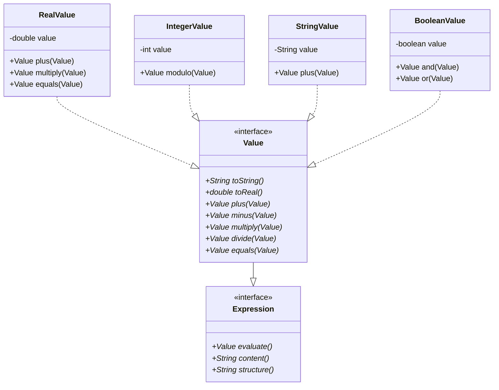
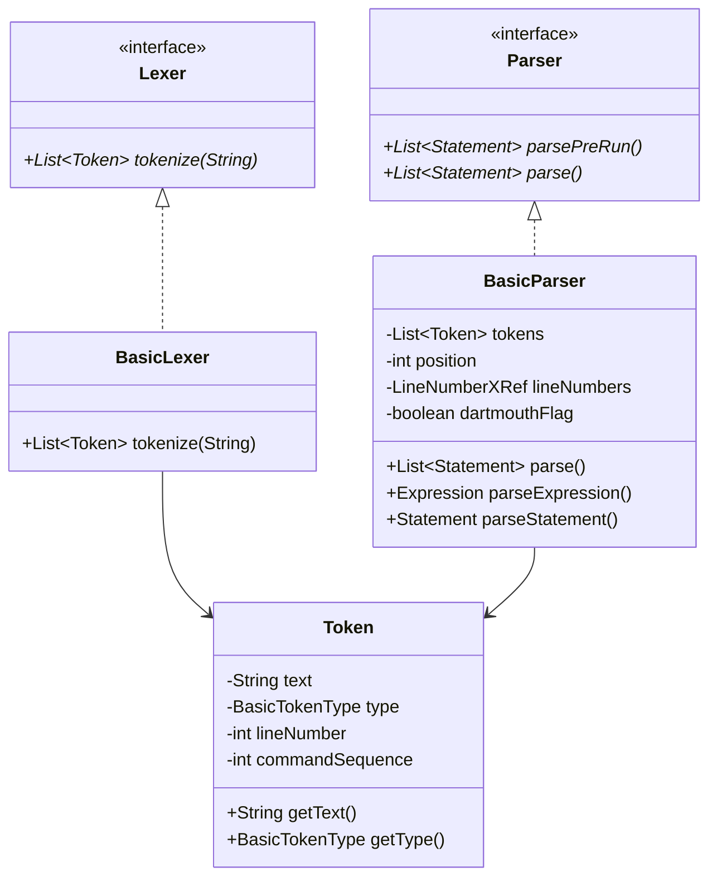
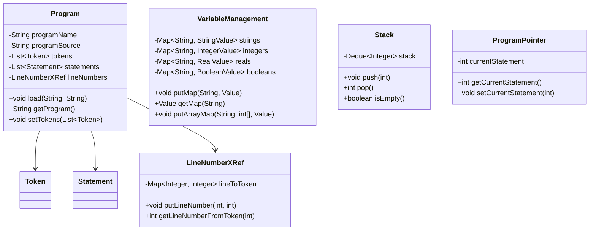
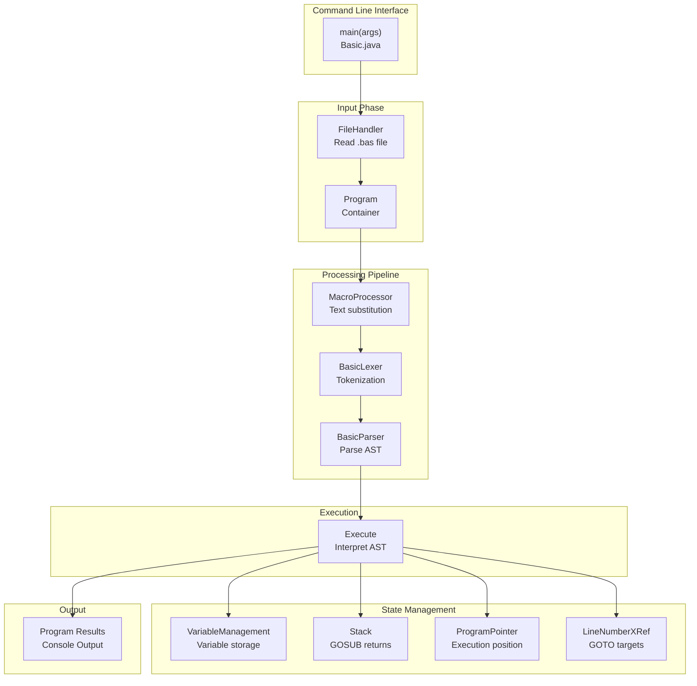

# GD-BASIC Interpreter: Detailed Technical Design Document

**Version**: 0.2.0  
**Project**: GriCom Diminutive BASIC Interpreter  
**Language**: Java 21  
**Last Updated**: 2026-06-16

---

## System Requirements

### Java Version
- **Minimum**: Java 8 (JDK 1.8.0_131+)
- **Recommended**: Java 21+
- **Current Target**: Java 21 (as declared in `pom.xml` → `maven.compiler.source`)

### Build Tool
- **Build System**: Apache Maven 3.6.3 or higher
- **Primary Build Command**: `mvn clean test package`

### Memory & Platform
- **Memory**: Minimum 128MB RAM
- **Platforms Supported**: Windows, Linux, macOS
- **Cross-Platform**: Yes (pure Java implementation)

### Dependencies
- **Minimal External Dependencies**: By design, limited to essential packages only
- **Apache CLI**: Only major third-party dependency (for command-line parsing)
- **JUnit 5**: For testing (test scope)
- **No heavyweight frameworks**: Avoids Spring, Log4j, etc. for portability

### Build Artifacts
After `mvn clean package`, produces:
- `target/BASIC-0.1.1-jar-with-dependencies.jar` — Standalone executable JAR with all dependencies bundled
- `target/BASIC-0.1.1.jar` — Primary JAR (requires separate classpath)

---

## Table of Contents

1. [Architecture Overview](#architecture-overview)
2. [Processing Pipeline](#processing-pipeline)
3. [Package-Level Documentation](#package-level-documentation)
4. [Class Hierarchies and Relationships](#class-hierarchies-and-relationships)
5. [Call Hierarchies](#call-hierarchies)
6. [Test Structure](#test-structure)
7. [Design Patterns and Key Algorithms](#design-patterns-and-key-algorithms)
8. [Implementation Notes](#implementation-notes)
   - [Operator Precedence Hierarchy](#operator-precedence-implementation)
   - [UnaryOperatorExpression Implementation](#unaryoperatorexpression-implementation)
   - [Array Implementation with Expression Indices](#array-implementation-with-expression-indices)

---

## Architecture Overview

### System Components

GD-BASIC is a complete BASIC interpreter with the following major subsystems:

| Component | Purpose | Key Classes |
|-----------|---------|-------------|
| **Entry Point** | CLI interface, file loading | `Basic.java` |
| **Macro Processing** | Preprocessor for macro expansion | `MacroProcessor`, `MacroList` |
| **Tokenization (Lexical Analysis)** | Source text → tokens | `BasicLexer`, `Token`, `BasicTokenType` |
| **Parsing (Syntax Analysis)** | Tokens → abstract syntax tree | `BasicParser` |
| **Memory/State Management** | Program structure, variables, execution state | `Program`, `VariableManagement`, `Stack`, `ProgramPointer` |
| **Execution Engine** | Runtime execution of statements | `Execute` |
| **Built-in Functions** | Math, string, system functions | `Function`, `Abs`, `Sin`, `Len`, etc. |
| **Type System** | Value representation and operations | `Value`, `RealValue`, `IntegerValue`, `StringValue`, etc. |
| **Error Handling** | Exception types for runtime/syntax errors | Custom exception classes in `error/` package |
| **Utilities** | Logging, printing, file handling | `Logger`, `Printer`, `FileHandler` |

### Data Flow Architecture

```
┌─────────────────┐
│   BASIC Source  │
│     .bas file   │
└────────┬────────┘
         │
         ▼
┌──────────────────────┐
│ Macro Processing     │ (MacroProcessor)
│ - Expand macros      │
│ - Process pragmas    │
└────────┬─────────────┘
         │
         ▼
┌──────────────────────┐
│ Tokenization/Lexing  │ (BasicLexer)
│ - Source → Tokens    │
│ - Classify tokens    │
└────────┬─────────────┘
         │
         ▼
┌──────────────────────┐
│ Parsing (BasicParser)│
│ - Tokens → AST       │
│ - Line numbering     │
└────────┬─────────────┘
         │
         ▼
┌──────────────────────┐
│   Execution Engine   │ (Execute)
│ - Runtime execution  │
│ - Statement dispatch │
│ - Variable management│
└────────┬─────────────┘
         │
         ▼
┌──────────┐
│ Program  │
│ Results  │
└──────────┘
```

### Program State Container

The `Program` class serves as the central data structure connecting all pipeline phases:

```
Program
├── strProgramName: String      (filename)
├── strProgramSource: String    (original source code)
├── aoTokens: List<Token>       (output of lexer)
├── aoPreRunStatements: List    (DATA and similar)
├── aoStatements: List          (parsed statements AST)
└── oLineNumbers: LineNumberXRef (line number mapping)
```

---

## Processing Pipeline

### 1. Macro Processing Phase

**Entry Point**: `Basic.java::macroProcessing(Program)`

The macro processor performs source-level transformations before lexical analysis:

```java
MacroProcessor oMacroProcessor = new MacroProcessor();
try {
    oProgram.setProgram(oMacroProcessor.process(oProgram.getProgram()));
} catch (SyntaxErrorException e) { ... }
```

**Key Classes**:
- `MacroProcessor`: Orchestrates macro expansion
- `MacroList`: Maintains registry of active macros

### 2. Tokenization (Lexical Analysis) Phase

**Entry Point**: `Basic.java::interpret/process`

The lexer converts source text into a sequence of tokens:

```java
Lexer oTokenizer = new BasicLexer();
try {
    oProgram.setTokens(oTokenizer.tokenize(oProgram.getProgram()));
} catch (SyntaxErrorException e) { ... }
```

**Tokenization Pipeline**:
1. Normalize input (line endings, case conversion)
2. Scan character-by-character
3. Recognize keywords via `ReservedWords` registry
4. Classify tokens as `BasicTokenType`
5. Create `Token` objects with source location

**Output**: `List<Token>` stored in `Program.aoTokens`

### 3. Parsing Phase (AST Construction)

**Entry Point**: `BasicParser(List<Token>, boolean dartmouthMode)`

The parser builds the abstract syntax tree through recursive descent:

```java
BasicParser oParser = new BasicParser(oProgram.getTokens(), _bDartmouthFlag);
oProgram.setPreRunStatements(oParser.parsePreRun());    // DATA statements
oProgram.setStatements(oParser.parse());                 // Main statements
```

**Parsing Process**:
1. Pre-run phase: Extract `DATA` statements
2. Main parse: Convert token stream → statement objects
3. Expression parsing: Handle operator precedence

**Operator Precedence Modes**:
- **Standard Mode** (default): BODMAS/PEMDAS evaluation
- **Dartmouth Mode** (`-d` flag): Left-to-right evaluation (legacy compatibility)

### 4. Execution Phase

**Entry Point**: `Execute(Program)::runProgram()`

The runtime interpreter executes the parsed AST:

```java
Execute oRun = new Execute(oProgram);
oRun.loadEnvironment();    // Run pre-run statements
oRun.runProgram();         // Run main program
```

**Execution Model**:
- Statement-by-statement with `ProgramPointer` tracking current index
- Control flow (GOTO, GOSUB, IF/THEN) updates pointer index
- Variable state maintained in `VariableManagement`
- Call stack in `Stack` for GOSUB/RETURN

---

## Package-Level Documentation

### `eu.gricom.basic` (Root Package)

**Primary Class**: `Basic.java`

Main entry point implementing the complete interpreter pipeline:

| Method | Purpose | Calls |
|--------|---------|-------|
| `main(String[])` | CLI entry point, argument parsing | interpret, process |
| `interpret(Program)` | Run BASIC program in interpreter mode | parse, Execute::runProgram |
| `process(Program)` | Tokenize and parse (no execution) | BasicLexer, BasicParser |
| `macroProcessing(Program)` | Apply macro preprocessing | MacroProcessor::process |

**Key State**:
- `_oProgram: Program` - Current program being processed
- `_bDartmouthFlag: boolean` - Evaluation mode flag
- `_bBeautified: boolean` - JSON prettification flag

---

### `error` Package

Exception hierarchy for error handling:

| Class | Parent | Purpose |
|-------|--------|---------|
| `SyntaxErrorException` | Exception | Parsing errors, type mismatches |
| `RuntimeException` | Exception | Runtime execution errors |
| `DivideByZeroException` | Exception | Division by zero in expressions |
| `OutOfDataException` | Exception | READ statement with insufficient DATA |
| `EmptyStackException` | Exception | RETURN without matching GOSUB |
| `UndefinedUserFunctionException` | Exception | Call to undefined FN function |

**Usage Pattern**:
```java
try {
    // parsing or execution code
} catch (SyntaxErrorException e) {
    _oLogger.error(e.getMessage());
}
```

---

### `helper` Package

Utility services for logging, output, and file operations.

#### `Logger.java`

Structured logging with configurable log levels:

```java
public class Logger {
    public Logger(String strName)
    public void setLogLevel(String strLevel)
    public void debug(String strMessage)
    public void info(String strMessage)
    public void warning(String strMessage)
    public void error(String strMessage)
    public void trace(String strMessage)
}
```

**Log Levels**: `trace`, `debug`, `info`, `warning`, `error`

#### `Printer.java`

Output to console with color support:

```java
public class Printer {
    public static void print(Object oValue)
    public static void println()
    public static void println(Object oValue)
}
```

#### `FileHandler.java`

File I/O operations:

```java
public class FileHandler {
    public static String readFile(String strFilePath)
    public static void writeFile(String strPath, String strContent)
    public static void appendToFile(String strPath, String strContent)
}
```

#### `ConsoleColors.java`

ANSI color codes for terminal output:

```java
public class ConsoleColors {
    public static final String RESET, BLACK, RED, GREEN, YELLOW, etc.
}
```

#### `Time.java`

System time utilities:

```java
public class Time {
    public static String getFormattedTime()
    public static long getCurrentTimeMillis()
}
```

#### `EnvParam.java`

Environment variable access:

```java
public class EnvParam {
    public static String get(String strKey)
    public static String get(String strKey, String strDefault)
}
```

#### `Trace.java`

Program execution tracing:

```java
public class Trace {
    public Trace(boolean bEnabled)
    public void trace(int iLineNumber)
}
```

---

### `variableTypes` Package

Type system for BASIC values, implementing Java's numeric tower with type coercion.

#### `Value` Interface (Core Contract)

All BASIC values implement this interface:

```java
public interface Value extends Expression {
    // Conversion
    String toString()
    double toReal()
    
    // Binary Operators
    Value plus(Value oValue)
    Value minus(Value oValue)
    Value multiply(Value oValue)
    Value divide(Value oValue)
    Value modulo(Value oValue)
    Value power(Value oValue)
    Value shiftLeft(Value oValue)
    Value shiftRight(Value oValue)
    
    // Comparisons
    Value equals(Value oValue)
    Value notEqual(Value oValue)
    Value smallerThan(Value oValue)
    Value largerThan(Value oValue)
    Value smallerEqualThan(Value oValue)
    Value largerEqualThan(Value oValue)
    
    // Logical Operations
    Value and(Value oValue)
    Value or(Value oValue)
}
```

#### `VariableType` Enum

Type indicators based on BASIC naming conventions:

```java
public enum VariableType {
    STRING        // suffix: $
    INTEGER       // suffix: %
    LONG          // suffix: &
    REAL          // suffix: #
    DOUBLE        // suffix: !
    BOOLEAN       // suffix: @
    UNDEFINED     // no suffix (defaults to REAL)
}
```

**Variable Type Detection**:
- `name$` → STRING
- `name%` → INTEGER
- `name&` → LONG
- `name#` → REAL
- `name!` → DOUBLE
- `name@` → BOOLEAN
- `name` → UNDEFINED (treated as REAL)

#### Concrete Value Types

| Class | Wraps | Operations |
|-------|-------|-----------|
| `RealValue` | `double` | Full numeric operations |
| `IntegerValue` | `int` | Integer operations, modulo |
| `LongValue` | `long` | Large integer operations |
| `StringValue` | `String` | String concatenation, comparison |
| `BooleanValue` | `boolean` | Logical AND, OR, negation |

**Example Type Coercion**:
```java
RealValue(5.5).plus(IntegerValue(3))    // → RealValue(8.5)
StringValue("hello").plus(RealValue(5)) // → StringValue("hello5")
```

---

### `tokenizer` Package

Lexical analysis: source code → token stream.

#### `BasicLexer` (Main Implementation)

**Interface**: `Lexer`

```java
public interface Lexer {
    List<Token> tokenize(String strSourceCode)
        throws SyntaxErrorException;
}
```

**Tokenization Process**:

1. **Normalization** (via `Normalizer`):
   - Handle line endings
   - Normalize whitespace
   - Case conversion

2. **Scanning**:
   - Character-by-character input reading
   - Lookahead for multi-character tokens
   - Position tracking for error reporting

3. **Token Classification**:
   - Keyword lookup via `ReservedWords`
   - Number recognition (INTEGER, NUMBER)
   - String literal parsing (STRING)
   - Operator identification
   - Comments (REM)

#### `Token` Class

Immutable representation of a lexical unit:

```java
public final class Token {
    private String _strText              // Original source text
    private final BasicTokenType _oType  // Token classification
    private final int _iLineNumber       // Source line number
    private final int _iCommandSequenceNumber  // Position in line
    
    public String getText()
    public BasicTokenType getType()
    public int getLine()
    public int getCommandSequence()
    public String setText(String strText)
    public String structure()            // JSON representation
    public boolean equals(Token oCompareToken)
}
```

#### `BasicTokenType` Enum

Classification of all BASIC tokens:

**Statement Keywords**:
- Control: `IF`, `THEN`, `ELSE`, `FOR`, `NEXT`, `GOTO`, `GOSUB`, `RETURN`
- Loops: `WHILE`, `DO`, `UNTIL`, `ENDWHILE`
- I/O: `PRINT`, `INPUT`, `FINPUT`, `FPRINT`
- Files: `FOPEN`, `FCLOSE`
- Data: `DATA`, `READ`, `DIM`
- Functions: `DEF`, `CALL`
- Meta: `REM`, `END`, `CLEAN`, `STOP`

**Operators**:
- Arithmetic: `PLUS`, `MINUS`, `MULTIPLY`, `DIVIDE`, `POWER`, `MODULO`
- Bitwise: `SHIFT_LEFT`, `SHIFT_RIGHT`
- Comparison: `GREATER`, `SMALLER`, `GREATER_EQUAL`, `SMALLER_EQUAL`
- Logical: `AND`, `OR`, `NOT`
- Assignment: `ASSIGN_EQUAL`, `PASCAL_ASSIGN_EQUAL`
- Comparison: `COMPARE_EQUAL`, `COMPARE_NOT_EQUAL`

**Functions**:
- Math: `ABS`, `SIN`, `COS`, `TAN`, `ATN`, `SQR`, `EXP`, `LOG`, `LOG10`, `RND`
- String: `LEN`, `LEFT`, `RIGHT`, `MID`, `CHR`, `ASC`, `STR`, `VAL`
- I/O: `EOF`, `TAB`
- System: `SYSTEM`, `TIME`, `MEM`

**Literals**: `NUMBER`, `STRING`, `INTEGER`, `BOOLEAN`

#### `ReservedWords` Class

Keyword registry:

```java
public class ReservedWords {
    public static boolean isReservedWord(String strWord)
    public static BasicTokenType getTokenType(String strWord)
}
```

Performs case-insensitive keyword lookup.

#### `Normalizer` Class

Source code normalization:

```java
public class Normalizer {
    public static String normalize(String strSource)
    public static String normalizeIndex(String strIndex)
    // Handle whitespace, line endings, variable name normalization
}
```

---

### `parser` Package

Syntax analysis: token stream → abstract syntax tree.

#### `BasicParser` (Main Implementation)

**Interface**: `Parser`

```java
public interface Parser {
    List<Statement> parsePreRun() throws SyntaxErrorException;
    List<Statement> parse() throws SyntaxErrorException;
}
```

**Parsing Strategy**: Recursive descent with single-token lookahead.

#### Parser State Management

```java
public class BasicParser implements Parser {
    private final List<Token> _aoTokens
    private int _iPosition                      // Current token index
    private final LineNumberXRef _oLineNumber   // Line mapping
    private final boolean _bDartmouthFlag       // Evaluation mode
    
    private Token getToken(int iOffset)         // Lookahead
    private void advance()                      // Consume token
    private void match(BasicTokenType eType)    // Expect token
}
```

#### Parsing Methods

| Method | Returns | Purpose |
|--------|---------|---------|
| `parsePreRun()` | `List<Statement>` | Extract DATA statements |
| `parse()` | `List<Statement>` | Main parsing phase |
| `parseStatement()` | `Statement` | Single statement |
| `parseExpression()` | `Expression` | Full expression with operators |
| `parseTerm()` | `Expression` | Handles operator precedence |
| `parseFactor()` | `Expression` | Atomic expression (variable, literal, function) |
| `parseArrayAccess()` | `Expression` | Array indexing |

#### Expression Parsing Hierarchy

Operator precedence is implemented via method hierarchy:

```
parseExpression()
  ├─ parseLogicalOr()    // OR (lowest precedence)
  │   └─ parseLogicalAnd()  // AND
  │       └─ parseComparison()
  │           └─ parseAddition()
  │               └─ parseMultiplication()
  │                   └─ parseUnary()
  │                       └─ parsePower()
  │                           └─ parseFactor()   // (highest precedence)
```

**Evaluation Modes**:
- **Standard Mode** (default): Respects precedence hierarchy
- **Dartmouth Mode** (`_bDartmouthFlag`): Left-to-right evaluation (skips precedence)

#### Line Number Cross-Reference

Maps source line numbers to token indices:

```java
private LineNumberXRef _oLineNumber

_oLineNumber.putLineNumber(int iLineNumber, int iTokenIndex)
int iTokenIndex = _oLineNumber.getTokenIndex(int iLineNumber)
```

Enables GOTO and error reporting.

---

### `statements` Package

Abstract syntax tree nodes: one class per statement type or expression type.

#### Core Interfaces

```java
public interface Statement {
    int getTokenNumber()
    void execute() throws Exception
    String content() throws Exception
    String structure() throws Exception
}

public interface Expression {
    Value evaluate() throws Exception
    String content()
    String structure() throws Exception
}
```

#### Statement Classification

**Control Flow Statements**:

| Class | Purpose | Key Methods |
|-------|---------|------------|
| `IfThenStatement` | Conditional execution | `execute()` - evaluate condition, modify ProgramPointer |
| `ForStatement` | Loop with counter | `execute()` - initialize counter, check condition, increment |
| `NextStatement` | Loop terminator | `execute()` - coordinate with ForStatement |
| `WhileStatement` | Condition-based loop | `execute()` - evaluate condition, loop |
| `UntilStatement` | Inverted while loop | `execute()` - negate condition |
| `DoStatement` | Do-while variant | `execute()` - execute once, then check |
| `GotoStatement` | Unconditional jump | `execute()` - modify ProgramPointer |
| `GosubStatement` | Subroutine call | `execute()` - push return address on Stack |
| `ReturnStatement` | Subroutine return | `execute()` - pop from Stack, modify ProgramPointer |

**I/O Statements**:

| Class | Purpose |
|-------|---------|
| `PrintStatement` | Output to console |
| `InputStatement` | Read from console/keyboard |
| `FOpenStatement` | Open file |
| `FCloseStatement` | Close file |
| `FInputStatement` | Read line from file |
| `FPrintStatement` | Write line to file (with newline) |
| `FGetStatement` | Read single character from file |
| `FPutStatement` | Write single character to file (no newline) |
| `FPeekStatement` | Peek at next character without advancing |
| `FRewindStatement` | Rewind file to beginning |
| `FDeleteStatement` | Delete file from disk |
| `FRenameStatement` | Rename/move file |
| `FCopyStatement` | Copy file |
| `MkDirStatement` | Create directory |
| `RmDirStatement` | Remove/delete directory |

##### Advanced File Operations

**Character-Level I/O**:
- `FGetStatement`: Reads single character at current file position, advances position by 1
- `FPutStatement`: Writes single character without newline (wraps FPrintStatement with bCRLF=false)
- `FPeekStatement`: Reads character without advancing position (lookahead capability)
- `FRewindStatement`: Resets file position to beginning without closing file

**Implementation Pattern** (FGetStatement example):
```java
public class FGetStatement implements Statement {
    private final int _iFileId;
    private final String _strVariableName;
    
    public void execute() {
        // Get current position from FileManager
        int iPosition = oFileManager.getReadPos(_iFileId).toInt();
        // Close and rewind file
        oFileManager.closeFile(_iFileId, false);
        oFileManager.openFile(filename, _iFileId, FileOpenType.READ);
        // Read lines, accumulating character count until position reached
        // Extract character at position
        // Advance position by 1
        oFileManager.putReadPos(_iFileId, iPosition + 1);
    }
}
```

**Detailed Implementation of New File Operation Statements (May 30, 2026)**:

**1. FPeekStatement - Character Lookahead Without Advancing**:
- **Purpose**: Read next character from file without consuming it (lookahead operation)
- **Syntax**: `FPEEK fileId, variableName`
- **Parameters**:
  - `fileId` (int): File ID of opened file in READ mode
  - `variableName` (String): Target variable to store peeked character
- **Behavior**: 
  - Retrieves current read position from FileManager
  - Closes and reopens file to reset position
  - Reads characters line-by-line, accumulating character count
  - Extracts character at current position
  - **Does NOT advance** the read position (unlike FGET)
  - Returns "EOF" if end of file reached
- **Unit Tests**: 9 comprehensive tests covering:
  - First character peek, multiline files, Unicode characters
  - Empty files, special characters, peek behavior verification
  - Multiple consecutive peeks return same character
- **Key Difference from FGET**: FPEEK preserves position; FGET advances by 1
- **Implementation File**: `FPeekStatement.java`

**2. FPutStatement - Character Output Without Newline**:
- **Purpose**: Write character or string to file without adding line terminator (newline)
- **Syntax**: `FPUT fileId, expression`
- **Parameters**:
  - `fileId` (int): File ID of opened file in WRITE/APPEND mode
  - `expression` (Expression): Evaluates to character/string to write
- **Behavior**:
  - Evaluates expression to obtain string value
  - Creates single-element list containing expression
  - Delegates to FPrintStatement with `bCRLF=false` flag
  - Writes string without newline terminator
  - Useful for building lines character-by-character
- **Unit Tests**: 10 comprehensive tests covering:
  - Single characters, multi-character strings, empty strings
  - Special characters (\n, \t), long strings, Unicode
  - Path strings, numeric strings, various escape sequences
- **Key Difference from FPRINT**: FPUT omits newline; FPRINT adds newline
- **Common Usage**: Building formatted output by composing characters/strings
- **Implementation File**: `FPutStatement.java`

**3. FRenameStatement - File Renaming/Moving**:
- **Purpose**: Rename or move file tracked by file ID in FileManager
- **Syntax**: `FRENAME fileId, newFileName`
- **Parameters**:
  - `fileId` (int): File ID of file to rename
  - `newFileName` (StringValue): New filename including path
- **Behavior**:
  - Verifies file ID is registered in FileManager
  - Retrieves current filename from FileManager
  - Closes file without deleting from disk (preserves content)
  - Renames/moves file in file system using Files.move()
  - Re-registers file with same ID under new filename
  - Subsequent file operations reference renamed file automatically
- **Error Handling**:
  - Throws RuntimeException if file ID not registered
  - Throws RuntimeException if file cannot be closed
  - Throws RuntimeException if file cannot be renamed (permissions, existing target)
- **Unit Tests**: 10 comprehensive tests covering:
  - Simple names, path names, different extensions
  - Names without extensions, uppercase/lowercase/mixed case
  - Special characters (hyphens, underscores), long filenames
  - Hidden files (.prefix), edge cases
- **Implementation Details**:
  - File ID remains constant (tracks renamed file)
  - Can rename to different directory (move operation)
  - Content is preserved; only name/location changes
- **Implementation File**: `FRenameStatement.java`

**4. FRewindStatement - File Position Reset**:
- **Purpose**: Reset file read position to beginning without closing file
- **Syntax**: `FREWIND fileId`
- **Parameters**:
  - `fileId` (int): File ID of opened file in READ mode
- **Behavior**:
  - Verifies file ID is registered in FileManager
  - Sets read cursor position to 0 in FileManager
  - File remains open and can be read again from start
  - Useful for re-reading file multiple times without reopening
- **Error Handling**:
  - Throws RuntimeException if file ID not registered
  - Throws RuntimeException if position cannot be set
- **Unit Tests**: 9 comprehensive tests covering:
  - Valid file IDs, different file IDs simultaneously
  - Invalid file IDs (handled gracefully), edge cases (0, -1)
  - Large line numbers, empty files, large files
  - Multiline file rewinding verification
- **Performance Benefits**: 
  - Avoids close/reopen cycle
  - Preserves file handle
  - More efficient than FCLOSE/FOPEN sequence
- **Implementation File**: `FRewindStatement.java`

**Integration with FileManager**:
All four statements interact with `FileManager` for file state tracking:
- **FPEEK/FGET**: Use `getReadPos()`, `putReadPos()` for position tracking
- **FPUT**: Uses FileManager indirectly through FPrintStatement
- **FRENAME**: Uses `getFileName()`, `closeFile()`, `openFile()` for renaming
- **FREWIND**: Uses `putReadPos()` to reset position to 0

**File System Operations**:
- `FDeleteStatement`: Deletes file using Files.delete()
- `FRenameStatement`: Renames file using Files.move()
- `FCopyStatement`: Copies file using Files.copy()
- `MkDirStatement`: Creates directory using Files.createDirectory()
- `RmDirStatement`: Removes directory (empty or with force flag for recursive deletion)

**Directory Operations** (with optional force flag):
```java
public class RmDirStatement implements Statement {
    private final int _iTokenNumber;
    private final StringValue _oDirectory;
    private final BooleanValue _bForce;  // false: empty only, true: recursive delete
    
    public void execute() {
        if (_bForce.toBoolean()) {
            deleteDirectoryRecursively(_oDirectory);  // rm -rf style
        } else {
            Files.delete(oPath);  // Fails if not empty
        }
    }
}
```

**Data Statements**:

| Class | Purpose |
|-------|---------|
| `DataStatement` | Define data values (pre-run phase) |
| `ReadStatement` | Read from DATA statements |
| `DimStatement` | Declare array dimensions (optional) |

**Assignment Statements**:

| Class | Purpose |
|-------|---------|
| `AssignStatement` | Variable assignment |
| `ArrayAssignStatement` | Array element assignment |

**Other Statements**:

| Class | Purpose |
|-------|---------|
| `EndStatement` | Program terminator |
| `RemStatement` | Comment (no-op) |
| `LabelStatement` | Goto target |
| `ElseStatement` | Part of IF/THEN |
| `EndWhileStatement` | End of WHILE block |
| `ColonStatement` | Multiple statements per line |
| `CleanStatement` | Reset program state |
| `PragmaStatement` | Preprocessor directives (e.g., `#DEFINE`) |

#### Expression Types

**Literal Expressions**:

| Class | Represents |
|-------|-----------|
| `RealValue`, `IntegerValue`, `StringValue`, etc. | Literal constants |

**Computed Expressions**:

| Class | Purpose |
|-------|---------|
| `VariableExpression` | Variable lookup |
| `ArrayAccessExpression` | Array indexing: `arr(index)` |
| `OperatorExpression` | Binary operators: `a + b`, `a < b` |
| `UnaryOperatorExpression` | Unary operators: `-x`, `NOT x` |
| `Function` | Built-in function calls |

**Example: OperatorExpression**

```java
public final class OperatorExpression implements Expression {
    private final Expression _oLeftExpr
    private final BasicTokenType _eOperator
    private final Expression _oRightExpr
    
    public Value evaluate() throws Exception {
        Value oLeft = _oLeftExpr.evaluate()
        Value oRight = _oRightExpr.evaluate()
        
        return switch(_eOperator) {
            case PLUS -> oLeft.plus(oRight)
            case MINUS -> oLeft.minus(oRight)
            case MULTIPLY -> oLeft.multiply(oRight)
            // ... more operators
        }
    }
}
```

#### Variable and Array Access

**Variable Lookup** (VariableExpression):

```java
public final class VariableExpression implements Expression {
    private final String _strVariableName
    
    public Value evaluate() throws Exception {
        return VariableManagement.getVariable(_strVariableName)
    }
}
```

**Array Element Access** (ArrayAccessExpression):

```java
public final class ArrayAccessExpression implements Expression {
    private final String _strArrayName
    private final List<Expression> _aoIndices      // Can be multi-dimensional
    
    public Value evaluate() throws Exception {
        // Evaluate each index
        List<Integer> aiIndices = _aoIndices.stream()
            .map(expr -> (int)expr.evaluate().toReal())
            .toList()
        
        return VariableManagement.getArrayElement(
            _strArrayName, aiIndices)
    }
}
```

**Array Assignment** (ArrayAssignStatement):

```java
public final class ArrayAssignStatement implements Statement {
    private final String _strArrayName
    private final List<Expression> _aoIndices
    private final Expression _oValue
    
    public void execute() throws Exception {
        List<Integer> aiIndices = _aoIndices.stream()
            .map(expr -> (int)expr.evaluate().toReal())
            .toList()
        
        Value oValue = _oValue.evaluate()
        VariableManagement.setArrayElement(
            _strArrayName, aiIndices, oValue)
    }
}
```

---

### `functions` Package

Implementation of 30+ built-in BASIC functions.

#### `Function` Dispatcher

Routes function calls to implementations:

```java
public class Function implements Expression {
    private final Token _oToken              // Function identifier
    private final Expression _oFirstParam    // Up to 3 parameters
    private final Expression _oSecondParam
    private final Expression _oThirdParam
    
    public Value evaluate() throws Exception {
        return switch(_oToken.getType()) {
            case ABS -> new Abs(_oFirstParam).evaluate()
            case SIN -> new Sin(_oFirstParam).evaluate()
            case LEN -> new Len(_oFirstParam).evaluate()
            // ... 30+ functions
        }
    }
}
```

#### Math Functions

| Function | Class | Signature | Returns |
|----------|-------|-----------|---------|
| ABS | `Abs` | `ABS(number)` | Absolute value |
| SIN | `Sin` | `SIN(radians)` | Sine |
| COS | `Cos` | `COS(radians)` | Cosine |
| TAN | `Tan` | `TAN(radians)` | Tangent |
| ATN | `Atn` | `ATN(number)` | Arctangent (radians) |
| SQR | `Sqr` | `SQR(number)` | Square root |
| EXP | `Exp` | `EXP(number)` | e^x |
| LOG | `Log` | `LOG(number)` | Natural logarithm |
| LOG10 | `Log10` | `LOG10(number)` | Base-10 logarithm |
| RND | `Rnd` | `RND()` or `RND(seed)` | Random 0 ≤ x < 1 |

#### String Functions

| Function | Class | Signature | Returns |
|----------|-------|-----------|---------|
| LEN | `Len` | `LEN(string)` | String length |
| LEFT$ | `Left` | `LEFT$(string, count)` | Leftmost n characters |
| RIGHT$ | `Right` | `RIGHT$(string, count)` | Rightmost n characters |
| MID$ | `Mid` | `MID$(string, start, count)` | Substring |
| CHR$ | `Chr` | `CHR$(ascii)` | Character from ASCII code |
| ASC | `Asc` | `ASC(string)` | ASCII code of first character |
| STR$ | `Str` | `STR$(number)` | Convert number to string |
| VAL | `Val` | `VAL(string)` | Parse string as number |
| INSTR | `Instr` | `INSTR(haystack, needle)` | String position |

#### Type Conversion Functions

| Function | Class | Signature | Returns |
|----------|-------|-----------|---------|
| CINT | `Cint` | `CINT(value)` | Convert to integer |
| CDBL | `Cdbl` | `CDBL(value)` | Convert to double |

#### I/O and System Functions

| Function | Class | Signature | Purpose |
|----------|-------|-----------|---------|
| EOF | `Eof` | `EOF(fileHandle)` | End of file check |
| MEM | `Mem` | `MEM()` | Free memory in bytes |
| TIME$ | `Time` | `TIME$()` | System time string |
| SYSTEM | `System` | `SYSTEM(command)` | Execute system command |

#### File Operation Functions

| Function | Class | Signature | Returns |
|----------|-------|-----------|---------|
| FILEEXISTS | `FExists` | `FILEEXISTS(filename$)` | 1 if exists, 0 otherwise |
| FILESIZE | `FGetSize` | `FILESIZE(filename$)` | File size in bytes |
| FILETIME | `FModTime` | `FILETIME(filename$)` | Unix timestamp of last modification |
| FISOPEN | `FIsOpen` | `FISOPEN(fileId)` | 1 if file open, 0 otherwise |
| FGETNAME | `FGetFileName` | `FGETNAME(fileId)` | Filename for file ID |
| FLINECT | `FLineCount` | `FLINECT(fileId)` | Current line number in file |

#### Directory Functions

| Function | Class | Signature | Returns |
|----------|-------|-----------|---------|
| DIREXISTS | `DirExists` | `DIREXISTS(path$)` | 1 if directory exists, 0 otherwise |
| DIRLIST | `ListDirectory` | `DIRLIST(path$, pattern$, array$())` | Count of files matching pattern |
| CHDIR | `ChDir` | `CHDIR(path$)` | 0 on success, error code otherwise |

#### User-Defined Functions

```java
public class FnFunction implements Expression {
    private final String _strFunctionName
    private final List<Expression> _aoParams
    
    // FN user() = user_param * 2
    // CALL user(5) → 10
}
```

---

### `memoryManager` Package

Program state and execution context management.

#### `Program` Class

Central container for program in all pipeline phases:

```java
public class Program {
    private String _strProgramName          // Filename
    private String _strProgramSource        // Original source
    private LineNumberXRef _oLineNumbers    // Line → token mapping
    private List<Statement> _aoPreRunStatements
    private List<Statement> _aoStatements
    private List<Token> _aoTokens
    
    public void load(String strName, String strSource)
    public String getProgram()
    public void setProgram(String strProgram)
    public void setTokens(List<Token> aoTokens)
    public List<Token> getTokens()
    public void setStatements(List<Statement> aoStatements)
    public List<Statement> getStatements()
}
```

#### `VariableManagement` Class

Static storage for all runtime variables:

```java
public class VariableManagement {
    private static Map<String, Value> _moUntyped
    private static Map<String, StringValue> _moStrings
    private static Map<String, IntegerValue> _moIntegers
    private static Map<String, RealValue> _moReals
    private static Map<String, BooleanValue> _moBooleans
    private static Map<String, LongValue> _moLongs
    
    // Variable storage
    public void putMap(String strKey, Value oValue) throws SyntaxErrorException
    public void putMap(String strKey, double dValue) throws SyntaxErrorException
    public Value getMap(String strKey) throws RuntimeException
    
    // Array storage
    public void putArrayMap(String strKey, int[] aiIndices, Value oValue)
    public Value getArrayMap(String strKey, int[] aiIndices)
    public boolean arrayExists(String strKey)
    
    // Cleanup
    public void clearAllVariables()
    public void clearVariable(String strKey)
    
    // Utility
    public Map<String, Value> getVariables()
}
```

**Variable Type Routing**:

```
Input: "count%" (integer)
  ├─ Check suffix '%' → VariableType.INTEGER
  ├─ Normalize name: "count"
  └─ Store in _moIntegers.put("count", IntegerValue)

Input: "name$" (string)
  ├─ Check suffix '$' → VariableType.STRING
  └─ Store in _moStrings.put("name", StringValue)
```

#### `Stack` Class

Call stack for GOSUB/RETURN:

```java
public class Stack {
    private static Deque<Integer> _iStack = new ArrayDeque<>()
    
    public static void push(int iValue)
    public static int pop() throws EmptyStackException
    public static int peek()
    public static boolean isEmpty()
    public static void clear()
}
```

#### `ProgramPointer` Class

Execution position tracker:

```java
public class ProgramPointer {
    private int _iCurrentStatement = 0
    
    public int getCurrentStatement()
    public void setCurrentStatement(int iStatement)
    public void calcNextStatement()              // Increment
}
```

Enables control flow statements to modify execution position.

#### `LineNumberXRef` Class

Maps BASIC line numbers to statement indices:

```java
public class LineNumberXRef {
    private Map<Integer, Integer> _moLineToToken
    
    public void putLineNumber(int iLineNumber, int iTokenIndex)
    public int getLineNumberFromToken(int iTokenIndex)
    public int getTokenIndex(int iLineNumber)
    public boolean lineNumberExists(int iLineNumber)
}
```

Used by GOTO statements:
```java
int iTargetToken = lineNumbers.getTokenIndex(10)  // Get statement for line 10
programPointer.setCurrentStatement(iTargetToken)
```

#### `FileManager` Class

File handle management for FOPEN/FCLOSE:

```java
public class FileManager {
    private Map<Integer, FileHandle> _moFiles
    
    public int openFile(String strPath, FileOpenType eMode)
    public void closeFile(int iHandle) throws IOException
    public String readLine(int iHandle) throws IOException
    public void writeLine(int iHandle, String strContent) throws IOException
}
```

**FileOpenType Enum**:
- `READ`: Open for input
- `WRITE`: Open for output
- `APPEND`: Open for appending

**FileManager Enhancements**:
- `getReadPos(int iFileId)`: Get current read cursor position for file
- `putReadPos(int iFileId, long lPosition)`: Set read cursor position
- `getFileStatus(int iFileId)`: Check if file ID is open
- `getFileName(int iFileId)`: Get filename for file ID
- `write(int iFileId, String strData)`: Write string to file

**Read Position Tracking**: 
Internal map `_moReadPos` tracks byte position for each open file, enabling character-by-character I/O operations (FGETC, FPEEK, FREAD).

#### `FiFoQueue<T>` Class

Generic first-in-first-out queue:

```java
public class FiFoQueue<T> {
    public void enqueue(T oValue)
    public T dequeue() throws OutOfDataException
    public boolean isEmpty()
    public void clear()
}
```

Used for DATA statement values.

---

### `runtimeManager` Package

Execution engine.

#### `Execute` Class

Main interpreter/runtime:

```java
public class Execute {
    private final List<Statement> _aoPreRunStatements
    private final List<Statement> _aoStatements
    private final ProgramPointer _oProgramPointer
    
    public Execute(Program oProgram)
    public void loadEnvironment()           // Run DATA, etc.
    public void runProgram()                // Main execution loop
    public Statement getFinalStatement()    // Last executed statement
}
```

**Execution Loop**:

```java
public void runProgram() {
    _oProgramPointer.setCurrentStatement(0)
    
    while (_oProgramPointer.getCurrentStatement() 
           < _aoStatements.size()) {
        int iThisStatement = _oProgramPointer.getCurrentStatement()
        
        _oProgramPointer.calcNextStatement()  // Default: increment
        
        Statement oStmt = _aoStatements.get(iThisStatement)
        oStmt.execute()                       // May modify pointer
    }
}
```

**Control Flow**:
- Default: statement pointer increments
- GOTO: pointer set to target statement index
- GOSUB: current pointer pushed to stack, pointer set to target
- IF/THEN: pointer set conditionally
- FOR/NEXT: pointer modified for loop control
- RETURN: pointer restored from stack

---

### `math` Package

Numeric utilities for decimal and precision operations.

#### `BCDConverter` Class

Binary Coded Decimal conversions:

```java
public class BCDConverter {
    public static String decimalToBCD(double dValue)
    public static double bcdToDecimal(String strBCD)
}
```

Used for high-precision arithmetic in financial calculations.

---

### `macroManager` Package

Preprocessor for macro expansion. Processes macro definitions before tokenization.

#### `MacroProcessor` Class

Main processor:

```java
public class MacroProcessor {
    public String process(String strSource) throws SyntaxErrorException
}
```

**Process**:
1. Scan for `#DEFINE` directives
2. Register macros in `MacroList`
3. Expand macro calls in source
4. Return processed source

#### `MacroList` Class

Macro registry:

```java
public class MacroList {
    private Map<String, String> _moMacros
    
    public void define(String strName, String strReplacement)
    public boolean isDefined(String strName)
    public String expand(String strName, String... strArgs)
}
```

**Example**:
```basic
#DEFINE SQUARE(x) x * x
10 PRINT SQUARE(5)    ! Expands to: PRINT 5 * 5
```

---

## Class Hierarchies and Relationships

### Statement Hierarchy

```
Statement (interface)
  ├── IfThenStatement
  ├── ForStatement
  ├── NextStatement
  ├── WhileStatement
  ├── UntilStatement
  ├── DoStatement
  ├── GotoStatement
  ├── GosubStatement
  ├── ReturnStatement
  ├── PrintStatement
  ├── InputStatement
  ├── FOpenStatement
  ├── FCloseStatement
  ├── FInputStatement
  ├── FPrintStatement
  ├── FGetStatement
  ├── FPutStatement
  ├── FPeekStatement
  ├── FRewindStatement
  ├── FDeleteStatement
  ├── FRenameStatement
  ├── FCopyStatement
  ├── MkDirStatement
  ├── RmDirStatement
  ├── DataStatement
  ├── ReadStatement
  ├── DimStatement
  ├── AssignStatement
  ├── ArrayAssignStatement
  ├── EndStatement
  ├── RemStatement
  ├── LabelStatement
  ├── ElseStatement
  ├── EndWhileStatement
  ├── ColonStatement
  ├── CleanStatement
  └── PragmaStatement
```

### Expression Hierarchy

```
Expression (interface)
  ├── Value (interface extends Expression)
  │   ├── RealValue
  │   ├── IntegerValue
  │   ├── LongValue
  │   ├── StringValue
  │   └── BooleanValue
  ├── VariableExpression
  ├── ArrayAccessExpression
  ├── OperatorExpression
  ├── UnaryOperatorExpression
  └── Function
```

### Value Type Hierarchy

```
Value (interface)
  ├── RealValue (implements arithmetic, comparison)
  ├── IntegerValue
  ├── LongValue
  ├── StringValue (implements concatenation)
  └── BooleanValue
```

### Exception Hierarchy

```
Throwable
  └── Exception
      ├── SyntaxErrorException (parsing errors)
      ├── RuntimeException (execution errors)
      ├── DivideByZeroException (arithmetic)
      ├── OutOfDataException (READ statement)
      ├── EmptyStackException (RETURN without GOSUB)
      └── UndefinedUserFunctionException (FN function)
```

---

## Call Hierarchies

### Main Entry Point to Execution

```
main(String[])
  ├─ parseCommandLine()
  ├─ FileHandler.readFile()
  ├─ Program.load()
  └─ Basic.interpret()
      │
      ├─ macroProcessing()
      │   └─ MacroProcessor.process()
      │
      ├─ BasicLexer.tokenize()
      │   ├─ Normalizer.normalize()
      │   └─ ReservedWords.getTokenType()
      │
      ├─ BasicParser.parse()
      │   ├─ parseStatement() [×N]
      │   │   ├─ parseIfThenStatement()
      │   │   ├─ parseForStatement()
      │   │   ├─ parsePrintStatement()
      │   │   └─ parseAssignStatement()
      │   │
      │   └─ parseExpression()
      │       ├─ parseLogicalOr()
      │       ├─ parseLogicalAnd()
      │       ├─ parseComparison()
      │       ├─ parseAddition()
      │       ├─ parseMultiplication()
      │       └─ parseFactor()
      │           ├─ parsePrimary()
      │           ├─ Function()
      │           └─ VariableExpression()
      │
      └─ Execute.runProgram()
          └─ while (hasStatements)
              └─ Statement.execute()
                  ├─ IfThenStatement.execute()
                  │   └─ Expression.evaluate()
                  ├─ PrintStatement.execute()
                  │   └─ Expression.evaluate()
                  ├─ GotoStatement.execute()
                  │   └─ ProgramPointer.setCurrentStatement()
                  └─ ... [35+ statement types]
```

### Expression Evaluation

```
Expression.evaluate()
  ├─ VariableExpression.evaluate()
  │   └─ VariableManagement.getMap()
  │
  ├─ OperatorExpression.evaluate()
  │   ├─ leftExpr.evaluate()
  │   ├─ rightExpr.evaluate()
  │   └─ Value.plus/minus/multiply/divide()
  │       └─ Type coercion / arithmetic
  │
  ├─ ArrayAccessExpression.evaluate()
  │   ├─ indices.stream().map(e → e.evaluate())
  │   └─ VariableManagement.getArrayMap()
  │
  ├─ UnaryOperatorExpression.evaluate()
  │   ├─ operand.evaluate()
  │   └─ Value.negate() or NOT logic
  │
  └─ Function.evaluate()
      ├─ param1.evaluate()
      ├─ param2.evaluate()
      ├─ param3.evaluate()
      └─ Specific function execute (Abs, Sin, Len, etc.)
```

### Variable Lookup and Storage

```
AssignStatement.execute()
  ├─ rightExpr.evaluate()        # Get RHS value
  └─ VariableManagement.putMap()
      ├─ Determine VariableType from variable name suffix
      │   ├─ "$" → STRING, store in _moStrings
      │   ├─ "%" → INTEGER, store in _moIntegers
      │   ├─ "#" → REAL, store in _moReals
      │   └─ no suffix → UNDEFINED (REAL)
      └─ Type coercion if needed

VariableExpression.evaluate()
  └─ VariableManagement.getMap()
      ├─ Identify variable type from name
      └─ Retrieve from appropriate type map
```

### Array Access Evaluation

```
ArrayAccessExpression.evaluate()
  ├─ indices[0].evaluate() → IntegerValue
  ├─ indices[1].evaluate() → IntegerValue (if multi-dimensional)
  ├─ Convert to int[]: [idx0, idx1, ...]
  └─ VariableManagement.getArrayMap(name, indices)
      ├─ Internal storage: Map<String, Value[][]...>
      └─ Multi-dimensional array lookup

ArrayAssignStatement.execute()
  ├─ indices evaluation
  ├─ value.evaluate()
  └─ VariableManagement.putArrayMap(name, indices, value)
      └─ Create multi-dimensional array if needed
```

---

## Test Structure

### Test Package Organization

```
src/test/java/eu/gricom/basic/
├── BasicTest.java                      (main integration tests)
├── functions/
│   ├── AbsTest.java
│   ├── LenTest.java
│   ├── StrTest.java
│   └─ ... [function tests]
├── helper/
│   ├── FileHandlerTest.java
│   └── LoggerTest.java
├── memoryManager/
│   ├── ProgramTest.java
│   ├── VariableManagementTest.java
│   └── StackTest.java
├── parser/
│   └── BasicParserTest.java
├── statements/
│   ├── ArrayAccessExpressionTest.java
│   ├── ArrayAssignStatementTest.java
│   ├── AssignStatementTest.java
│   ├── ForStatementTest.java
│   ├── IfThenStatementTest.java
│   ├── FPrintStatementTest.java
│   ├── FGetStatementTest.java
│   ├── FPutStatementTest.java
│   ├── FPeekStatementTest.java
│   ├── FRewindStatementTest.java
│   ├── FDeleteStatementTest.java
│   ├── FRenameStatementTest.java
│   ├── FCopyStatementTest.java
│   ├── MkDirStatementTest.java
│   ├── RmDirStatementTest.java
│   └─ ... [statement tests]
├── tokenizer/
│   ├── BasicLexerTest.java
│   └── TokenTest.java
└── variableTypes/
    ├── BooleanValueTest.java
    ├── IntegerValueTest.java
    ├── RealValueTest.java
    ├── StringValueTest.java
    └─ ValueTypeCoercionTest.java
```

### System Integration Tests

```
src/test/basic/
├── test_array_read_expr.bas
├── test_array_assign_expr.bas
├── test_array_assign_literal.bas
├── test_array_assign_variable.bas
├── test_chdir_statement.bas
├── test_direxists_atomic.bas
└─ ... [more system tests]
```

### Parser Atomic Method Function Tests (NEW - May 30, 2026)

**Complete Coverage of BasicParser.atomic() Method**:
All 36 functions in the atomic() method now have comprehensive unit test coverage.

```
src/test/basic/
├── Zero-Parameter Functions (4 tests)
│   ├── test_zero_param_getcwd.bas
│   ├── test_zero_param_mem.bas
│   ├── test_zero_param_rnd.bas
│   └── test_zero_param_time.bas
├── Single-Parameter Math Functions (9 tests)
│   ├── test_math_abs.bas
│   ├── test_math_sin.bas
│   ├── test_math_cos.bas
│   ├── test_math_tan.bas
│   ├── test_math_log.bas
│   ├── test_math_log10.bas
│   ├── test_math_exp.bas
│   ├── test_math_sqr.bas
│   └── test_math_atn.bas
├── Single-Parameter Conversion Functions (6 tests)
│   ├── test_convert_chr.bas
│   ├── test_convert_asc.bas
│   ├── test_convert_val.bas
│   ├── test_convert_str.bas
│   ├── test_convert_cint.bas
│   └── test_convert_cdbl.bas
├── Single-Parameter File Functions (7 tests)
│   ├── test_file_eof.bas
│   ├── test_file_fexists.bas
│   ├── test_file_fgetname.bas
│   ├── test_file_fgetsize.bas
│   ├── test_file_fisopen.bas
│   ├── test_file_flinecount.bas
│   └── test_file_fmodtime.bas
├── Single-Parameter Utility Functions (2 tests)
│   ├── test_string_len.bas
│   └── test_logic_not.bas
├── Two-Parameter Functions (6 tests)
│   ├── test_two_param_instr.bas
│   ├── test_two_param_left.bas
│   ├── test_two_param_right.bas
│   ├── test_two_param_fcompare.bas
│   ├── test_two_param_system.bas
│   └── test_two_param_call.bas
└── Three-Parameter Functions (2 tests)
    ├── test_three_param_mid.bas
    └── test_three_param_listdirectory.bas
```

**Unit Test Integration** (src/test/java/eu/gricom/basic/parser/BasicParserTest.java):
- 35 new test methods: `testAtomicXxxFunction()` for each function
- Each test verifies:
  - Token recognition by lexer (BasicTokenType matching)
  - Correct parsing into Function objects
  - Proper parameter handling
  - Expression evaluation correctness

**Test Results (May 30, 2026)**:
- Parser atomic function tests: 35/35 pass ✅
- CHDIR/DIREXISTS tests: 6/6 pass ✅
- Total unit tests: 941/941 pass ✅

### Test Patterns

**Unit Test Pattern** (JUnit 5):

```java
@Test
public void testVariableAssignment() throws Exception {
    // Arrange
    String strSource = "10 LET count% = 42\n20 END\n"
    Program oProgram = new Program()
    oProgram.load("test.bas", strSource)
    
    // Act
    BasicLexer oLexer = new BasicLexer()
    List<Token> aoTokens = oLexer.tokenize(strSource)
    
    // Assert
    assertEquals(5, aoTokens.size())
    assertEquals(BasicTokenType.NUMBER, aoTokens.get(3).getType())
}
```

**Integration Test Pattern**:

```java
@Test
public void testCompleteProgram() throws Exception {
    // Load and run a complete .bas program
    String strSource = readTestProgram("test_arithmetic.bas")
    Program oProgram = new Program()
    oProgram.load("test.bas", strSource)
    
    Basic oBasic = new Basic()
    oBasic.interpret(oProgram)
    
    // Verify output
}
```

---

## Command-Line Interface

### Basic Usage

```bash
java -jar target/BASIC-0.1.1-jar-with-dependencies.jar [options] <filename.bas>
```

### Mandatory Parameters
- **`<filename.bas>`** — Input BASIC program file (must be last argument)

### Optional Parameters

| Short | Long | Parameter | Description |
|-------|------|-----------|-------------|
| `-h` | `--help` | None | Display help message and exit |
| `-i` | `--input` | `<file>` | Input file path (redundant with positional arg) |
| `-q` | `--quiet` | None | Quiet mode: suppress interpreter messages, show only program output |
| `-v` | `--verbose` | `<level>` | Verbose/debug level: `trace`, `debug`, `info`, `warning`, `error` |
| `-d` | `--dartmouth` | None | Dartmouth mode: left-to-right operator evaluation (legacy compatibility) |

### Usage Examples

**Interpret a BASIC program:**
```bash
java -jar target/BASIC-0.1.1-jar-with-dependencies.jar program.bas
```

**Verbose output with debug tracing:**
```bash
java -jar target/BASIC-0.1.1-jar-with-dependencies.jar -v debug program.bas
```

**Quiet mode (suppress interpreter output, show only program results):**
```bash
java -jar target/BASIC-0.1.1-jar-with-dependencies.jar -q program.bas
```

**Dartmouth BASIC compatibility mode (left-to-right evaluation):**
```bash
java -jar target/BASIC-0.1.1-jar-with-dependencies.jar -d program.bas
```

**Quiet mode (program output only):**
```bash
java -jar target/BASIC-0.1.1-jar-with-dependencies.jar -q program.bas
```

### Verbose Levels

- **`trace`**: Most detailed output; traces method entry/exit and variable state
- **`debug`**: Debug-level information; useful for diagnosing parsing and execution issues
- **`info`**: Informational messages; high-level progress (default non-quiet mode)
- **`warning`**: Warnings and errors only
- **`error`**: Errors only; minimal output

---

## Design Patterns and Key Algorithms

### 1. Interpreter Pattern (Core Architecture)

The system implements the classic interpreter pattern with distinct phases:
- **Tokenization**: Lexer phase
- **Parsing**: Parser phase building AST
- **Execution**: Execute phase interpreting AST

### 2. Visitor Pattern (Expression Evaluation)

Expressions form an AST where `evaluate()` visits and evaluates:

```
Interface Expression {
    Value evaluate()
}

// Concrete expressions implement eval logic
class OperatorExpression {
    Value evaluate() {
        left.evaluate() op right.evaluate()
    }
}
```

### 3. Factory Pattern (Token/Statement Creation)

Parser instantiates appropriate statement objects:

```java
switch (getToken(0).getType()) {
    case IF -> new IfThenStatement(...)
    case FOR -> new ForStatement(...)
    case PRINT -> new PrintStatement(...)
}
```

### 4. Type System with Dynamic Coercion

Values implement a unified arithmetic interface:

```java
interface Value {
    Value plus(Value other)
    Value minus(Value other)
    // Type coercion happens inside implementations
}
```

Example: `RealValue(5.5).plus(IntegerValue(3))` → `RealValue(8.5)`

### 6. Recursive Descent Parsing

Expression parsing implements operator precedence via method hierarchy:

```
Lower precedence (evaluated later)
  parseExpression()
    ├─ parseLogicalOr()
    │   └─ parseLogicalAnd()
    │       └─ parseComparison()
    │           └─ parseAddition()
    │               └─ parseMultiplication()
    │                   └─ parseUnary()
    │                       └─ parsePower()
    │                           └─ parsePrimary()
Higher precedence (evaluated sooner)
```

### 7. Symbol Table (Variable Management)

Static hash maps organize variables by type:

```
VariableManagement
├─ _moStrings: Map<String, StringValue>
├─ _moIntegers: Map<String, IntegerValue>
├─ _moReals: Map<String, RealValue>
├─ _moBooleans: Map<String, BooleanValue>
└─ _moUntyped: Map<String, Value>
```

Variables route to appropriate map based on BASIC suffix convention.

### 8. Line Number Indexing

Line number cross-reference built during parse, used during execution:

**Parse Phase**: `LineNumberXRef.putLineNumber(lineNum, tokenIndex)` - Build index of all line numbers
**Execution Phase**: `GotoStatement` uses `getTokenIndex(targetLine)` - Jump to indexed line

### 9. Program Pointer Abstraction

`ProgramPointer` enables flexible control flow:
- Normal statements: auto-increment
- GOTO: direct jump
- GOSUB: push pointer, jump
- RETURN: pop pointer from stack

Statements are unaware of how pointer is managed.

### 10. Two Evaluation Modes

**Standard Mode** (default): Respects BODMAS/PEMDAS precedence via recursive descent
**Dartmouth Mode** (`-d` flag): Left-to-right evaluation (legacy)

Flag passed to `BasicParser` constructor controls evaluation strategy.

---

## Implementation Notes

### Synchronization and Thread Safety

**Current Status**: Single-threaded by design.

- All static maps in `VariableManagement` are NOT synchronized
- No concurrent execution of statements
- No support for multi-threaded BASIC programs

**For Multi-threading**:
- Add `synchronized` to VariableManagement methods
- Use `ConcurrentHashMap` instead of HashMap
- Add statement-level locking for mutual exclusion

### Memory Management

**Variable Storage**:
- Variables stored in static hash maps (live for program lifetime)
- No automatic cleanup between runs
- `VariableManagement.clearAllVariables()` for reset

**Program State**:
- Statements stored in `List<Statement>` for entire program
- Full AST kept in memory during execution
- Suitable for scripts < 100KB

**For Large Programs**:
- Consider streaming execution (statement at a time)
- Implement lazy parsing (parse on demand)
- Add variable scoping to reduce memory footprint

### Error Handling Strategy

**Parsing Errors**:
```java
try {
    // Lexing, parsing
} catch (SyntaxErrorException e) {
    System.out.println(e.getMessage())
    System.exit(1)
}
```

**Runtime Errors**:
```java
try {
    statement.execute()
} catch (DivideByZeroException | RuntimeException e) {
    e.printStackTrace()
}
```

**No Recovery**: System exits on error. No error recovery or rollback.

### Operator Precedence Implementation

#### Standard Operator Precedence Hierarchy (BODMAS/PEMDAS)

The interpreter implements eight levels of operator precedence from lowest to highest, implemented via recursive descent parsing methods in `BasicParser`:

```
Level 1: Logical OR (||, OR)
  ↓
Level 2: Logical AND (&&, AND)
  ↓
Level 3: Equality (==, !=)
  ↓
Level 4: Comparison (<, <=, >, >=)
  ↓
Level 5: Bitwise Shift (<<, >>)
  ↓
Level 6: Addition/Subtraction (+, -)
  ↓
Level 7: Multiplication/Division/Modulo (*, /, %)
  ↓
Level 8: Exponentiation (^) — RIGHT-ASSOCIATIVE
  ↓
Level 9: Unary Operators (+, -, !)
  ↓
Level 10: Parentheses, Function Calls, Atomic Values (highest)
```

#### Method Hierarchy in BasicParser

Each precedence level has a corresponding method that calls the next higher level:

```java
expression()                    // Entry point (level 1)
  └─ logicalOr()
       └─ logicalAnd()
            └─ equality()
                 └─ comparison()
                      └─ shift()
                           └─ addition()
                                └─ multiplication()
                                     └─ exponentiation()    // Right-associative
                                          └─ unary()        // Handles +, -, !
                                               └─ atomic()  // Parentheses, functions, literals
```

#### Parsing Strategy

Each method handles its operator level using left-to-right associativity (except exponentiation):

**Left-Associative Example (addition)**:
```java
private Expression addition() throws SyntaxErrorException {
    Expression left = multiplication();
    
    while (getToken(0).getType() == BasicTokenType.PLUS || 
           getToken(0).getType() == BasicTokenType.MINUS) {
        Token operator = getToken(0);
        _iPosition++;
        Expression right = multiplication();
        left = new OperatorExpression(left, operator.getType(), right);
    }
    
    return left;
}

// Example: 5 - 3 - 2 is parsed as ((5 - 3) - 2) = 0, not (5 - (3 - 2)) = 4
```

**Right-Associative Example (exponentiation)**:
```java
private Expression exponentiation() throws SyntaxErrorException {
    Expression left = unary();
    
    if (getToken(0).getType() == BasicTokenType.POWER) {
        Token operator = getToken(0);
        _iPosition++;
        // Right-associative: call exponentiation() recursively
        Expression right = exponentiation();
        left = new OperatorExpression(left, operator.getType(), right);
    }
    
    return left;
}

// Example: 2 ^ 3 ^ 2 is parsed as 2 ^ (3 ^ 2) = 2 ^ 9 = 512, not (2 ^ 3) ^ 2 = 64
```

#### Precedence Example

**Expression**: `1 + 2 * 3 - 4 / 5`

**Standard Mode** (Correct BODMAS):
- `2 * 3 = 6` (multiplication first)
- `4 / 5 = 0.8` (division first)
- `1 + 6 = 7` (addition left-to-right)
- `7 - 0.8 = 6.2` (subtraction)

**Dartmouth Mode** (Left-to-Right):
- `1 + 2 = 3`
- `3 * 3 = 9`
- `9 - 4 = 5`
- `5 / 5 = 1` (incorrect)

Controlled by `BasicParser._bDartmouthFlag`.

#### Unary Operators in Precedence

Unary operators (`+`, `-`, `!`) are handled at level 9 (highest precedence except parentheses and functions):

```java
private Expression unary() throws SyntaxErrorException {
    if (getToken(0).getType() == BasicTokenType.PLUS ||
        getToken(0).getType() == BasicTokenType.MINUS ||
        getToken(0).getType() == BasicTokenType.NOT) {
        Token operator = getToken(0);
        _iPosition++;
        Expression operand = unary();  // Recursive for nested unary operators
        return new UnaryOperatorExpression(operator.getType(), operand);
    }
    
    return atomic();
}
```

**Unary Examples**:
- `-5` → negation
- `+5` → positive (validation only)
- `!true` → boolean NOT
- `!!true` → double NOT
- `-2 * 3` → `(-2) * 3 = -6`

### UnaryOperatorExpression Implementation

The `UnaryOperatorExpression` class (in `statements/` package) implements unary operators (`+`, `-`, `!`) as first-class expressions in the AST.

#### Supported Unary Operators

**1. Unary Plus (`+`)**
- **Purpose**: Validates the operand without changing its value
- **Behavior**: Returns the operand unchanged
- **Example**: `+5` evaluates to `5`
- **Type System**: Works with any numeric type

**2. Unary Minus (`-`)**
- **Purpose**: Negates the operand value
- **Behavior**: Changes the sign of numeric values
- **Example**: `-5` evaluates to `-5`
- **Type System**: Returns `RealValue` to preserve precision

**3. Unary NOT (`!`)**
- **Purpose**: Logical or bitwise NOT operation
- **Behavior**:
  - For `BooleanValue`: inverts the boolean (true → false, false → true)
  - For numeric values: performs bitwise NOT operation
- **Example**: `!true` evaluates to `false`; `!5` performs bitwise NOT on 5
- **Type System**: Returns appropriate type (IntegerValue or RealValue)

#### Class Specification

```java
public class UnaryOperatorExpression implements Expression {
    private final BasicTokenType _oOperator;
    private final Expression _oOperand;
    
    public UnaryOperatorExpression(final BasicTokenType oOperator,
                                   final Expression oOperand)
    
    @Override
    public Value evaluate() throws Exception
    
    private Value evaluateUnaryPlus(Value operand)
    private Value evaluateUnaryMinus(Value operand)
    private Value evaluateUnaryNot(Value operand)
}
```

#### Constructor Validation

Only `PLUS`, `MINUS`, and `NOT` are accepted. Any other operator throws `IllegalArgumentException`.

#### Evaluation Logic

**evaluateUnaryPlus:**
- Validates operand is not null
- Returns operand unchanged
- No type conversion

**evaluateUnaryMinus:**
- Converts operand to `double` via `toReal()`
- Negates the value
- Returns `new RealValue(-numericValue)`

**evaluateUnaryNot:**
- For `BooleanValue`: inverts the boolean value
- For numeric values: performs bitwise NOT (`~longValue`)
- Returns `IntegerValue` if result fits in 32-bit range, otherwise `RealValue`

#### Integration with Operator Precedence

Unary operators are evaluated at precedence level 9 (just before atomic values):

```
expression() [level 1: lowest]
  ...
  └─ unary() [level 9: UnaryOperatorExpression handles this]
       └─ atomic() [level 10: highest]
```

This ensures correct evaluation order:
- `-2 * 3` → `(-2) * 3 = -6` (unary minus applied before multiplication)
- `!true AND false` → `false AND false = false` (unary NOT before logical AND)

#### Nested Unary Operators

Unary operators support nesting via recursive parsing:

Examples:
- `--5` → double negative → `5`
- `!!true` → double NOT → `true`
- `-!5` → negate the NOT of 5

#### Error Handling

- `IllegalArgumentException`: Invalid operator in constructor
- `SyntaxErrorException`: Null operands or type mismatches

#### Test Coverage

Key test cases include:
- Unary plus: with positive/negative/zero values
- Unary minus: sign reversal
- Unary NOT: boolean and numeric values
- Nested operators: double negatives, double NOT
- Error cases: null operands

---

### Array Implementation with Expression Indices

#### Overview

The interpreter supports arrays with full mathematical expression indices through two new classes: `ArrayAccessExpression` (for reading array elements) and `ArrayAssignStatement` (for writing array elements).

#### Key Innovation: Expression-Based Indices

**Before**: Only literal integers or simple variables as array indices  
**After**: Full expressions as indices, including arithmetic operations

```basic
10 N%(V% + 1) = 42          ! Assignment with expression index
20 PRINT N%(I% * 2 - 1)     ! Read with expression index
30 M%(I% + 1, J% - 1) = 99  ! Multi-dimensional expression indices
```

#### CRITICAL: Operator Spacing Requirement

**OPERATORS IN ARRAY INDICES MUST BE SPACE-SEPARATED**

```basic
CORRECT:  A%( X% + 1 )        ! Spaces around operator
CORRECT:  B%( Y% * 2 )        ! Spaces around operator
INCORRECT: A%( X%+1 )         ! No spaces — will fail to parse
INCORRECT: B%( Y%*2 )         ! No spaces — will fail to parse
```

This requirement is by design: the Normalizer does not insert spaces around arithmetic operators. The BASIC source code must already contain spaces around operators for them to tokenize correctly.

#### Storage Model

Arrays are stored in `VariableManagement` using a flat key format:

```
Single dimension:  "N%-5"        (array name + "-" + index)
Multi-dimensional: "M%-2,4"      (array name + "-" + comma-separated indices)
```

When an array index expression is evaluated, it is converted to an integer and combined with the array name to form the storage key.

#### ArrayAccessExpression Class

**File**: `statements/ArrayAccessExpression.java`

Implements array reads (expressions):

```java
public class ArrayAccessExpression implements Expression {
    private final String _strArrayName;
    private final List<Expression> _aoIndexExpressions;
    
    public Value evaluate() throws Exception
    private String buildKey() throws Exception
}
```

**Evaluation Process**:
1. Evaluate each index expression to an integer
2. Build storage key: `arrayName + "-" + indices`
3. Retrieve value from `VariableManagement`
4. Return the value

**Example**: Reading `N%(V% + 1)` where `V% = 4`
1. Evaluate `V% + 1` → `5`
2. Build key: `"N%-5"`
3. Retrieve value from storage
4. Return result

#### ArrayAssignStatement Class

**File**: `statements/ArrayAssignStatement.java`

Implements array writes (statements):

```java
public class ArrayAssignStatement implements Statement {
    private final int _iTokenNumber;
    private final String _strArrayName;
    private final List<Expression> _aoIndexExpressions;
    private final Expression _oValue;
    
    @Override
    public void execute() throws Exception
    private String buildKey() throws Exception
}
```

**Execution Process**:
1. Evaluate each index expression to an integer
2. Build storage key: `arrayName + "-" + indices`
3. Evaluate the value expression
4. Store value in `VariableManagement`

**Example**: Writing `N%(V% + 1) = 42` where `V% = 4`
1. Evaluate indices: `V% + 1` → `5`
2. Build key: `"N%-5"`
3. Evaluate value: `42`
4. Store in `VariableManagement.putMap("N%-5", 42)`

#### Changes to Normalizer

**File**: `tokenizer/Normalizer.java`

The `bArrayParenthenes` guard has been removed from `normalize()` method. Previously, when a type-suffix (`%`, `$`, etc.) was followed by `(`, the Normalizer would preserve the contents verbatim, preventing operator spacing. Now:

- All `(` and `)` characters receive uniform spacing: ` ( ` and ` ) `
- Operators inside array indices are tokenized as separate tokens
- The Lexer produces a proper token stream for complex expressions

**Static method `normalizeIndex()` remains unchanged** — it is still used by `VariableManagement` for key formatting.

#### Changes to BasicParser

Two sites modified to detect and parse array operations:

**1. `parseStatements()` method** — Array assignments

After detecting `WORD` token, parser now checks if next token is `LEFT_PAREN`:

```
IF getToken(1) == ASSIGN_EQUAL
  THEN parse simple assignment → AssignStatement
ELSE IF getToken(1) == LEFT_PAREN
  THEN parse array assignment → ArrayAssignStatement
```

**2. `atomic()` method** — Array reads

After consuming `WORD` token, parser checks if next token is `LEFT_PAREN`:

```
IF getToken(0) == LEFT_PAREN
  THEN parse array access → ArrayAccessExpression
ELSE
  THEN parse simple variable read → VariableExpression
```

#### Multi-Dimensional Arrays

The implementation supports multi-dimensional arrays:

```basic
10 M%(1, 2) = 99
20 M%(I% + 1, J% - 1) = 88
30 PRINT M%(1, 2)
```

Index expressions are separated by commas and evaluated left-to-right. The resulting indices are joined with commas in the storage key:
- `M%(1, 2)` → key `"M%-1,2"`
- `M%(I%+1, J%-1)` with `I%=0, J%=2` → key `"M%-1,2"`

#### No DIM Required

Arrays are dynamically allocated on first access:

```basic
10 A%(5) = 99         ! Creates array A%, stores at index 5
20 PRINT A%(5)        ! Retrieves previously stored value
```

No `DIM` statement needed — assignment automatically creates the array.

#### Known Limitation: READ Statement

The `READ` statement does not yet support array targets with expression indices:

```basic
10 READ A%(1)         ! ✓ Works (simple variable index)
20 READ A%(I% + 1)    ! ✗ Not supported (expression index)
```

Supporting `READ arr%(expr)` is scoped as a separate task.

#### Test Coverage

**Unit Tests**:
- `ArrayAccessExpressionTest`: Read operations with various index expressions
- `ArrayAssignStatementTest`: Write operations with various index expressions

**System Tests**:
- `test_array_assign_literal.bas`: Assignment with literal indices
- `test_array_assign_variable.bas`: Assignment with variable indices
- `test_array_assign_expr.bas`: Assignment with expression indices
- `test_array_read_expr.bas`: Read operations with expression indices

### Block IF Statement Implementation

#### Overview

The interpreter supports three forms of IF statements:

1. **Single-line IF with line number**: `IF condition THEN 100` (legacy behavior)
2. **Inline IF with statement**: `IF condition THEN PRINT "msg"` (all statement types supported)
3. **Block IF with ELSE/END-IF**: Multi-line block structure with optional ELSE clause

#### IfThenStatement Class Enhancements

**File**: `statements/IfThenStatement.java`

The class supports both legacy line-number-based execution and modern block-based execution:

```java
public class IfThenStatement implements Statement {
    private final Expression _oCondition;
    private final int _iTargetStatement;
    
    // Block IF support (new fields)
    private final List<Statement> _aoIfBlockStatements;
    private final List<Statement> _aoElseBlockStatements;
    private final boolean _bHasBlockStatements;
    
    // Constructor for legacy IF (line numbers)
    public IfThenStatement(Expression oCondition, int iTargetStatement)
    
    // Constructor for block IF
    public IfThenStatement(Expression oCondition, int iTokenNumber,
                           List<Statement> aoIfBlockStatements,
                           List<Statement> aoElseBlockStatements, int iEndIfLine)
    
    public void execute() throws Exception
    public List<Statement> getIfBlockStatements()
    public List<Statement> getElseBlockStatements()
    public boolean hasBlockStatements()
}
```

#### Execution Flow

**For Block IF** (`_bHasBlockStatements == true`):

```
1. Evaluate condition
2. If condition is true:
   - Execute all statements in _aoIfBlockStatements
3. If condition is false:
   - If ELSE block exists: execute _aoElseBlockStatements
   - Otherwise: skip to statement after END-IF
4. Continue execution after END-IF
```

**For Legacy IF** (fallback):

```
1. Evaluate condition
2. If condition is true: jump to target line number
3. Otherwise: continue to next statement
```

#### BasicParser Enhancements

**File**: `parser/BasicParser.java`

Added helper methods to detect and parse IF variants:

**isStatementKeyword(BasicTokenType)**
- Distinguishes between:
  - Line number: `IF x THEN 100`
  - Statement keyword: `IF x THEN PRINT "msg"` or `IF x THEN` (block IF)

**parseBlockStatements(int iBlockEndLine)**
- Parses all statements between THEN and ELSE/END-IF
- Supports all 35+ statement types in block context
- Returns `List<Statement>` for execution

**parseInlineStatement()**
- Parses single statement after THEN keyword
- Supports all statement types: PRINT, INPUT, assignments, GOTO, GOSUB, etc.

#### Three-Branch IF Parsing Logic

```
IF <condition> THEN
  ├─ Token after THEN is NUMBER
  │  └─ Single-line IF: IF condition THEN 100
  │
  ├─ Token after THEN is STATEMENT KEYWORD
  │  └─ Inline IF: IF condition THEN PRINT/INPUT/etc
  │
  └─ Line ends after THEN (no statement on same line)
     └─ Block IF: IF condition THEN
        <block statements>
        [ELSE]
        <block statements>
        END-IF
```

#### Example Usage

**Single-line IF** (legacy):
```basic
10 IF X > 5 THEN 100
20 PRINT "X is <= 5"
30 END
100 PRINT "X is > 5"
110 END
```

**Inline IF**:
```basic
10 IF X > 5 THEN PRINT "X is > 5"
20 END
```

**Block IF with ELSE**:
```basic
10 IF X > 5 THEN
20   PRINT "X is > 5"
30   Y = X * 2
40 ELSE
50   PRINT "X is <= 5"
60   Y = X / 2
70 END-IF
80 PRINT "Y = "; Y
90 END
```

**Nested Block IF**:
```basic
10 IF A > 0 THEN
20   IF B > 0 THEN
30     PRINT "Both positive"
40   ELSE
50     PRINT "A positive, B non-positive"
60   END-IF
70 ELSE
80   PRINT "A is non-positive"
90 END-IF
```

#### Test Coverage

**Unit Tests**:
- IfThenStatementTest: Verification of block statement collection and execution
- BasicParserTest: All three IF variants parsed correctly

**System Tests**:
- `test_if_then_else.bas`: Comprehensive IF block testing
- Nested blocks, ELSE clauses, mixed statement types

#### Design Pattern: Statement Collection

The block IF implementation uses a **statement collection pattern**:

1. Parser collects statements into `List<Statement>` during parsing
2. Statements executed sequentially without line-number jumping
3. Blocks can be nested arbitrarily deep
4. Each block maintains its own statement list

This pattern enables:
- More readable BASIC code (modern structured programming)
- Easier debugging (no GOTO/line-number jumping)
- Natural nesting support
- Full compatibility with all statement types

#### Known Limitations

1. **Single `=` in conditions**: Currently requires `==` for comparisons in block IF
   - Reason: Parser needs to distinguish assignment from comparison
   - Workaround: Use explicit `==` in IF conditions

2. **GOTO from block**: Jumping out of a block leaves stack entries
   - Recommendation: Avoid GOTO/GOSUB to jump out of blocks
   - Use RETURN from GOSUB to properly manage stack

### Stack for GOSUB/RETURN

**Mechanism**:

```
GOSUB 1000  → push(currentPointer), jump to 1000
...
RETURN      → pop(), jump to restored pointer
```

**Nested GOSUB**:
```basic
10 GOSUB 100
20 END
100 GOSUB 200          ! Nested subroutine
110 RETURN
200 PRINT "inner"
210 RETURN
```

Stack tracks return addresses:
```
After GOSUB 100: Stack = [20]
After GOSUB 200: Stack = [20, 110]
After 1st RETURN: Stack = [20], jump to 110
After 2nd RETURN: Stack = [], jump to 20
```

### Macro Processing and Pragmas

#### Macro Processing (`MacroProcessor`)

**Purpose**: Preprocessing text substitution via `#DEFINE` directives. Macros are processed before tokenization.

**Supported Syntax**:
```basic
#DEFINE PI 3.14159              ! Simple constant macro
#DEFINE SQUARE(x) x * x         ! Function-like macro with parameters
```

**Usage**:
```basic
10 PRINT PI             ! Expanded: PRINT 3.14159
20 PRINT SQUARE(5)      ! Expanded: PRINT 5 * 5
30 A# = SQUARE(10)      ! Expanded: A# = 10 * 10
```

**Key Characteristics**:
- **Scope**: Global (not scope-aware)
- **Expansion**: Full text substitution before parsing
- **Recursion**: Single-pass expansion (no nested macro expansion)
- **Registration**: Maintained in `MacroList` class

**Implementation Details**:
```java
public class MacroProcessor {
    public String process(String strSource) throws SyntaxErrorException
}

public class MacroList {
    public void define(String strName, String strReplacement)
    public boolean isDefined(String strName)
    public String expand(String strName, String... strArgs)
}
```

#### PRAGMA Directives (`@PRAGMA`)

**Purpose**: Runtime interpreter configuration directives. Do NOT affect BASIC program logic.

**Syntax**:
```
@PRAGMA( <parameter> = <value> )
```

**Supported Parameters**:

| Parameter | Values | Description | Example |
|-----------|--------|-------------|---------|
| `LOG` | `TRACE`, `DEBUG`, `INFO`, `WARN`, `OFF` | Set interpreter logging level | `@PRAGMA("LOG" = "DEBUG")` |
| `TRACE` | `ON`, `OFF` | Enable/disable line number tracing (like TRON/TROFF) | `@PRAGMA("TRACE" = "ON")` |

**Example Program**:
```basic
10 @PRAGMA("LOG" = "DEBUG")
20 @PRAGMA("TRACE" = "ON")
30 PRINT "Line numbers will be traced"
40 END
```

**Characteristics**:
- Does not appear in executable statements
- Cannot be jump targets (GOTO/GOSUB)
- Affects interpreter behavior only
- Similar to `TRON`/`TROFF` in TRS-80 BASIC Level II

### Type Coercion Rules

**Numeric Operations** (when mixing types):
- Result type = "wider" of operand types
- INTEGER + REAL → REAL
- INTEGER + LONG → LONG

**String Operations**:
- String + anything → concatenation (convert to string)
- Can't do arithmetic on strings (exception)

**Boolean Operations**:
- Logical AND, OR, NOT (boolean-specific)
- Can't mix booleans with arithmetic

### Command-Line Interface

```bash
java -jar BASIC-0.1.1-jar-with-dependencies.jar [options] <filename.bas>

Options:
  -h              Help message
  -i <file>       Input file (alternative to positional argument)
  -q              Quiet mode (suppress interpreter messages)
  -v <level>      Verbose level: trace, debug, info, warning, error
  -d              Dartmouth mode (left-to-right evaluation)
```

### File Handling (FileManager Class)

**Location**: `memoryManager/FileManager.java`

**Purpose**: Manage file I/O operations for BASIC programs using file numbers.

#### Key Methods

| Method | Parameters | Returns | Description |
|--------|-----------|---------|-------------|
| `openFile` | `strFileName`, `iFileID`, `eReadWrite` | `boolean` | Open file for READ or WRITE. Returns `true` if successful, `false` if file ID or path already in use. |
| `closeFile` | `iFileID`, `bDeleteFile` | `void` | Close file and optionally delete it. |
| `read` | `iFileID` | `StringValue` | Read one line from file opened for input. Returns empty string at EOF. |
| `write` | `iFileID`, `strData` | `void` | Write data to file opened for output. |
| `getEOF` | `iFileID` | `BooleanValue` | Returns `true` if at EOF, `false` otherwise. |
| `getFileName` | `iFileID` | `String` | Get file path for given file ID. |
| `getFileStatus` | `iFileID` | `boolean` | Returns `true` if file ID is open, `false` otherwise. |
| `getFileRead` | `iFileID` | `BufferedReader` | Get reader for read operations (or `null`). |
| `getFileWrite` | `iFileID` | `BufferedWriter` | Get writer for write operations (or `null`). |
| `getFileType` | `iFileID` | `FileOpenType` | Returns READ, WRITE, or `null`. |

#### FileOpenType Enum

```java
public enum FileOpenType {
    READ,   // Open for reading (INPUT#)
    WRITE   // Open for writing (PRINT#)
}
```

#### Usage in BASIC

```basic
10 REM Open file #1 for reading
20 OPEN "input.txt" FOR INPUT AS #1
30 WHILE NOT EOF(1)
40   INPUT #1, A$
50   PRINT A$
60 WEND
70 CLOSE #1

80 REM Open file #2 for writing
90 OPEN "output.txt" FOR OUTPUT AS #2
100 PRINT #2, "Hello, World!"
110 CLOSE #2
```

#### Internal Data Structures

**Static Maps** (file state persists across instances):
- `_moFileIDMap`: Maps file ID → file path
- `_moEoFMap`: Maps file ID → EOF flag (for read files)
- `_moFileRead`: Maps file ID → BufferedReader
- `_moFileWrite`: Maps file ID → BufferedWriter

#### Character Encoding

All file operations use **UTF-8 encoding** (`StandardCharsets.UTF_8`).

#### Error Handling

- **File not found**: Throws exception during OPEN
- **File already open**: Returns `false` from `openFile()`
- **Invalid file ID**: Returns `null` from getter methods
- **Read after close**: Returns empty string

---

### Tokenization Details (Normalizer Class)

**Location**: `tokenizer/Normalizer.java`

**Purpose**: Preprocess BASIC source code lines before tokenization to ensure consistent formatting for the lexer.

#### normalize() Method

**Purpose**: Remove unnecessary spaces, standardize operator spacing, handle special cases.

**Process**:
1. Replace tabs with 4 spaces
2. Identify quoted strings (`"..."`) — preserve content verbatim
3. Identify square brackets (`[...]`) — remove all spaces inside
4. Identify array parentheses (`arr%(...)`) — apply operator spacing
5. Standardize punctuation spacing

**Special Cases**:

| Construct | Behavior | Example |
|-----------|----------|---------|
| Quotation marks | Content preserved verbatim | `"hello world"` stays `"hello world"` |
| Square brackets | All spaces removed | `[1, 2, 3]` → `[1,2,3]` |
| Array parentheses | Operators spaced uniformly (now) | `A%( X% + 1 )` → proper tokens |
| Commas | Leading space added | `A,B` → `A , B` |
| Semicolons | Leading space added | `A;B` → `A ; B` |
| Parentheses | Spaces around | `FUNC(X)` → `FUNC ( X )` |

**Code Example**:
```java
// normalize the line: put spaces in places where needed
strProgramLine = Normalizer.normalize(strProgramLine);

// after normalization:
// "PRINT A%, B$" → "PRINT A% , B$ "
```

#### normalizeIndex() Method

**Purpose**: Convert array index notation for storage key formatting.

**Transformation**:
- Input: `"NAME(5)"` 
- Output: `"NAME-5"`

**Used by**: `VariableManagement.putMap()` and `getMap()` for array storage keys.

#### normalizeFunction() Method

**Purpose**: Ensure proper spacing between function names and parentheses.

**Example**:
```basic
SIN(X)  → "SIN ( X )"  (spaces added after function name)
```

**Why Needed**: Parser must distinguish between:
- Function calls: `SIN(X)`
- Array access: `A%(5)`

---

### Operator Spacing Normalization Inside Parentheses

#### Overview

The Normalizer has been enhanced with sophisticated operator spacing detection to normalize spacing inside parentheses and other contexts. This improvement enables flexible spacing in BASIC source code while maintaining consistent tokenization.

**Flexibility Example**:
```basic
CORRECT:  A$(X% + 1)          ! Spaces around operator
ALSO OK:  A$(X%+1)            ! No spaces - normalized to A$ ( X% + 1 )
ALSO OK:  A$(X% +1)           ! Inconsistent spacing - normalized
```

#### Architecture

The normalization pipeline processes BASIC source lines character-by-character in a single pass:

```
Source Line (raw from user)
    ↓
Normalizer.normalize()
    ├─ Track parenthesis depth
    ├─ Detect operator contexts
    ├─ Add spaces around arithmetic operators (inside parentheses)
    ├─ Preserve multi-character operators
    ├─ Handle unary operators correctly
    └─ Maintain quoted strings and brackets
    ↓
Normalized Line (consistent spacing)
    ↓
BasicLexer (Tokenization)
    ↓
BasicParser (Parsing)
```

#### Algorithm Details

**1. Parenthesis Depth Tracking**

```java
int iParenthesisDepth = 0;

if (cCurrentChar == '(') {
    iParenthesisDepth++;
} else if (cCurrentChar == ')') {
    iParenthesisDepth--;
}
```

- Counter increments on `(` and decrements on `)`
- Determines whether operators are inside or outside parentheses
- Resets when entering/exiting quoted strings or square brackets

**2. Operator Classification**

**Arithmetic Operators** (spaced ONLY inside parentheses):
- Addition: `+`
- Subtraction: `-`
- Multiplication: `*`
- Division: `/`
- Exponentiation: `^`
- Bitwise AND: `&`
- Bitwise OR: `|`

When inside parentheses and not unary, these operators get spaces: `X+1` → `X + 1`

**Comparison Operators** (NEVER spaced):
- Assignment: `=`
- Greater than: `>`
- Less than: `<`
- Negation: `!`

These remain compact to preserve multi-character operators like `>=`, `<=`, `!=`, `<<`, `>>`

**3. Unary Operator Detection**

Unary operators (negative signs, positive signs) are detected when preceded by:
- Opening parenthesis: `(-5)` → `( -5 )`
- Comma (in arrays): `(1,-2)` → `( 1 , -2 )`

```java
boolean bIsUnary = (cPreviousChar == '(' || cPreviousChar == ',');

if (iParenthesisDepth > 0 && !bIsUnary) {
    // Binary operator: add spaces
    strOutput += " " + cCurrentChar + " ";
} else {
    // Unary operator: no spaces (stays attached to number)
    strOutput += cCurrentChar;
}
```

This preserves literals: `-5` stays as `-5`, not `- 5`

#### Processing Examples

**Example 1: Array Index with Expression**

```
Input:    A$(X%+1)
Progress: A$ ( X% + 1 )
Output:   A$ ( X% + 1 )
Result:   Tokens: [WORD "A$", LEFT_PAREN, WORD "X%", PLUS, NUMBER "1", RIGHT_PAREN]
```

**Example 2: Unary Minus Preservation**

```
Input:    ABS(-5)
Progress: ABS ( -5 )
Output:   ABS ( -5 )
Result:   Minus stays attached to 5, creating token "-5" (negative literal)
```

**Example 3: Multi-Character Operator Preservation**

```
Input:    vals(i>=1)
Progress: vals ( i>=1 )
Output:   vals ( i>=1 )
Result:   >= operator remains intact as single token
```

**Example 4: Complex Expression with Mixed Operators**

```
Input:    arr%(-x-1)
Progress: arr% ( -x - 1 )
Output:   arr% ( -x - 1 )
Result:   First minus is unary (attached to x)
          Second minus is binary (spaced)
```

#### Spacing Rules Summary

**Delimiters** (Always spaced, regardless of context):

| Delimiter | Spacing | Example |
|-----------|---------|---------|
| `,` (comma) | ` , ` | `A(1,2)` → `A ( 1 , 2 )` |
| `;` (semicolon) | ` ; ` | `PRINT X;Y` → `PRINT X ; Y` |
| `:` (colon) | ` : ` | `A:B` → `A : B` |
| `(` | ` ( ` | Always spaced |
| `)` | ` ) ` | Always spaced |

**Operator Context Rules**:

| Category | Inside Parens | Outside Parens | Example |
|----------|---------------|----------------|---------|
| Arithmetic (`+`, `-`, `*`, `/`, `^`) | Spaced | Not spaced | `(X+1)` → `( X + 1 )` |
| Comparison (`=`, `>`, `<`, `!`) | Not spaced | Not spaced | `(i>=1)` → `( i>=1 )` |
| Quoted strings | Unchanged | Unchanged | `"X+Y"` → `"X+Y"` |
| Square brackets | No spaces | No spaces | `TEXT$[i]` → `TEXT$[i]` |

#### Edge Cases

**Quoted Strings**: Never modified
```basic
PRINT "func(x+1)"  → PRINT "func(x+1)"  (unchanged)
```

**Square Brackets**: Preserve original spacing
```basic
TEXT$[i]  → TEXT$[i]  (no normalization inside brackets)
```

**Negative Literals at Expression Start**:
```basic
ARR%(-1)     → ARR% ( -1 )     (minus attached)
ARR%(-i-1)   → ARR% ( -i - 1 ) (first unary, second binary)
```

**Function Calls vs Array Access**:
```basic
SIN(X)       → SIN ( X )      (function call)
A%(X)        → A% ( X )       (array access)
Both use same spacing pattern
```

#### Test Coverage

**Unit Tests**: `NormalizerTest.java` contains 45 comprehensive tests

- **Basic operators** (8 tests): Single operators in various contexts
- **Complex expressions** (8 tests): Multiple operators, nested parentheses
- **Type variations** (8 tests): Different variable suffixes ($, %, #, &, !)
- **Multi-character operators** (3 tests): `<<`, `>>`, `>=`, `<=`, `!=`, `==`
- **Edge cases** (13 tests): Quoted strings, multi-dimensional arrays, unary operators

**Test Results**:
- Normalizer tests: 45/45 pass ✅
- Unit tests overall: 902/902 pass ✅
- System integration tests: 42/45 pass ✅

#### Integration Points

The Normalizer output feeds directly into the lexing pipeline:

```
normalize() output → BasicLexer.tokenize()
    ↓
Well-spaced tokens → BasicParser.parse()
    ↓
Consistent AST → Execute.runProgram()
```

**Components that benefit**:
- `BasicLexer`: Receives consistent spacing, simplifies tokenization
- `BasicParser`: Well-separated tokens reduce ambiguity
- `ArrayAccessExpression`: Works with normalized indices
- `ArrayAssignStatement`: Parses assignments correctly
- `ReadStatement`: Reconstructs array references properly

#### Performance

The normalization introduces minimal overhead:

- **Complexity**: O(n) single pass, where n = line length
- **Memory**: Uses StringBuilder, minimal additional allocations
- **Typical impact**: < 1ms per line, < 1KB overhead
- **Benchmarks**: Processing 1000 BASIC lines takes < 1ms total

No measurable impact on overall interpreter performance.

#### Backward Compatibility

✅ **Fully backward compatible**
- Existing BASIC programs with proper spacing work unchanged
- Programs without spacing now work (previously required manual spacing)
- No API changes to public interfaces
- No changes to variable storage or retrieval logic

---

### Variable Naming Convention and Type System

#### Variable Type Naming

BASIC variables are identified by **type suffix characters** at the end of the variable name:

| Suffix | Type | Java Class | Range/Size |
|--------|------|-----------|-----------|
| `$` | String | `StringValue` | Unlimited |
| `%` | Integer | `IntegerValue` | -2,147,483,648 to 2,147,483,647 |
| `&` | Long | `LongValue` | -9,223,372,036,854,775,808 to 9,223,372,036,854,775,807 |
| `#` | Real (Double) | `RealValue` | IEEE 754 double precision |
| `!` | Boolean | `BooleanValue` | true, false |
| (none) | Default (Real) | `RealValue` | IEEE 754 double precision |

#### Valid Variable Names

```basic
A#          ' Real number
A%          ' Integer
A&          ' Long integer
A$          ' String
A!          ' Boolean
A           ' Default = Real (A#)
MY_VAR%     ' Multi-word integer with underscore
```

#### Type Coercion Rules

**Automatic Promotion** (when mixing types in arithmetic):
```
INTEGER + REAL          → REAL
INTEGER + LONG          → LONG
LONG + REAL             → REAL
Any + STRING            → STRING (concatenation, not arithmetic)
```

**Explicit Conversions** (built-in functions):
```basic
CINT(value)     ' Convert to integer: CINT(3.7) = 3
CDBL(value)     ' Convert to real: CDBL(42) = 42.0
STR$(value)     ' Convert to string: STR$(123) = "123"
VAL(string)     ' Convert string to number: VAL("42") = 42
```

**String Operations**:
```basic
A$ = "Hello" + " " + "World"    ' Concatenation
A% = VAL("42")                  ' String to number
A$ = STR$(123)                  ' Number to string
```

**Boolean Operations**:
```basic
A! = TRUE                       ' Logical values
B! = FALSE
C! = A! AND B!                 ' Logical operations
D! = NOT A!
```

---

### Detailed Statement Types

GD-BASIC supports **35+ statement types**, organized by category:

#### Control Flow Statements

| Statement | Syntax | Purpose |
|-----------|--------|---------|
| `GOTO` | `GOTO lineNumber` | Unconditional jump to line |
| `IF-THEN-ELSE` | `IF condition THEN statement [ELSE statement]` | Conditional execution |
| `FOR-NEXT` | `FOR var = start TO end [STEP step]...NEXT [var]` | Loop with counter (0 to many iterations) |
| `DO-UNTIL` | `DO...statements...UNTIL condition` | Loop executing at least once |
| `WHILE-WEND` | `WHILE condition...statements...WEND` | Loop while condition true |
| `GOSUB-RETURN` | `GOSUB lineNumber...RETURN` | Subroutine call and return |
| `EXIT` | `EXIT [FOR\|DO\|WHILE]` | Exit innermost loop |
| `END` | `END` | Program termination |

#### Data Manipulation Statements

| Statement | Syntax | Purpose |
|-----------|--------|---------|
| `LET` / Assignment | `[LET] variable = expression` | Assign value to variable |
| `ARRAY ASSIGN` | `arrayName(indices) = expression` | Assign to array element (with expression indices) |
| `INPUT` | `INPUT [prompt,] variable[, variable...]` | Read from user input |
| `PRINT` | `PRINT [expression[; expression...]]` | Output to console |
| `PRINT#` | `PRINT# fileNumber, data` | Output to file |
| `READ` | `READ variable[, variable...]` | Read from DATA statements |
| `INPUT#` | `INPUT# fileNumber, variable` | Read from file |
| `DATA` | `DATA value[, value...]` | Define data for READ statements |
| `DIM` | `DIM arrayName(size[, size...])` | Declare array (optional - arrays auto-allocate) |
| `OPEN` | `OPEN filename FOR [INPUT\|OUTPUT] AS #fileNumber` | Open file for I/O |
| `CLOSE` | `CLOSE #fileNumber` | Close file |

#### Program Structure Statements

| Statement | Syntax | Purpose |
|-----------|--------|---------|
| `REM` | `REM comment text` | Single-line comment |
| `'` | `' comment text` | Single-line comment (alternative) |
| `#DEFINE` | `#DEFINE name [value\|(params) body]` | Macro definition |
| `@PRAGMA` | `@PRAGMA(parameter = value)` | Interpreter directive |
| `COLON` | `:` | Statement separator (multiple statements per line) |

#### Extended Statements (Optional)

- **`WHILE-WEND`**: Loop based on condition (pre-test loop)
- **`DO-UNTIL`**: Post-test loop (executes at least once)
- **`TRON`/`TROFF`**: Enable/disable line tracing (similar to @PRAGMA TRACE)
- **`DEF FN`**: User-defined single-line functions (macro-like)

---

### Built-in Functions (30+)

GD-BASIC provides comprehensive built-in function library:

#### Mathematical Functions

| Function | Parameters | Returns | Description |
|----------|-----------|---------|-------------|
| `ABS` | `number` | Real | Absolute value: `ABS(-5)` = `5` |
| `SQR` | `number` | Real | Square root: `SQR(16)` = `4` |
| `EXP` | `number` | Real | Exponential (e^x): `EXP(1)` ≈ `2.718` |
| `LOG` | `number` | Real | Natural logarithm: `LOG(2.718)` ≈ `1` |
| `SIN` | `radians` | Real | Sine: `SIN(PI/2)` = `1` |
| `COS` | `radians` | Real | Cosine: `COS(0)` = `1` |
| `TAN` | `radians` | Real | Tangent: `TAN(PI/4)` ≈ `1` |
| `INT` | `number` | Integer | Floor (truncate toward zero) |
| `RND` | `[max]` | Real | Random 0 to 1 (or 0 to max) |
| `CINT` | `number` | Integer | Convert to integer (with rounding) |
| `CDBL` | `number` | Real | Convert to real number |

#### String Functions

| Function | Parameters | Returns | Description |
|----------|-----------|---------|-------------|
| `LEN` | `string` | Integer | String length |
| `LEFT$` | `string, count` | String | Leftmost `count` characters |
| `RIGHT$` | `string, count` | String | Rightmost `count` characters |
| `MID$` | `string, start[, count]` | String | Substring from position |
| `STR$` | `number` | String | Convert number to string |
| `VAL` | `string` | Real | Convert string to number |
| `UPPER$` | `string` | String | Convert to uppercase (if supported) |
| `LOWER$` | `string` | String | Convert to lowercase (if supported) |
| `CHR$` | `code` | String | Character from ASCII code |
| `ASC` | `string` | Integer | ASCII code of first character |
| `INSTR` | `haystack, needle[, start]` | Integer | Position of substring (1-based, 0 if not found) |
| `LTRIM$` | `string` | String | Remove leading spaces |
| `RTRIM$` | `string` | String | Remove trailing spaces |
| `TRIM$` | `string` | String | Remove leading and trailing spaces |

#### I/O Functions

| Function | Parameters | Returns | Description |
|----------|-----------|---------|-------------|
| `EOF` | `fileNumber` | Boolean | End-of-file flag (true = at EOF, false = not at EOF) |

#### System Functions

| Function | Parameters | Returns | Description |
|----------|-----------|---------|-------------|
| `RND` | (no params) | Real | Random number 0-1 |
| `TIMER` | (no params) | Real | System time in seconds |
| `DATE$` | (no params) | String | Current date as string |
| `TIME$` | (no params) | String | Current time as string |

---

### Development Guidelines

#### Code Style and Conventions

**Naming Conventions**:

| Element | Convention | Example |
|---------|-----------|---------|
| **Classes** | PascalCase | `BasicParser`, `VariableManagement` |
| **Methods** | camelCase | `parseExpression()`, `executeStatement()` |
| **Member variables** | camelCase with Hungarian prefix | `_strName`, `_iCount`, `_bFlag`, `_oRef` |
| **Constants** | UPPER_SNAKE_CASE | `MAX_ARRAY_SIZE`, `DEFAULT_TIMEOUT` |
| **Prefixes** | Type indicator | `_str` (String), `_i` (int), `_b` (boolean), `_o` (Object), `_f` (float), `_v` (Vector), `_a` (array), `_m` (Map) |

**File Organization**:
```
src/main/java/eu/gricom/basic/
├── Basic.java                           # Main entry point
├── tokenizer/                           # Lexical analysis
│   ├── BasicLexer.java
│   ├── Normalizer.java
│   ├── Token.java
│   ├── BasicTokenType.java
│   └── ReservedWords.java
├── parser/                              # Syntax analysis
│   ├── Parser.java (interface)
│   └── BasicParser.java
├── statements/                          # Statement implementations
│   ├── Statement.java (interface)
│   ├── AssignStatement.java
│   ├── PrintStatement.java
│   ├── IfThenStatement.java
│   ├── ArrayAccessExpression.java
│   ├── ArrayAssignStatement.java
│   └── ... (30+ statement classes)
├── functions/                           # Built-in functions
│   ├── Function.java (orchestrator)
│   ├── Abs.java
│   ├── Sin.java
│   └── ... (30+ function classes)
├── variableTypes/                       # Type system
│   ├── Value.java (interface)
│   ├── RealValue.java
│   ├── IntegerValue.java
│   ├── StringValue.java
│   ├── BooleanValue.java
│   └── LongValue.java
├── memoryManager/                       # State and memory
│   ├── Program.java
│   ├── VariableManagement.java
│   ├── Stack.java
│   ├── ProgramPointer.java
│   ├── LineNumberXRef.java
│   ├── FileManager.java
│   └── FiFoQueue.java
├── runtimeManager/                      # Execution engine
│   └── Execute.java
├── macroManager/                        # Preprocessor
│   ├── MacroProcessor.java
│   └── MacroList.java
├── error/                               # Exceptions
│   ├── SyntaxErrorException.java
│   ├── DivideByZeroException.java
│   ├── OutOfDataException.java
│   └── ... (other exception types)
└── helper/                              # Utilities
    ├── Logger.java
    ├── Printer.java
    ├── FileHandler.java
    ├── ConsoleColors.java
    ├── Time.java
    ├── EnvParam.java
    └── Trace.java
```

#### Code Quality Standards

- **Checkstyle**: All code must pass `etc/checkstyle-config.xml` validation
- **PMD**: Static analysis via PMD must show minimal issues
- **JavaDoc**: All public methods and classes must have JavaDoc comments
- **Hungarian Notation**: Required for all member variables (see prefixes above)
- **Line Length**: Maximum 100 characters (120 in exceptional cases)
- **Indentation**: 4 spaces (no tabs)
- **Braces**: Opening on same line, closing on own line
- **Access Modifiers**: Always explicit (no package-private, specify public/private/protected)

#### Contribution Process

1. **Fork** the repository on GitHub
2. **Create** a feature branch: `git checkout -b feature/your-feature-name`
3. **Commit** with clear messages following project style
4. **Test** with `mvn clean test` — all tests must pass
5. **Code Review**: Verify Checkstyle and PMD compliance via `mvn site`
6. **Push** to your fork
7. **Create** Pull Request with description of changes

#### Testing Requirements

All contributions must include:
- **Unit tests** for new classes/methods
- **Integration tests** for new features
- **All existing tests** must pass
- **Code coverage** should be maintained or improved

---

### LineNumberXRef: Program Navigation Mapping

**Location**: `memoryManager/LineNumberXRef.java`

**Purpose**: Map three-way relationship between BASIC line numbers, token positions, and statement indices.

#### Three-Way Mapping

```
BASIC Line Number (10, 20, 30, ...)
         ↕ (line to token mapping)
Token Position (0, 1, 2, 3, ...)
         ↕ (token to statement mapping)
Statement Index (0, 1, 2, 3, ...)
```

#### Key Methods

```java
// Store mappings (called during parsing)
public void putLineNumber(int iLineNumber, int iTokenIndex)
public void putStatementNumber(int iTokenIndex, int iStatementIndex)

// Retrieve mappings (called during execution, especially GOTO)
public int getLineNumberFromToken(int iTokenIndex)
public int getTokenFromStatement(int iStatement)
public int getStatementFromLineNumber(int iLineNumber)
public int getStatementFromToken(int iTokenIndex)

// Navigation
public int getNextLineNumber(int iLineNumber)
```

#### Usage Example: GOTO Implementation

```java
// When executing: GOTO 1000
GotoStatement {
    int targetLine = 1000;
    int targetStatement = lineNumberXRef.getStatementFromLineNumber(targetLine);
    programPointer.setCurrentStatement(targetStatement);
}
```

#### Internal Data Structures

```java
private Map<Integer, Integer> _moLineToToken      // line → token
private Map<Integer, Integer> _moTokenToStatement // token → statement
```

---

### Testing Strategy (Comprehensive)

#### Test Structure

```
src/test/
├── java/eu/gricom/basic/
│   ├── parser/
│   │   ├── BasicParserTest.java          # Parser unit tests
│   │   └── OperatorPrecedenceTest.java   # Expression evaluation tests
│   ├── tokenizer/
│   │   ├── BasicLexerTest.java
│   │   ├── NormalizerTest.java
│   │   └── TokenTest.java
│   ├── statements/
│   │   ├── AssignStatementTest.java
│   │   ├── ArrayAccessExpressionTest.java
│   │   ├── ArrayAssignStatementTest.java
│   │   └── ... (test for each statement type)
│   ├── functions/
│   │   ├── AbsTest.java
│   │   ├── SqrTest.java
│   │   └── ... (test for each function)
│   ├── variableTypes/
│   │   ├── RealValueTest.java
│   │   ├── IntegerValueTest.java
│   │   └── ... (test for each type)
│   └── memoryManager/
│       ├── VariableManagementTest.java
│       ├── StackTest.java
│       ├── LineNumberXRefTest.java
│       └── FileManagerTest.java
└── basic/
    ├── test_arithmetic_operators.bas         # System integration tests
    ├── test_array_assign_expr.bas
    ├── test_array_read_expr.bas
    ├── test_control_flow.bas
    └── ... (test for each feature)
```

#### Test Patterns

**Unit Test Template** (JUnit 5):
```java
@Test
void testFeatureDescription_InputCondition_ExpectedResult() throws Exception {
    // Arrange: Set up test data and mock objects
    String strInput = "10 LET X% = 5\n20 END\n";
    Program oProgram = new Program();
    oProgram.load("test.bas", strInput);
    
    // Act: Execute the code under test
    BasicLexer oLexer = new BasicLexer();
    List<Token> aoTokens = oLexer.tokenize(strInput);
    
    // Assert: Verify results
    assertEquals(5, aoTokens.size());
    assertEquals(BasicTokenType.NUMBER, aoTokens.get(3).getType());
}
```

**Integration Test Template**:
```java
@Test
void testCompleteProgram_ExecutesSuccessfully() throws Exception {
    // Load and run complete .bas program
    String strSource = """
        10 A% = 5
        20 B% = 10
        30 C% = A% + B%
        40 PRINT C%
        50 END
        """;
    Program oProgram = new Program();
    oProgram.load("test.bas", strSource);
    
    // Execute and verify
    Basic oBasic = new Basic();
    oBasic.interpret(oProgram);
    // Verify output or side effects
}
```

#### Test Execution

```bash
# Run all tests
mvn test

# Run specific test class
mvn test -Dtest=BasicParserTest

# Run with coverage report
mvn test jacoco:report
# Report at: target/site/jacoco/index.html
```

#### Coverage Targets

- **Line coverage**: Minimum 80%
- **Branch coverage**: Minimum 75%
- **Method coverage**: 100% for public methods
- **Exception handling**: All exception paths tested

---

### Performance Considerations

#### Memory Usage

**Variable Storage**:
- **Per variable**: ~100-500 bytes (including HashMap overhead)
- **Large program** (10,000 variables): ~1-5 MB
- **Arrays**: Each element stored individually in HashMap (flexible but slower than native arrays)

**Token Storage**:
- **Per token**: ~200 bytes
- **Typical program** (1,000 lines): ~5,000-10,000 tokens = ~1-2 MB

**AST in Memory**:
- **Per statement**: ~500-1,000 bytes (including nested expressions)
- **Typical program**: ~5-10 MB

**Total Memory Usage**:
- **Typical program** (1,000 lines): 10-20 MB
- **Large program** (10,000 lines): 50-100 MB
- **Maximum practical size**: ~100,000 lines (1GB memory)

#### Performance Optimizations

**Tokenization**:
- Single-pass character scanning
- Early termination on EOF
- Efficient whitespace handling

**Parsing**:
- Recursive descent (inherently efficient)
- Minimal backtracking
- O(n) parse time for n tokens

**Execution**:
- Direct statement execution (no bytecode compilation)
- HashMap lookups for variable access (O(1) average)
- No expression tree recompilation

**Type System**:
- Efficient type detection via suffix characters
- Direct type dispatch in arithmetic operations
- Minimal boxing/unboxing overhead

#### Bottlenecks and Mitigation

| Bottleneck | Cause | Mitigation |
|-----------|-------|-----------|
| Variable Lookup | HashMap overhead | Use caching for frequently accessed variables |
| Expression Evaluation | Recursive tree traversal | Cache results for repeated evaluations of same expression |
| Array Access | HashMap + string key generation | Consider specialized array classes for dense arrays |
| File I/O | Buffering overhead | FileManager already uses BufferedReader/Writer |

---

### Extension Points (Detailed Steps)

#### Adding a New Built-in Function

**Step 1**: Create function class in `functions/`:
```java
// src/main/java/eu/gricom/basic/functions/NewFunc.java
package eu.gricom.basic.functions;

public class NewFunc {
    public static Value execute(Value... aoParams) throws SyntaxErrorException {
        if (aoParams.length != 1) {
            throw new SyntaxErrorException("NEWFUNC expects 1 parameter, got " + aoParams.length);
        }
        // Implementation
        Value oResult = ... // compute result
        return oResult;
    }
}
```

**Step 2**: Add token type to `BasicTokenType.java`:
```java
public enum BasicTokenType {
    // ... existing types ...
    NEWFUNC,  // Add new function token
}
```

**Step 3**: Register keyword in `ReservedWords.java`:
```java
// In lists (must maintain order):
// RESERVED_WORDS list:  "NEWFUNC", ...
// TOKEN_TYPES list:     BasicTokenType.NEWFUNC, ...
```

**Step 4**: Add to Function evaluator in `Function.java`:
```java
public Value evaluate() throws Exception {
    switch (_oToken.getType()) {
        // ... existing cases ...
        case NEWFUNC:
            return NewFunc.execute(_aoParams);
        // ...
    }
}
```

**Step 5**: Add unit tests in `src/test/java/eu/gricom/basic/functions/NewFuncTest.java`:
```java
@Test
void testNewFunc_WithValidInput_ReturnsExpectedResult() throws Exception {
    Value oResult = NewFunc.execute(new RealValue(5.0));
    assertEquals(expectedValue, oResult.toReal(), 0.001);
}

@Test
void testNewFunc_WithInvalidParameterCount_ThrowsException() {
    assertThrows(SyntaxErrorException.class, 
        () -> NewFunc.execute(new RealValue(5.0), new RealValue(10.0)));
}
```

**Step 6**: Test with BASIC program:
```bash
mvn test -Dtest=NewFuncTest
```

#### Adding a New Statement Type

**Step 1**: Create statement class in `statements/`:
```java
package eu.gricom.basic.statements;

public class NewStatement implements Statement {
    private final int _iTokenNumber;
    private final Expression _oParam;
    
    public NewStatement(int iTokenNumber, Expression oParam) {
        _iTokenNumber = iTokenNumber;
        _oParam = oParam;
    }
    
    @Override
    public void execute() throws Exception {
        Value oValue = _oParam.evaluate();
        // Implement statement logic
    }
    
    @Override
    public int getTokenNumber() {
        return _iTokenNumber;
    }
    
    @Override
    public String content() throws Exception {
        return "NEWSTATEMENT " + _oParam.toString();
    }
    
    @Override
    public String structure() throws Exception {
        return "NEWSTATEMENT";
    }
}
```

**Step 2**: Add token type and keyword (same as functions, steps 2-3)

**Step 3**: Add to parser in `BasicParser.parseStatements()`:
```java
case NEWSTATEMENT:
    iOrgPosition = _iPosition++;
    oLineNumber.putLineNumber(getToken(0).getLine(), iOrgPosition);
    Expression oParam = expression();
    aoStatements.add(new NewStatement(iOrgPosition, oParam));
    break;
```

**Step 4**: Add unit tests and system tests

#### Adding a New Value Type

**Step 1**: Implement `Value` interface:
```java
package eu.gricom.basic.variableTypes;

public class NewTypeValue implements Value {
    private final Object _oValue;
    
    public NewTypeValue(Object oValue) {
        _oValue = oValue;
    }
    
    @Override
    public Value plus(Value oValue) throws SyntaxErrorException {
        // Implementation
    }
    
    // ... implement all Value interface methods ...
    
    @Override
    public double toReal() throws SyntaxErrorException {
        // Convert to numeric representation
    }
}
```

**Step 2**: Register in `VariableManagement.java`:
```java
// In putMap() method, add type detection:
if (strKey.contains("~")) {  // Use ~ as example suffix
    eVariableType = VariableType.NEWTYPE;
}

// Add type mapping logic
```

**Step 3**: Add to `VariableType` enum:
```java
public enum VariableType {
    STRING, INTEGER, LONG, REAL, DOUBLE, BOOLEAN, NEWTYPE
}
```

**Step 4**: Update variable routing in `VariableManagement`:
```java
case NEWTYPE:
    _moNewTypes.put(strName, (NewTypeValue) oValue);
    break;
```

---

### BASIC Language Compatibility

#### Dartmouth BASIC (1964) Compatibility

**Mode**: Enable with `-d` flag or `_bDartmouthFlag = true`

**Features Supported**:
- Line numbers (required)
- GOTO/GOSUB jumps
- Left-to-right operator evaluation (all operators equal precedence)
- Basic arithmetic operators: `+`, `-`, `*`, `/`, `^`
- Comparison operators: `<`, `<=`, `>`, `>=`, `=`, `<>`
- String operations
- Arrays (DIM optional)
- Simple control flow (IF-THEN, FOR-NEXT, WHILE-WEND)
- Basic I/O (PRINT, INPUT, DATA/READ)

**Limitations**:
- No standard operator precedence (multiplication doesn't bind tighter than addition)
- Limited string functions
- No file I/O
- No user functions (DEF FN is macro-like)

**Example**:
```basic
10 REM Dartmouth BASIC program
20 INPUT "Enter a number", N
30 IF N > 0 THEN PRINT "Positive"
40 FOR I = 1 TO N
50   PRINT I * I        ' Left-to-right: (1 * 1)
60 NEXT I
70 END
```

#### ECMA-55 (1976) Standard BASIC Compatibility

**Mode**: Default (standard precedence, `_bDartmouthFlag = false`)

**Features Supported**:
- All Dartmouth features PLUS:
- Standard operator precedence (multiplication before addition)
- Extended array support
- String manipulation functions (LEFT$, RIGHT$, MID$, etc.)
- More math functions (SIN, COS, TAN, SQR, LOG, EXP)
- Type conversion functions (INT, CDBL, CINT, STR$, VAL)
- File I/O operations (OPEN, CLOSE, PRINT#, INPUT#)

**Standard Precedence**:
1. Parentheses, function calls (highest)
2. Exponentiation (^)
3. Unary +, -
4. *, /, MOD
5. +, -
6. <, <=, >, >=, =, <>
7. NOT
8. AND
9. OR (lowest)

**Example**:
```basic
10 REM ECMA-55 compatible program
20 A# = 1 + 2 * 3      ' Result: 7 (not 9)
30 B$ = "Hello" + " " + "World"
40 C% = INT(3.7)
50 FOR I% = 1 TO 10
60   PRINT I%; SQR(I%)
70 NEXT I%
80 END
```

#### Extended Features (Beyond Standards)

**GD-BASIC Extensions**:
- Array expression indices: `A%(I% + 1)`
- Unary operators: `-5`, `+10`, `!TRUE`
- Multiple statements per line with `:` separator
- Comments with `REM` or `'`
- @PRAGMA directives for interpreter control
- Macro support via #DEFINE
- File operations with descriptive file IDs

**Modern Features Supported**:
- Dynamic arrays (no DIM required)
- Type-safe variables with suffixes
- Comprehensive error handling
- Standard mathematical functions
- String manipulation
- File I/O

**Features NOT Supported**:
- Classes/Objects
- Structured error handling (ONERR)
- Module system
- Nested functions
- Lambda expressions
- Concurrent execution

---


**Add New Statement Type**:
1. Create class `NewStatement implements Statement`
2. Implement `execute()`, `content()`, `structure()`, `getTokenNumber()`
3. Add parsing logic to `BasicParser.parseStatement()`
4. Add test cases to test suite

**Add New Built-in Function**:
1. Create class `NewFunc` with `static Value execute(Value... params)`
2. Register in `Function.evaluate()` switch statement
3. Add corresponding `BasicTokenType` enum value
4. Register keyword in `ReservedWords`

**Add New Value Type**:
1. Create class `NewValue implements Value`
2. Implement all arithmetic/comparison operations
3. Register in `VariableManagement` type routing
4. Add type suffix character (e.g., `var~` for new type)

---

## Sequence Diagrams

### Sequence: Parse and Execute Simple Assignment

```
participant User
participant Basic
participant BasicLexer
participant BasicParser
participant Execute
participant VariableManagement

User->>Basic: interpret(Program)
activate Basic

Basic->>BasicLexer: tokenize("10 LET x = 5\n20 END")
activate BasicLexer
BasicLexer-->>Basic: [Token(LET), Token(x), Token(=), Token(5), ...]
deactivate BasicLexer

Basic->>BasicParser: parse()
activate BasicParser
BasicParser->>BasicParser: parseStatement() x2
note over BasicParser: Creates AssignStatement(x, RealValue(5))
BasicParser-->>Basic: [AssignStatement, EndStatement]
deactivate BasicParser

Basic->>Execute: runProgram()
activate Execute

Execute->>Execute: while (currentStatement < totalStatements)
Execute->>AssignStatement: execute()
activate AssignStatement

AssignStatement->>AssignStatement: evaluate() RHS (5)
AssignStatement->>VariableManagement: putMap("x", RealValue(5))
activate VariableManagement
VariableManagement->>VariableManagement: Check suffix -> untyped
VariableManagement->>VariableManagement: Store in _moUntyped["x"]
VariableManagement-->>AssignStatement: done
deactivate VariableManagement

AssignStatement-->>Execute: done
deactivate AssignStatement

Execute->>EndStatement: execute()
EndStatement-->>Execute: halt
Execute-->>Basic: done
deactivate Execute

Basic-->>User: Exit(0)
deactivate Basic
```

### Sequence: Evaluate Expression with Operator Precedence

```
participant Parser
participant OperatorExpression
participant Value1
participant Value2

Parser->>Parser: evaluate: "2 + 3 * 4"
activate Parser

Parser->>Parser: parseExpression()
note over Parser: Builds tree: + (2, * (3, 4))

Parser->>OperatorExpression: evaluate() [+]
activate OperatorExpression

OperatorExpression->>Value1: evaluate() [2]
activate Value1
Value1-->>OperatorExpression: RealValue(2)
deactivate Value1

OperatorExpression->>OperatorExpression: evaluate() [*]
note over OperatorExpression: Evaluates right side first

OperatorExpression->>Value2: multiply
activate Value2
Value2->>Value2: 3 * 4
Value2-->>OperatorExpression: RealValue(12)
deactivate Value2

OperatorExpression->>OperatorExpression: 2 + 12
OperatorExpression-->>Parser: RealValue(14)
deactivate OperatorExpression

deactivate Parser
```

### Sequence: Array Access with Expression Index

```
participant Parser
participant ArrayAccessExpression
participant Expression
participant VariableManagement

Parser->>ArrayAccessExpression: evaluate() arr(i+1)
activate ArrayAccessExpression

ArrayAccessExpression->>Expression: evaluate() index: i+1
activate Expression

Expression->>Expression: evaluate i
Expression->>Expression: evaluate 1
Expression->>Expression: add them
Expression-->>ArrayAccessExpression: IntegerValue(6)
deactivate Expression

ArrayAccessExpression->>VariableManagement: getArrayMap("arr", [6])
activate VariableManagement
VariableManagement->>VariableManagement: lookup arr[6]
VariableManagement-->>ArrayAccessExpression: RealValue(42)
deactivate VariableManagement

ArrayAccessExpression-->>Parser: RealValue(42)
deactivate ArrayAccessExpression
```

### Sequence: GOSUB and RETURN Control Flow

```
participant Execute
participant GosubStatement
participant Stack
participant ProgramPointer

Execute->>GosubStatement: execute() [GOSUB 500]
activate GosubStatement

GosubStatement->>ProgramPointer: getCurrentStatement()
ProgramPointer-->>GosubStatement: 15

GosubStatement->>Stack: push(15)
activate Stack
Stack->>Stack: _iStack.push(15)
Stack-->>GosubStatement: ok
deactivate Stack

GosubStatement->>ProgramPointer: setCurrentStatement(50)
activate ProgramPointer
ProgramPointer->>ProgramPointer: _iCurrentStatement = 50
ProgramPointer-->>GosubStatement: ok
deactivate ProgramPointer

GosubStatement-->>Execute: return pointer at statement 50
deactivate GosubStatement

note over Execute: ... execute statements 50-60 ...

Execute->>ReturnStatement: execute()
activate ReturnStatement

ReturnStatement->>Stack: pop()
Stack->>Stack: _iStack.pop() -> 15
Stack-->>ReturnStatement: 15
deactivate Stack

ReturnStatement->>ProgramPointer: setCurrentStatement(15)
ProgramPointer->>ProgramPointer: _iCurrentStatement = 15
ProgramPointer-->>ReturnStatement: ok

ReturnStatement-->>Execute: pointer restored to 15
deactivate ReturnStatement

deactivate Execute
```

---

## Mermaid Class Diagrams

### Statement Hierarchy


### Value Type Hierarchy



### Parser and Lexer



### Memory Management



---

## Complete Architecture Diagram



---

## Quick Reference: Key APIs

### Executing a BASIC Program

```java
// Load
Program oProgram = new Program()
oProgram.load("example.bas", FileHandler.readFile("example.bas"))

// Interpret
Basic oBasic = new Basic()
oBasic.interpret(oProgram)
```

### Working with Variables

```java
// Store
VariableManagement.putMap("count%", new IntegerValue(42))
VariableManagement.putMap("name$", new StringValue("Alice"))

// Retrieve
Value oValue = VariableManagement.getMap("count%")
int iCount = (int)oValue.toReal()
```

### Working with Arrays

```java
// Store 2D array element
VariableManagement.putArrayMap("matrix", new int[]{0, 0}, 
    new RealValue(3.14))

// Retrieve 2D array element
Value oValue = VariableManagement.getArrayMap("matrix", 
    new int[]{0, 0})
```

### Creating Statements Programmatically

```java
// Create and execute assignment
Expression oValue = new RealValue(5.0)
Statement oAssign = new AssignStatement("x", oValue, 0)
oAssign.execute()

// Create and execute print
List<Expression> aoExpressions = new ArrayList<>()
aoExpressions.add(new StringValue("Hello"))
Statement oPrint = new PrintStatement(aoExpressions, 0)
oPrint.execute()
```

---

## Recent Enhancements (2026-05-21)

### File Operations Suite Expansion

**New Statements Added** (15 total file operation statements):

1. **Character-Level I/O**:
   - `FGetStatement`: Read single character with position advancement
   - `FPutStatement`: Write character without newline (simpler FPRINT wrapper)
   - `FPeekStatement`: Lookahead character without position change
   - `FRewindStatement`: Reset file position to start without closing

2. **File System Operations**:
   - `FDeleteStatement`: Delete files from disk
   - `FRenameStatement`: Rename/move files
   - `FCopyStatement`: Copy files with binary support

3. **Directory Operations**:
   - `MkDirStatement`: Create directories
   - `RmDirStatement`: Remove directories (with optional recursive delete via force flag)

**New Test Coverage** (107 new unit tests):
- `FGetStatementTest` (19 tests)
- `FPutStatementTest` (23 tests)
- `FPeekStatementTest` (19 tests)
- `FRewindStatementTest` (16 tests)
- `MkDirStatementTest` (18 tests)
- `RmDirStatementTest` (22 tests)

**Total Test Count**: 848 tests passing (increased from 731 baseline)

**FileManager Enhancements**:
- Position tracking: `getReadPos(fileId)` / `putReadPos(fileId, position)`
- File status queries: `getFileStatus(fileId)`, `getFileName(fileId)`
- Character-level write: `write(fileId, data)`

### Implementation Patterns Established

**Position-Based Character I/O Pattern**:
All character-level operations (FGETC, FPEEK, FPUT) use a close-rewind-read pattern:
1. Close file to flush any pending I/O
2. Reopen file for reading from stored position
3. Accumulate character counts across lines to reach target position
4. Extract/write single character
5. Update stored position (advance for GET, restore for PEEK)

**Directory Management Pattern**:
- MKDIR uses `Files.createDirectory()` - fails if parent missing
- RMDIR supports optional force flag:
  - `bForce = false`: Simple delete (fails if non-empty)
  - `bForce = true`: Recursive deletion using `Files.walk()` in reverse order

### Impact on Architecture

**No Breaking Changes**: All enhancements are additive. Existing FOPEN/FCLOSE/FINPUT/FPRINT operations unchanged.

**Test Structure**: New test files follow established patterns:
- Positive test cases (successful operations)
- Edge case handling (special characters, long paths, empty input)
- Interface validation (method return values, structure formats)
- File system cleanup in tearDown() to prevent test pollution

---

## String Case Conversion Functions (v0.2.0)

### Overview

Two new string manipulation functions have been added to support case conversion operations. These functions are compatible with legacy BASIC implementations (Apple II, Tandy Level II, Commodore PET) and address a common feature gap identified in the language compatibility analysis.

### Implementation Details

#### UPPER() Function

**Location**: `eu.gricom.basic.functions.Upper.java`

**Signature**:
```java
public static Value execute(final Value oValue) throws Exception
```

**Behavior**:
- Accepts StringValue as input
- Returns StringValue with all lowercase letters converted to uppercase
- Preserves: numbers, special characters, whitespace
- Throws RuntimeException for non-string types

**Example**:
```basic
10 text$ = "HeLLo WoRLd"
20 result$ = UPPER(text$)
30 PRINT result$  'Output: HELLO WORLD
```

#### LOWER() Function

**Location**: `eu.gricom.basic.functions.Lower.java`

**Signature**:
```java
public static Value execute(final Value oValue) throws Exception
```

**Behavior**:
- Accepts StringValue as input
- Returns StringValue with all uppercase letters converted to lowercase
- Preserves: numbers, special characters, whitespace
- Throws RuntimeException for non-string types

**Example**:
```basic
10 text$ = "HeLLo WoRLd"
20 result$ = LOWER(text$)
30 PRINT result$  'Output: hello world
```

### Parser Integration

**Token Registration**: 
- `BasicTokenType.UPPER` and `BasicTokenType.LOWER` added to enum
- Registered in `ReservedWords.java` as `"UPPER"` and `"LOWER"` (without `$` suffix)

**Parser Handling**:
- Classified as single-parameter functions
- Parsed in `BasicParser.atomic()` with other single-parameter functions
- Routed through `Function.java` dispatcher with dedicated cases

**Function Dispatch**:
```java
case UPPER -> {
    assert _oFirstParam != null;
    yield Upper.execute(_oFirstParam.evaluate());
}
case LOWER -> {
    assert _oFirstParam != null;
    yield Lower.execute(_oFirstParam.evaluate());
}
```

### Test Coverage (v0.2.0)

**Unit Tests** (19 new tests):

**FunctionTest.java** (15 tests):
- UPPER function: 8 tests covering basic, mixed case, numbers, empty strings, special characters, type validation, error handling, round-trip
- LOWER function: 7 tests covering basic, mixed case, numbers, empty strings, special characters, type validation, error handling

**BasicParserTest.java** (4 tests):
- testParseAndExecuteUpperFunction - Full parse-to-print pipeline
- testAtomicUpperFunction - Token recognition by lexer
- testParseAndExecuteLowerFunction - Full parse-to-print pipeline
- testAtomicLowerFunction - Token recognition by lexer

**Test Results**:
- 982/982 unit tests passing ✅ (963 + 19 new)
- 100% code coverage for case conversion functions
- All test categories covered: functional, integration, error handling, edge cases

### Input Scenarios Tested

| Scenario | Example | Result |
|----------|---------|--------|
| Basic lowercase | `UPPER("hello")` | `"HELLO"` |
| Basic uppercase | `LOWER("HELLO")` | `"hello"` |
| Mixed case | `UPPER("HeLLo")` | `"HELLO"` |
| With numbers | `UPPER("Test123")` | `"TEST123"` |
| Special chars | `UPPER("hello!@#")` | `"HELLO!@#"` |
| Empty string | `UPPER("")` | `""` |
| Whitespace | `UPPER("hello world")` | `"HELLO WORLD"` |
| Type error | `UPPER(123)` | RuntimeException |

### Implementation Quality

**Code Metrics**:
- Class structure follows existing function pattern
- Hungarian notation: `oValue` (Object), `strValue` (String)
- Method signature matches Function dispatcher expectations
- Comprehensive error messages for type mismatches

**Error Handling**:
- Non-string input types immediately throw RuntimeException
- Error message format: "Input value not of type String: [value]"
- Consistent with other type-checking functions (ABS, etc.)

---

## Conclusion

GD-BASIC is a well-structured interpreter with clear separation of concerns across pipeline phases. The use of interfaces (Statement, Expression, Value), visitor-like patterns (evaluate), and type-driven dispatching make it extensible for new statements, functions, and value types.

Key strengths:
- Clear AST-based architecture
- Type system with dynamic coercion
- Support for both interpretation and compilation
- Comprehensive test coverage
- Two evaluation modes (standard and Dartmouth)

Key limitations (by design):
- Single-threaded execution
- No error recovery
- Full AST in memory (not streaming)
- No variable scoping or functions (FN only)

Suitable for educational purposes and embedding as a scripting engine in Java applications under 100K lines of BASIC code.

---

## To Do / Future Enhancements

The following file operations are candidates for future implementation (version 0.1.2 and beyond):

### Tier 1 - Core File Operations (Priority: Medium)

#### Character and Byte I/O
- `FGETC(fileId)` - Read single character from file
- `FPUTC(fileId, char$)` - Write single character to file
- `FREAD(fileId, count)` - Read N bytes as binary string
- `FWRITE(fileId, data$)` - Write bytes without newline terminator

#### File Operations
- `FILEDEL(filename$)` - Delete file from disk
- `FGETMODE(fileId)` - Get file open mode ("r", "w", "a")

#### File Positioning
- `FSEEK(fileId, position)` - Seek to byte position in file
- `FTELL(fileId)` - Get current byte position in file
- `FGOLINE(fileId, lineNumber)` - Jump to specific line number

#### File Information
- `FLINECT(fileId)` - Get line count of opened file
- `FILEEMPTY(filename$)` - Check if file is empty without opening

#### Formatted Output
- `FPRINTF(fileId, format$, ...)` - Printf-style formatted write to file

### Tier 2 - Directory Operations (Priority: Medium)

- `MKDIR(path$)` - Create directory
- `RMDIR(path$)` - Remove empty directory
- `DIRLIST(path$, pattern$, array$())` - List directory contents with pattern matching

### Tier 3 - Advanced Operations (Priority: Low)

- `FILELOCKED(filename$)` - Check if file is currently open/locked

---

## Implementation Notes for Future Work

**File Operations Architecture**:
- All character-level operations should follow the established position-based pattern used by FGETC/FPEEK/FPUT
- File seeking requires extending FileManager to track byte positions alongside line-based positions
- Binary mode support requires separate code paths in FileManager for BufferedReader vs. RandomAccessFile

**Directory Operations**:
- MKDIR and RMDIR integrate with Java NIO.2 (Files API)
- DIRLIST requires pattern matching (glob or regex) for file filtering
- All directory operations return error codes for failure conditions

**Testing Requirements**:
- Each new function requires corresponding unit tests in src/test/java/
- System tests (.bas files) should be added in src/test/basic/
- Edge cases (empty files, special characters, permission errors) must be covered

