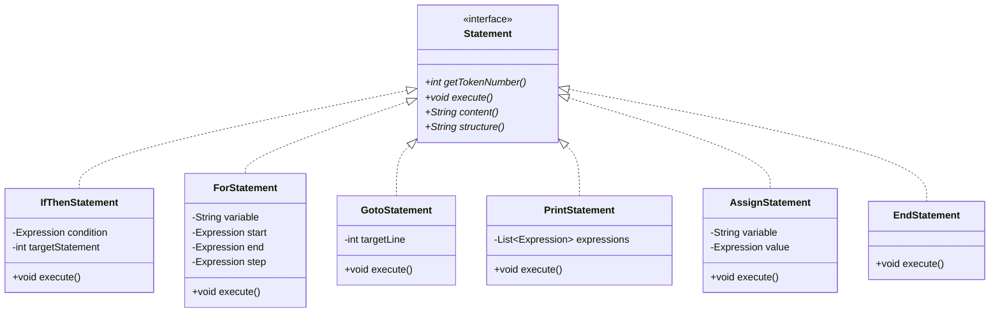
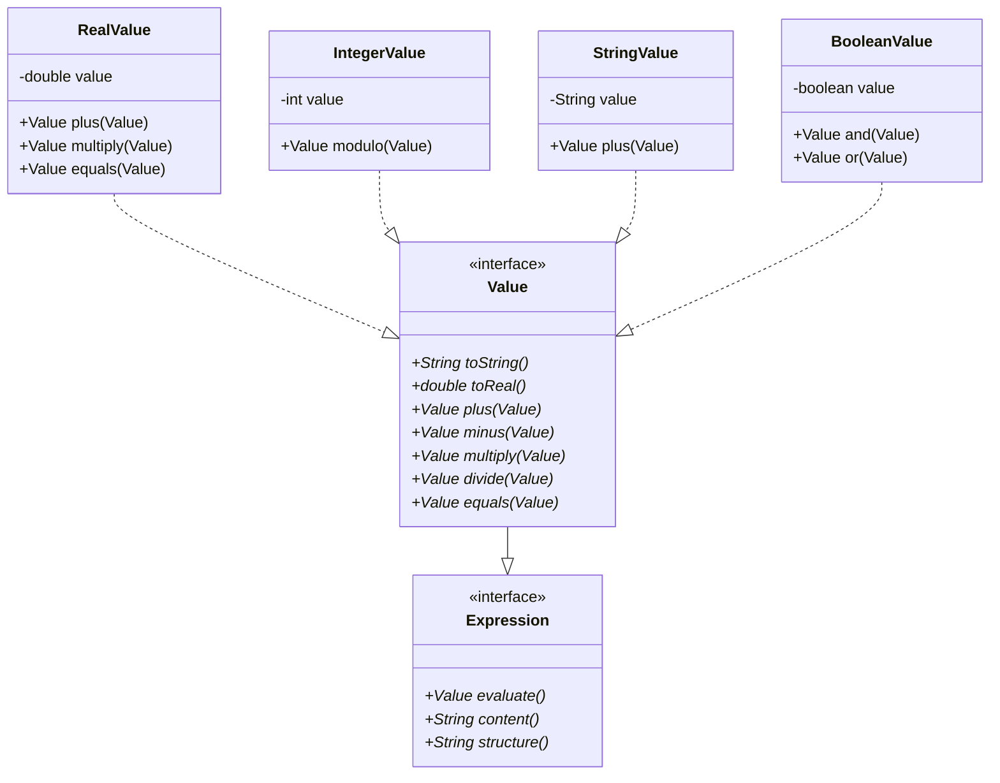
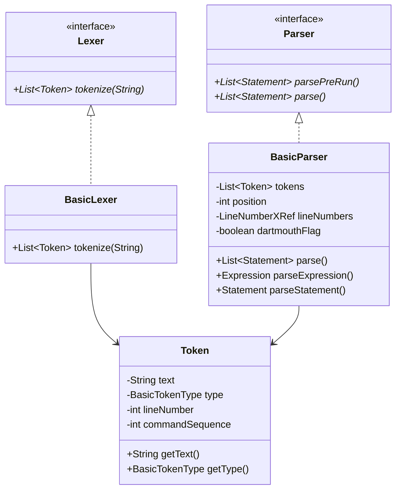
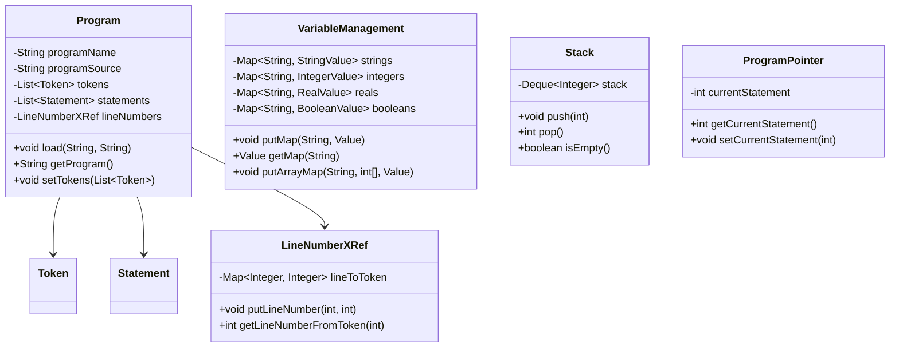
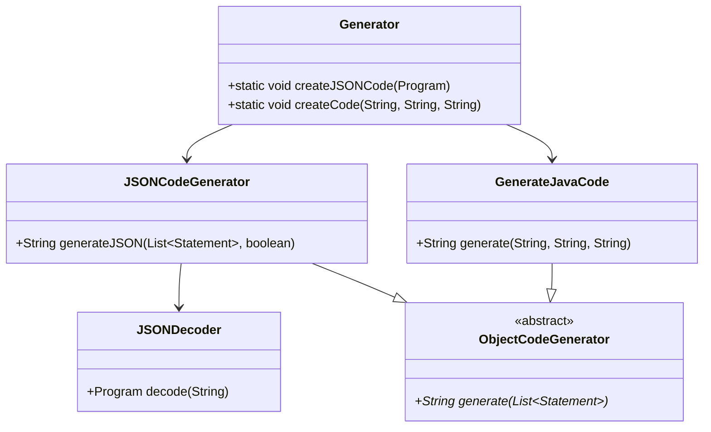
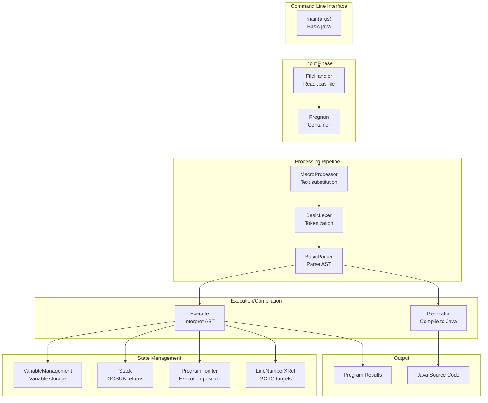

# GD-BASIC Interpreter: Detailed Technical Design Document

**Version**: 0.1.0  
**Project**: GriCom Diminutive BASIC Interpreter  
**Language**: Java 21  
**Last Updated**: 2026-05-14

---

## Table of Contents

1. [Architecture Overview](#architecture-overview)
2. [Processing Pipeline](#processing-pipeline)
3. [Package-Level Documentation](#package-level-documentation)
4. [Class Hierarchies and Relationships](#class-hierarchies-and-relationships)
5. [Call Hierarchies](#call-hierarchies)
6. [Test Structure](#test-structure)
7. [Design Patterns and Key Algorithms](#design-patterns-and-key-algorithms)
8. [Implementation Notes](#implementation-notes)
   - [Operator Precedence Hierarchy](#operator-precedence-implementation)
   - [UnaryOperatorExpression Implementation](#unaryoperatorexpression-implementation)
   - [Array Implementation with Expression Indices](#array-implementation-with-expression-indices)

---

## Architecture Overview

### System Components

GD-BASIC is a complete BASIC interpreter and compiler architecture with the following major subsystems:

| Component | Purpose | Key Classes |
|-----------|---------|-------------|
| **Entry Point** | CLI interface, file loading | `Basic.java` |
| **Macro Processing** | Preprocessor for macro expansion | `MacroProcessor`, `MacroList` |
| **Tokenization (Lexical Analysis)** | Source text → tokens | `BasicLexer`, `Token`, `BasicTokenType` |
| **Parsing (Syntax Analysis)** | Tokens → abstract syntax tree | `BasicParser` |
| **Memory/State Management** | Program structure, variables, execution state | `Program`, `VariableManagement`, `Stack`, `ProgramPointer` |
| **Execution Engine** | Runtime execution of statements | `Execute` |
| **Code Generation** | BASIC → JSON intermediate → Java source | `Generator`, `JSONCodeGenerator`, `GenerateJavaCode` |
| **Built-in Functions** | Math, string, system functions | `Function`, `Abs`, `Sin`, `Len`, etc. |
| **Type System** | Value representation and operations | `Value`, `RealValue`, `IntegerValue`, `StringValue`, etc. |
| **Error Handling** | Exception types for runtime/syntax errors | Custom exception classes in `error/` package |
| **Utilities** | Logging, printing, file handling | `Logger`, `Printer`, `FileHandler` |

### Data Flow Architecture

```
┌─────────────────┐
│   BASIC Source  │
│     .bas file   │
└────────┬────────┘
         │
         ▼
┌──────────────────────┐
│ Macro Processing     │ (MacroProcessor)
│ - Expand macros      │
│ - Process pragmas    │
└────────┬─────────────┘
         │
         ▼
┌──────────────────────┐
│ Tokenization/Lexing  │ (BasicLexer)
│ - Source → Tokens    │
│ - Classify tokens    │
└────────┬─────────────┘
         │
    ┌────┴────┐
    │          │
    ▼          ▼
┌─────────┐ ┌──────────┐
│ Compile │ │Interpret │
└────┬────┘ └─────┬────┘
     │            │
     ▼            ▼
┌──────────────────────┐
│ Parsing (BasicParser)│
│ - Tokens → AST       │
│ - Line numbering     │
└────────┬─────────────┘
         │
    ┌────┴───────────────────┐
    │                         │
    ▼                         ▼
┌─────────────┐       ┌─────────────────┐
│   Execute   │       │    Generator    │
│   Runtime   │       │ JSON + Java Gen │
└─────┬───────┘       └────────┬────────┘
      │                        │
      ▼                        ▼
┌──────────┐           ┌──────────────┐
│ Program  │           │ Java Source  │
│ Results  │           │  Code Files  │
└──────────┘           └──────────────┘
```

### Program State Container

The `Program` class serves as the central data structure connecting all pipeline phases:

```
Program
├── strProgramName: String      (filename)
├── strProgramSource: String    (original source code)
├── aoTokens: List<Token>       (output of lexer)
├── aoPreRunStatements: List    (DATA and similar)
├── aoStatements: List          (parsed statements AST)
└── oLineNumbers: LineNumberXRef (line number mapping)
```

---

## Processing Pipeline

### 1. Macro Processing Phase

**Entry Point**: `Basic.java::macroProcessing(Program)`

The macro processor performs source-level transformations before lexical analysis:

```java
MacroProcessor oMacroProcessor = new MacroProcessor();
try {
    oProgram.setProgram(oMacroProcessor.process(oProgram.getProgram()));
} catch (SyntaxErrorException e) { ... }
```

**Key Classes**:
- `MacroProcessor`: Orchestrates macro expansion
- `MacroList`: Maintains registry of active macros

### 2. Tokenization (Lexical Analysis) Phase

**Entry Point**: `Basic.java::interpret/compile/process`

The lexer converts source text into a sequence of tokens:

```java
Lexer oTokenizer = new BasicLexer();
try {
    oProgram.setTokens(oTokenizer.tokenize(oProgram.getProgram()));
} catch (SyntaxErrorException e) { ... }
```

**Tokenization Pipeline**:
1. Normalize input (line endings, case conversion)
2. Scan character-by-character
3. Recognize keywords via `ReservedWords` registry
4. Classify tokens as `BasicTokenType`
5. Create `Token` objects with source location

**Output**: `List<Token>` stored in `Program.aoTokens`

### 3. Parsing Phase (AST Construction)

**Entry Point**: `BasicParser(List<Token>, boolean dartmouthMode)`

The parser builds the abstract syntax tree through recursive descent:

```java
BasicParser oParser = new BasicParser(oProgram.getTokens(), _bDartmouthFlag);
oProgram.setPreRunStatements(oParser.parsePreRun());    // DATA statements
oProgram.setStatements(oParser.parse());                 // Main statements
```

**Parsing Process**:
1. Pre-run phase: Extract `DATA` statements
2. Main parse: Convert token stream → statement objects
3. Expression parsing: Handle operator precedence

**Operator Precedence Modes**:
- **Standard Mode** (default): BODMAS/PEMDAS evaluation
- **Dartmouth Mode** (`-d` flag): Left-to-right evaluation (legacy compatibility)

### 4. Execution Phase

**Entry Point**: `Execute(Program)::runProgram()`

The runtime interpreter executes the parsed AST:

```java
Execute oRun = new Execute(oProgram);
oRun.loadEnvironment();    // Run pre-run statements
oRun.runProgram();         // Run main program
```

**Execution Model**:
- Statement-by-statement with `ProgramPointer` tracking current index
- Control flow (GOTO, GOSUB, IF/THEN) updates pointer index
- Variable state maintained in `VariableManagement`
- Call stack in `Stack` for GOSUB/RETURN

### 5. Code Generation Phase (Compilation)

**Entry Point**: `Basic.java::compile(Program)`

Generates Java source from parsed AST:

1. **JSON Intermediate** (via `JSONCodeGenerator`):
   - Serializes AST to JSON intermediate representation
   - Option for prettified output (`-b` flag)
   - Option to store intermediate files (`-n` flag)

2. **Java Code Generation** (via `GenerateJavaCode`):
   - Reads JSON intermediate
   - Generates executable Java class
   - Uses template from `-t` option

---

## Package-Level Documentation

### `eu.gricom.basic` (Root Package)

**Primary Class**: `Basic.java`

Main entry point implementing the complete interpreter/compiler pipeline:

| Method | Purpose | Calls |
|--------|---------|-------|
| `main(String[])` | CLI entry point, argument parsing | interpret, compile, process |
| `interpret(Program)` | Run BASIC program in interpreter mode | parse, Execute::runProgram |
| `compile(Program)` | Generate Java code from BASIC | parse, Generator::createCode |
| `process(Program)` | Tokenize and parse (no execution) | BasicLexer, BasicParser |
| `macroProcessing(Program)` | Apply macro preprocessing | MacroProcessor::process |

**Key State**:
- `_oProgram: Program` - Current program being processed
- `_bCompile: boolean` - Compilation flag
- `_bDartmouthFlag: boolean` - Evaluation mode flag
- `_bBeautified: boolean` - JSON prettification flag

---

### `error` Package

Exception hierarchy for error handling:

| Class | Parent | Purpose |
|-------|--------|---------|
| `SyntaxErrorException` | Exception | Parsing errors, type mismatches |
| `RuntimeException` | Exception | Runtime execution errors |
| `DivideByZeroException` | Exception | Division by zero in expressions |
| `OutOfDataException` | Exception | READ statement with insufficient DATA |
| `EmptyStackException` | Exception | RETURN without matching GOSUB |
| `UndefinedUserFunctionException` | Exception | Call to undefined FN function |

**Usage Pattern**:
```java
try {
    // parsing or execution code
} catch (SyntaxErrorException e) {
    _oLogger.error(e.getMessage());
}
```

---

### `helper` Package

Utility services for logging, output, and file operations.

#### `Logger.java`

Structured logging with configurable log levels:

```java
public class Logger {
    public Logger(String strName)
    public void setLogLevel(String strLevel)
    public void debug(String strMessage)
    public void info(String strMessage)
    public void warning(String strMessage)
    public void error(String strMessage)
    public void trace(String strMessage)
}
```

**Log Levels**: `trace`, `debug`, `info`, `warning`, `error`

#### `Printer.java`

Output to console with color support:

```java
public class Printer {
    public static void print(Object oValue)
    public static void println()
    public static void println(Object oValue)
}
```

#### `FileHandler.java`

File I/O operations:

```java
public class FileHandler {
    public static String readFile(String strFilePath)
    public static void writeFile(String strPath, String strContent)
    public static void appendToFile(String strPath, String strContent)
}
```

#### `ConsoleColors.java`

ANSI color codes for terminal output:

```java
public class ConsoleColors {
    public static final String RESET, BLACK, RED, GREEN, YELLOW, etc.
}
```

#### `Time.java`

System time utilities:

```java
public class Time {
    public static String getFormattedTime()
    public static long getCurrentTimeMillis()
}
```

#### `EnvParam.java`

Environment variable access:

```java
public class EnvParam {
    public static String get(String strKey)
    public static String get(String strKey, String strDefault)
}
```

#### `Trace.java`

Program execution tracing:

```java
public class Trace {
    public Trace(boolean bEnabled)
    public void trace(int iLineNumber)
}
```

---

### `variableTypes` Package

Type system for BASIC values, implementing Java's numeric tower with type coercion.

#### `Value` Interface (Core Contract)

All BASIC values implement this interface:

```java
public interface Value extends Expression {
    // Conversion
    String toString()
    double toReal()
    
    // Binary Operators
    Value plus(Value oValue)
    Value minus(Value oValue)
    Value multiply(Value oValue)
    Value divide(Value oValue)
    Value modulo(Value oValue)
    Value power(Value oValue)
    Value shiftLeft(Value oValue)
    Value shiftRight(Value oValue)
    
    // Comparisons
    Value equals(Value oValue)
    Value notEqual(Value oValue)
    Value smallerThan(Value oValue)
    Value largerThan(Value oValue)
    Value smallerEqualThan(Value oValue)
    Value largerEqualThan(Value oValue)
    
    // Logical Operations
    Value and(Value oValue)
    Value or(Value oValue)
}
```

#### `VariableType` Enum

Type indicators based on BASIC naming conventions:

```java
public enum VariableType {
    STRING        // suffix: $
    INTEGER       // suffix: %
    LONG          // suffix: &
    REAL          // suffix: #
    DOUBLE        // suffix: !
    BOOLEAN       // suffix: @
    UNDEFINED     // no suffix (defaults to REAL)
}
```

**Variable Type Detection**:
- `name$` → STRING
- `name%` → INTEGER
- `name&` → LONG
- `name#` → REAL
- `name!` → DOUBLE
- `name@` → BOOLEAN
- `name` → UNDEFINED (treated as REAL)

#### Concrete Value Types

| Class | Wraps | Operations |
|-------|-------|-----------|
| `RealValue` | `double` | Full numeric operations |
| `IntegerValue` | `int` | Integer operations, modulo |
| `LongValue` | `long` | Large integer operations |
| `StringValue` | `String` | String concatenation, comparison |
| `BooleanValue` | `boolean` | Logical AND, OR, negation |

**Example Type Coercion**:
```java
RealValue(5.5).plus(IntegerValue(3))    // → RealValue(8.5)
StringValue("hello").plus(RealValue(5)) // → StringValue("hello5")
```

---

### `tokenizer` Package

Lexical analysis: source code → token stream.

#### `BasicLexer` (Main Implementation)

**Interface**: `Lexer`

```java
public interface Lexer {
    List<Token> tokenize(String strSourceCode)
        throws SyntaxErrorException;
}
```

**Tokenization Process**:

1. **Normalization** (via `Normalizer`):
   - Handle line endings
   - Normalize whitespace
   - Case conversion

2. **Scanning**:
   - Character-by-character input reading
   - Lookahead for multi-character tokens
   - Position tracking for error reporting

3. **Token Classification**:
   - Keyword lookup via `ReservedWords`
   - Number recognition (INTEGER, NUMBER)
   - String literal parsing (STRING)
   - Operator identification
   - Comments (REM)

#### `Token` Class

Immutable representation of a lexical unit:

```java
public final class Token {
    private String _strText              // Original source text
    private final BasicTokenType _oType  // Token classification
    private final int _iLineNumber       // Source line number
    private final int _iCommandSequenceNumber  // Position in line
    
    public String getText()
    public BasicTokenType getType()
    public int getLine()
    public int getCommandSequence()
    public String setText(String strText)
    public String structure()            // JSON representation
    public boolean equals(Token oCompareToken)
}
```

#### `BasicTokenType` Enum

Classification of all BASIC tokens:

**Statement Keywords**:
- Control: `IF`, `THEN`, `ELSE`, `FOR`, `NEXT`, `GOTO`, `GOSUB`, `RETURN`
- Loops: `WHILE`, `DO`, `UNTIL`, `ENDWHILE`
- I/O: `PRINT`, `INPUT`, `FINPUT`, `FPRINT`
- Files: `FOPEN`, `FCLOSE`
- Data: `DATA`, `READ`, `DIM`
- Functions: `DEF`, `CALL`
- Meta: `REM`, `END`, `CLEAN`, `STOP`

**Operators**:
- Arithmetic: `PLUS`, `MINUS`, `MULTIPLY`, `DIVIDE`, `POWER`, `MODULO`
- Bitwise: `SHIFT_LEFT`, `SHIFT_RIGHT`
- Comparison: `GREATER`, `SMALLER`, `GREATER_EQUAL`, `SMALLER_EQUAL`
- Logical: `AND`, `OR`, `NOT`
- Assignment: `ASSIGN_EQUAL`, `PASCAL_ASSIGN_EQUAL`
- Comparison: `COMPARE_EQUAL`, `COMPARE_NOT_EQUAL`

**Functions**:
- Math: `ABS`, `SIN`, `COS`, `TAN`, `ATN`, `SQR`, `EXP`, `LOG`, `LOG10`, `RND`
- String: `LEN`, `LEFT`, `RIGHT`, `MID`, `CHR`, `ASC`, `STR`, `VAL`
- I/O: `EOF`, `TAB`
- System: `SYSTEM`, `TIME`, `MEM`

**Literals**: `NUMBER`, `STRING`, `INTEGER`, `BOOLEAN`

#### `ReservedWords` Class

Keyword registry:

```java
public class ReservedWords {
    public static boolean isReservedWord(String strWord)
    public static BasicTokenType getTokenType(String strWord)
}
```

Performs case-insensitive keyword lookup.

#### `Normalizer` Class

Source code normalization:

```java
public class Normalizer {
    public static String normalize(String strSource)
    public static String normalizeIndex(String strIndex)
    // Handle whitespace, line endings, variable name normalization
}
```

---

### `parser` Package

Syntax analysis: token stream → abstract syntax tree.

#### `BasicParser` (Main Implementation)

**Interface**: `Parser`

```java
public interface Parser {
    List<Statement> parsePreRun() throws SyntaxErrorException;
    List<Statement> parse() throws SyntaxErrorException;
}
```

**Parsing Strategy**: Recursive descent with single-token lookahead.

#### Parser State Management

```java
public class BasicParser implements Parser {
    private final List<Token> _aoTokens
    private int _iPosition                      // Current token index
    private final LineNumberXRef _oLineNumber   // Line mapping
    private final boolean _bDartmouthFlag       // Evaluation mode
    
    private Token getToken(int iOffset)         // Lookahead
    private void advance()                      // Consume token
    private void match(BasicTokenType eType)    // Expect token
}
```

#### Parsing Methods

| Method | Returns | Purpose |
|--------|---------|---------|
| `parsePreRun()` | `List<Statement>` | Extract DATA statements |
| `parse()` | `List<Statement>` | Main parsing phase |
| `parseStatement()` | `Statement` | Single statement |
| `parseExpression()` | `Expression` | Full expression with operators |
| `parseTerm()` | `Expression` | Handles operator precedence |
| `parseFactor()` | `Expression` | Atomic expression (variable, literal, function) |
| `parseArrayAccess()` | `Expression` | Array indexing |

#### Expression Parsing Hierarchy

Operator precedence is implemented via method hierarchy:

```
parseExpression()
  ├─ parseLogicalOr()    // OR (lowest precedence)
  │   └─ parseLogicalAnd()  // AND
  │       └─ parseComparison()
  │           └─ parseAddition()
  │               └─ parseMultiplication()
  │                   └─ parseUnary()
  │                       └─ parsePower()
  │                           └─ parseFactor()   // (highest precedence)
```

**Evaluation Modes**:
- **Standard Mode** (default): Respects precedence hierarchy
- **Dartmouth Mode** (`_bDartmouthFlag`): Left-to-right evaluation (skips precedence)

#### Line Number Cross-Reference

Maps source line numbers to token indices:

```java
private LineNumberXRef _oLineNumber

_oLineNumber.putLineNumber(int iLineNumber, int iTokenIndex)
int iTokenIndex = _oLineNumber.getTokenIndex(int iLineNumber)
```

Enables GOTO and error reporting.

---

### `statements` Package

Abstract syntax tree nodes: one class per statement type or expression type.

#### Core Interfaces

```java
public interface Statement {
    int getTokenNumber()
    void execute() throws Exception
    String content() throws Exception
    String structure() throws Exception
}

public interface Expression {
    Value evaluate() throws Exception
    String content()
    String structure() throws Exception
}
```

#### Statement Classification

**Control Flow Statements**:

| Class | Purpose | Key Methods |
|-------|---------|------------|
| `IfThenStatement` | Conditional execution | `execute()` - evaluate condition, modify ProgramPointer |
| `ForStatement` | Loop with counter | `execute()` - initialize counter, check condition, increment |
| `NextStatement` | Loop terminator | `execute()` - coordinate with ForStatement |
| `WhileStatement` | Condition-based loop | `execute()` - evaluate condition, loop |
| `UntilStatement` | Inverted while loop | `execute()` - negate condition |
| `DoStatement` | Do-while variant | `execute()` - execute once, then check |
| `GotoStatement` | Unconditional jump | `execute()` - modify ProgramPointer |
| `GosubStatement` | Subroutine call | `execute()` - push return address on Stack |
| `ReturnStatement` | Subroutine return | `execute()` - pop from Stack, modify ProgramPointer |

**I/O Statements**:

| Class | Purpose |
|-------|---------|
| `PrintStatement` | Output to console |
| `InputStatement` | Read from console/keyboard |
| `FOpenStatement` | Open file |
| `FCloseStatement` | Close file |
| `FInputStatement` | Read from file |
| `FPrintStatement` | Write to file |

**Data Statements**:

| Class | Purpose |
|-------|---------|
| `DataStatement` | Define data values (pre-run phase) |
| `ReadStatement` | Read from DATA statements |
| `DimStatement` | Declare array dimensions (optional) |

**Assignment Statements**:

| Class | Purpose |
|-------|---------|
| `AssignStatement` | Variable assignment |
| `ArrayAssignStatement` | Array element assignment |

**Other Statements**:

| Class | Purpose |
|-------|---------|
| `EndStatement` | Program terminator |
| `RemStatement` | Comment (no-op) |
| `LabelStatement` | Goto target |
| `ElseStatement` | Part of IF/THEN |
| `EndWhileStatement` | End of WHILE block |
| `ColonStatement` | Multiple statements per line |
| `CleanStatement` | Reset program state |
| `PragmaStatement` | Compiler directives |

#### Expression Types

**Literal Expressions**:

| Class | Represents |
|-------|-----------|
| `RealValue`, `IntegerValue`, `StringValue`, etc. | Literal constants |

**Computed Expressions**:

| Class | Purpose |
|-------|---------|
| `VariableExpression` | Variable lookup |
| `ArrayAccessExpression` | Array indexing: `arr(index)` |
| `OperatorExpression` | Binary operators: `a + b`, `a < b` |
| `UnaryOperatorExpression` | Unary operators: `-x`, `NOT x` |
| `Function` | Built-in function calls |

**Example: OperatorExpression**

```java
public final class OperatorExpression implements Expression {
    private final Expression _oLeftExpr
    private final BasicTokenType _eOperator
    private final Expression _oRightExpr
    
    public Value evaluate() throws Exception {
        Value oLeft = _oLeftExpr.evaluate()
        Value oRight = _oRightExpr.evaluate()
        
        return switch(_eOperator) {
            case PLUS -> oLeft.plus(oRight)
            case MINUS -> oLeft.minus(oRight)
            case MULTIPLY -> oLeft.multiply(oRight)
            // ... more operators
        }
    }
}
```

#### Variable and Array Access

**Variable Lookup** (VariableExpression):

```java
public final class VariableExpression implements Expression {
    private final String _strVariableName
    
    public Value evaluate() throws Exception {
        return VariableManagement.getVariable(_strVariableName)
    }
}
```

**Array Element Access** (ArrayAccessExpression):

```java
public final class ArrayAccessExpression implements Expression {
    private final String _strArrayName
    private final List<Expression> _aoIndices      // Can be multi-dimensional
    
    public Value evaluate() throws Exception {
        // Evaluate each index
        List<Integer> aiIndices = _aoIndices.stream()
            .map(expr -> (int)expr.evaluate().toReal())
            .toList()
        
        return VariableManagement.getArrayElement(
            _strArrayName, aiIndices)
    }
}
```

**Array Assignment** (ArrayAssignStatement):

```java
public final class ArrayAssignStatement implements Statement {
    private final String _strArrayName
    private final List<Expression> _aoIndices
    private final Expression _oValue
    
    public void execute() throws Exception {
        List<Integer> aiIndices = _aoIndices.stream()
            .map(expr -> (int)expr.evaluate().toReal())
            .toList()
        
        Value oValue = _oValue.evaluate()
        VariableManagement.setArrayElement(
            _strArrayName, aiIndices, oValue)
    }
}
```

---

### `functions` Package

Implementation of 30+ built-in BASIC functions.

#### `Function` Dispatcher

Routes function calls to implementations:

```java
public class Function implements Expression {
    private final Token _oToken              // Function identifier
    private final Expression _oFirstParam    // Up to 3 parameters
    private final Expression _oSecondParam
    private final Expression _oThirdParam
    
    public Value evaluate() throws Exception {
        return switch(_oToken.getType()) {
            case ABS -> new Abs(_oFirstParam).evaluate()
            case SIN -> new Sin(_oFirstParam).evaluate()
            case LEN -> new Len(_oFirstParam).evaluate()
            // ... 30+ functions
        }
    }
}
```

#### Math Functions

| Function | Class | Signature | Returns |
|----------|-------|-----------|---------|
| ABS | `Abs` | `ABS(number)` | Absolute value |
| SIN | `Sin` | `SIN(radians)` | Sine |
| COS | `Cos` | `COS(radians)` | Cosine |
| TAN | `Tan` | `TAN(radians)` | Tangent |
| ATN | `Atn` | `ATN(number)` | Arctangent (radians) |
| SQR | `Sqr` | `SQR(number)` | Square root |
| EXP | `Exp` | `EXP(number)` | e^x |
| LOG | `Log` | `LOG(number)` | Natural logarithm |
| LOG10 | `Log10` | `LOG10(number)` | Base-10 logarithm |
| RND | `Rnd` | `RND()` or `RND(seed)` | Random 0 ≤ x < 1 |

#### String Functions

| Function | Class | Signature | Returns |
|----------|-------|-----------|---------|
| LEN | `Len` | `LEN(string)` | String length |
| LEFT$ | `Left` | `LEFT$(string, count)` | Leftmost n characters |
| RIGHT$ | `Right` | `RIGHT$(string, count)` | Rightmost n characters |
| MID$ | `Mid` | `MID$(string, start, count)` | Substring |
| CHR$ | `Chr` | `CHR$(ascii)` | Character from ASCII code |
| ASC | `Asc` | `ASC(string)` | ASCII code of first character |
| STR$ | `Str` | `STR$(number)` | Convert number to string |
| VAL | `Val` | `VAL(string)` | Parse string as number |
| INSTR | `Instr` | `INSTR(haystack, needle)` | String position |

#### Type Conversion Functions

| Function | Class | Signature | Returns |
|----------|-------|-----------|---------|
| CINT | `Cint` | `CINT(value)` | Convert to integer |
| CDBL | `Cdbl` | `CDBL(value)` | Convert to double |

#### I/O and System Functions

| Function | Class | Signature | Purpose |
|----------|-------|-----------|---------|
| EOF | `Eof` | `EOF(fileHandle)` | End of file check |
| MEM | `Mem` | `MEM()` | Free memory in bytes |
| TIME$ | `Time` | `TIME$()` | System time string |
| SYSTEM | `System` | `SYSTEM(command)` | Execute system command |

#### User-Defined Functions

```java
public class FnFunction implements Expression {
    private final String _strFunctionName
    private final List<Expression> _aoParams
    
    // FN user() = user_param * 2
    // CALL user(5) → 10
}
```

---

### `memoryManager` Package

Program state and execution context management.

#### `Program` Class

Central container for program in all pipeline phases:

```java
public class Program {
    private String _strProgramName          // Filename
    private String _strProgramSource        // Original source
    private LineNumberXRef _oLineNumbers    // Line → token mapping
    private List<Statement> _aoPreRunStatements
    private List<Statement> _aoStatements
    private List<Token> _aoTokens
    
    public void load(String strName, String strSource)
    public String getProgram()
    public void setProgram(String strProgram)
    public void setTokens(List<Token> aoTokens)
    public List<Token> getTokens()
    public void setStatements(List<Statement> aoStatements)
    public List<Statement> getStatements()
}
```

#### `VariableManagement` Class

Static storage for all runtime variables:

```java
public class VariableManagement {
    private static Map<String, Value> _moUntyped
    private static Map<String, StringValue> _moStrings
    private static Map<String, IntegerValue> _moIntegers
    private static Map<String, RealValue> _moReals
    private static Map<String, BooleanValue> _moBooleans
    private static Map<String, LongValue> _moLongs
    
    // Variable storage
    public void putMap(String strKey, Value oValue) throws SyntaxErrorException
    public void putMap(String strKey, double dValue) throws SyntaxErrorException
    public Value getMap(String strKey) throws RuntimeException
    
    // Array storage
    public void putArrayMap(String strKey, int[] aiIndices, Value oValue)
    public Value getArrayMap(String strKey, int[] aiIndices)
    public boolean arrayExists(String strKey)
    
    // Cleanup
    public void clearAllVariables()
    public void clearVariable(String strKey)
    
    // Utility
    public Map<String, Value> getVariables()
}
```

**Variable Type Routing**:

```
Input: "count%" (integer)
  ├─ Check suffix '%' → VariableType.INTEGER
  ├─ Normalize name: "count"
  └─ Store in _moIntegers.put("count", IntegerValue)

Input: "name$" (string)
  ├─ Check suffix '$' → VariableType.STRING
  └─ Store in _moStrings.put("name", StringValue)
```

#### `Stack` Class

Call stack for GOSUB/RETURN:

```java
public class Stack {
    private static Deque<Integer> _iStack = new ArrayDeque<>()
    
    public static void push(int iValue)
    public static int pop() throws EmptyStackException
    public static int peek()
    public static boolean isEmpty()
    public static void clear()
}
```

#### `ProgramPointer` Class

Execution position tracker:

```java
public class ProgramPointer {
    private int _iCurrentStatement = 0
    
    public int getCurrentStatement()
    public void setCurrentStatement(int iStatement)
    public void calcNextStatement()              // Increment
}
```

Enables control flow statements to modify execution position.

#### `LineNumberXRef` Class

Maps BASIC line numbers to statement indices:

```java
public class LineNumberXRef {
    private Map<Integer, Integer> _moLineToToken
    
    public void putLineNumber(int iLineNumber, int iTokenIndex)
    public int getLineNumberFromToken(int iTokenIndex)
    public int getTokenIndex(int iLineNumber)
    public boolean lineNumberExists(int iLineNumber)
}
```

Used by GOTO statements:
```java
int iTargetToken = lineNumbers.getTokenIndex(10)  // Get statement for line 10
programPointer.setCurrentStatement(iTargetToken)
```

#### `FileManager` Class

File handle management for FOPEN/FCLOSE:

```java
public class FileManager {
    private Map<Integer, FileHandle> _moFiles
    
    public int openFile(String strPath, FileOpenType eMode)
    public void closeFile(int iHandle) throws IOException
    public String readLine(int iHandle) throws IOException
    public void writeLine(int iHandle, String strContent) throws IOException
}
```

**FileOpenType Enum**:
- `READ`: Open for input
- `WRITE`: Open for output
- `APPEND`: Open for appending

#### `FiFoQueue<T>` Class

Generic first-in-first-out queue:

```java
public class FiFoQueue<T> {
    public void enqueue(T oValue)
    public T dequeue() throws OutOfDataException
    public boolean isEmpty()
    public void clear()
}
```

Used for DATA statement values.

---

### `runtimeManager` Package

Execution engine.

#### `Execute` Class

Main interpreter/runtime:

```java
public class Execute {
    private final List<Statement> _aoPreRunStatements
    private final List<Statement> _aoStatements
    private final ProgramPointer _oProgramPointer
    
    public Execute(Program oProgram)
    public void loadEnvironment()           // Run DATA, etc.
    public void runProgram()                // Main execution loop
    public Statement getFinalStatement()    // Last executed statement
}
```

**Execution Loop**:

```java
public void runProgram() {
    _oProgramPointer.setCurrentStatement(0)
    
    while (_oProgramPointer.getCurrentStatement() 
           < _aoStatements.size()) {
        int iThisStatement = _oProgramPointer.getCurrentStatement()
        
        _oProgramPointer.calcNextStatement()  // Default: increment
        
        Statement oStmt = _aoStatements.get(iThisStatement)
        oStmt.execute()                       // May modify pointer
    }
}
```

**Control Flow**:
- Default: statement pointer increments
- GOTO: pointer set to target statement index
- GOSUB: current pointer pushed to stack, pointer set to target
- IF/THEN: pointer set conditionally
- FOR/NEXT: pointer modified for loop control
- RETURN: pointer restored from stack

---

### `math` Package

Numeric utilities for decimal and precision operations.

#### `BCDConverter` Class

Binary Coded Decimal conversions:

```java
public class BCDConverter {
    public static String decimalToBCD(double dValue)
    public static double bcdToDecimal(String strBCD)
}
```

Used for high-precision arithmetic in financial calculations.

---

### `macroManager` Package

Preprocessor for compile-time macro expansion.

#### `MacroProcessor` Class

Main processor:

```java
public class MacroProcessor {
    public String process(String strSource) throws SyntaxErrorException
}
```

**Process**:
1. Scan for `#DEFINE` directives
2. Register macros in `MacroList`
3. Expand macro calls in source
4. Return processed source

#### `MacroList` Class

Macro registry:

```java
public class MacroList {
    private Map<String, String> _moMacros
    
    public void define(String strName, String strReplacement)
    public boolean isDefined(String strName)
    public String expand(String strName, String... strArgs)
}
```

**Example**:
```basic
#DEFINE SQUARE(x) x * x
10 PRINT SQUARE(5)    ! Expands to: PRINT 5 * 5
```

---

### `codeGenerator` Package

Compilation pipeline: AST → JSON intermediate → Java source.

#### `Generator` Class (Orchestrator)

```java
public class Generator {
    public static void createJSONCode(Program oProgram, 
                                      boolean bBeautified, 
                                      boolean bStoreIntermediate)
    
    public static void createCode(String strProgramName,
                                  String strSource,
                                  String strTemplate)
}
```

**Compilation Flow**:
1. Parse BASIC to AST (in `Basic.java::compile()`)
2. Generate JSON intermediate (via `JSONCodeGenerator`)
3. Read template
4. Generate Java source (via `GenerateJavaCode`)
5. Write output files

#### `JSONCodeGenerator` Class

Serializes AST to JSON:

```java
public class JSONCodeGenerator {
    public String generateJSON(List<Statement> aoStatements,
                              boolean bBeautified)
}
```

**JSON Structure**:
```json
{
  "program": {
    "statements": [
      {
        "type": "PRINT",
        "expressions": [
          {"type": "LITERAL", "value": "Hello World"}
        ]
      }
    ]
  }
}
```

#### `JSONDecoder` Class

Parses JSON intermediate:

```java
public class JSONDecoder {
    public Program decode(String strJSON)
}
```

Companion to `JSONCodeGenerator`.

#### `ExpressionDecoder`, `TokenDecoder`, `OperatorDecoder` Classes

Specialized decoders for JSON components:

```java
public class ExpressionDecoder {
    public Expression decode(JsonObject oJson)
}

public class TokenDecoder {
    public Token decode(JsonObject oJson)
}

public class OperatorDecoder {
    public BasicTokenType decode(String strOperator)
}
```

#### `GenerateJavaCode` Class

Generates executable Java from JSON:

```java
public class GenerateJavaCode {
    public String generate(String strProgramName,
                          String strJSON,
                          String strTemplate)
}
```

**Template Substitution**:
- Reads template from resource path
- Replaces placeholders: `${PROGRAM_NAME}`, `${STATEMENTS}`, etc.
- Returns complete Java source

#### `ObjectCodeGenerator` Class

Base class for code generation strategies:

```java
public abstract class ObjectCodeGenerator {
    abstract String generate(List<Statement> aoStatements)
}
```

---

## Class Hierarchies and Relationships

### Statement Hierarchy

```
Statement (interface)
  ├── IfThenStatement
  ├── ForStatement
  ├── NextStatement
  ├── WhileStatement
  ├── UntilStatement
  ├── DoStatement
  ├── GotoStatement
  ├── GosubStatement
  ├── ReturnStatement
  ├── PrintStatement
  ├── InputStatement
  ├── FOpenStatement
  ├── FCloseStatement
  ├── FInputStatement
  ├── FPrintStatement
  ├── DataStatement
  ├── ReadStatement
  ├── DimStatement
  ├── AssignStatement
  ├── ArrayAssignStatement
  ├── EndStatement
  ├── RemStatement
  ├── LabelStatement
  ├── ElseStatement
  ├── EndWhileStatement
  ├── ColonStatement
  ├── CleanStatement
  └── PragmaStatement
```

### Expression Hierarchy

```
Expression (interface)
  ├── Value (interface extends Expression)
  │   ├── RealValue
  │   ├── IntegerValue
  │   ├── LongValue
  │   ├── StringValue
  │   └── BooleanValue
  ├── VariableExpression
  ├── ArrayAccessExpression
  ├── OperatorExpression
  ├── UnaryOperatorExpression
  └── Function
```

### Value Type Hierarchy

```
Value (interface)
  ├── RealValue (implements arithmetic, comparison)
  ├── IntegerValue
  ├── LongValue
  ├── StringValue (implements concatenation)
  └── BooleanValue
```

### Exception Hierarchy

```
Throwable
  └── Exception
      ├── SyntaxErrorException (parsing errors)
      ├── RuntimeException (execution errors)
      ├── DivideByZeroException (arithmetic)
      ├── OutOfDataException (READ statement)
      ├── EmptyStackException (RETURN without GOSUB)
      └── UndefinedUserFunctionException (FN function)
```

---

## Call Hierarchies

### Main Entry Point to Execution

```
main(String[])
  ├─ parseCommandLine()
  ├─ FileHandler.readFile()
  ├─ Program.load()
  └─ Basic.interpret() OR Basic.compile()
      │
      ├─ macroProcessing()
      │   └─ MacroProcessor.process()
      │
      ├─ BasicLexer.tokenize()
      │   ├─ Normalizer.normalize()
      │   └─ ReservedWords.getTokenType()
      │
      ├─ BasicParser.parse()
      │   ├─ parseStatement() [×N]
      │   │   ├─ parseIfThenStatement()
      │   │   ├─ parseForStatement()
      │   │   ├─ parsePrintStatement()
      │   │   └─ parseAssignStatement()
      │   │
      │   └─ parseExpression()
      │       ├─ parseLogicalOr()
      │       ├─ parseLogicalAnd()
      │       ├─ parseComparison()
      │       ├─ parseAddition()
      │       ├─ parseMultiplication()
      │       └─ parseFactor()
      │           ├─ parsePrimary()
      │           ├─ Function()
      │           └─ VariableExpression()
      │
      └─ Execute.runProgram()
          └─ while (hasStatements)
              └─ Statement.execute()
                  ├─ IfThenStatement.execute()
                  │   └─ Expression.evaluate()
                  ├─ PrintStatement.execute()
                  │   └─ Expression.evaluate()
                  ├─ GotoStatement.execute()
                  │   └─ ProgramPointer.setCurrentStatement()
                  └─ ... [35+ statement types]
```

### Expression Evaluation

```
Expression.evaluate()
  ├─ VariableExpression.evaluate()
  │   └─ VariableManagement.getMap()
  │
  ├─ OperatorExpression.evaluate()
  │   ├─ leftExpr.evaluate()
  │   ├─ rightExpr.evaluate()
  │   └─ Value.plus/minus/multiply/divide()
  │       └─ Type coercion / arithmetic
  │
  ├─ ArrayAccessExpression.evaluate()
  │   ├─ indices.stream().map(e → e.evaluate())
  │   └─ VariableManagement.getArrayMap()
  │
  ├─ UnaryOperatorExpression.evaluate()
  │   ├─ operand.evaluate()
  │   └─ Value.negate() or NOT logic
  │
  └─ Function.evaluate()
      ├─ param1.evaluate()
      ├─ param2.evaluate()
      ├─ param3.evaluate()
      └─ Specific function execute (Abs, Sin, Len, etc.)
```

### Variable Lookup and Storage

```
AssignStatement.execute()
  ├─ rightExpr.evaluate()        # Get RHS value
  └─ VariableManagement.putMap()
      ├─ Determine VariableType from variable name suffix
      │   ├─ "$" → STRING, store in _moStrings
      │   ├─ "%" → INTEGER, store in _moIntegers
      │   ├─ "#" → REAL, store in _moReals
      │   └─ no suffix → UNDEFINED (REAL)
      └─ Type coercion if needed

VariableExpression.evaluate()
  └─ VariableManagement.getMap()
      ├─ Identify variable type from name
      └─ Retrieve from appropriate type map
```

### Array Access Evaluation

```
ArrayAccessExpression.evaluate()
  ├─ indices[0].evaluate() → IntegerValue
  ├─ indices[1].evaluate() → IntegerValue (if multi-dimensional)
  ├─ Convert to int[]: [idx0, idx1, ...]
  └─ VariableManagement.getArrayMap(name, indices)
      ├─ Internal storage: Map<String, Value[][]...>
      └─ Multi-dimensional array lookup

ArrayAssignStatement.execute()
  ├─ indices evaluation
  ├─ value.evaluate()
  └─ VariableManagement.putArrayMap(name, indices, value)
      └─ Create multi-dimensional array if needed
```

---

## Test Structure

### Test Package Organization

```
src/test/java/eu/gricom/basic/
├── BasicTest.java                      (main integration tests)
├── codeGenerator/
│   ├── GeneratorTest.java
│   └── json/
│       ├── ExpressionDecoderTest.java
│       ├── JSONDecoderTest.java
│       └── TokenDecoderTest.java
├── functions/
│   ├── AbsTest.java
│   ├── LenTest.java
│   ├── StrTest.java
│   └─ ... [function tests]
├── helper/
│   ├── FileHandlerTest.java
│   └── LoggerTest.java
├── memoryManager/
│   ├── ProgramTest.java
│   ├── VariableManagementTest.java
│   └── StackTest.java
├── parser/
│   └── BasicParserTest.java
├── statements/
│   ├── ArrayAccessExpressionTest.java
│   ├── ArrayAssignStatementTest.java
│   ├── AssignStatementTest.java
│   ├── ForStatementTest.java
│   ├── IfThenStatementTest.java
│   └─ ... [statement tests]
├── tokenizer/
│   ├── BasicLexerTest.java
│   └── TokenTest.java
└── variableTypes/
    ├── BooleanValueTest.java
    ├── IntegerValueTest.java
    ├── RealValueTest.java
    ├── StringValueTest.java
    └─ ValueTypeCoercionTest.java
```

### System Integration Tests

```
src/test/basic/
├── test_array_read_expr.bas
├── test_array_assign_expr.bas
├── test_array_assign_literal.bas
├── test_array_assign_variable.bas
└─ ... [more system tests]
```

### Test Patterns

**Unit Test Pattern** (JUnit 5):

```java
@Test
public void testVariableAssignment() throws Exception {
    // Arrange
    String strSource = "10 LET count% = 42\n20 END\n"
    Program oProgram = new Program()
    oProgram.load("test.bas", strSource)
    
    // Act
    BasicLexer oLexer = new BasicLexer()
    List<Token> aoTokens = oLexer.tokenize(strSource)
    
    // Assert
    assertEquals(5, aoTokens.size())
    assertEquals(BasicTokenType.NUMBER, aoTokens.get(3).getType())
}
```

**Integration Test Pattern**:

```java
@Test
public void testCompleteProgram() throws Exception {
    // Load and run a complete .bas program
    String strSource = readTestProgram("test_arithmetic.bas")
    Program oProgram = new Program()
    oProgram.load("test.bas", strSource)
    
    Basic oBasic = new Basic()
    oBasic.interpret(oProgram)
    
    // Verify output
}
```

---

## Design Patterns and Key Algorithms

### 1. Interpreter Pattern (Core Architecture)

The system implements the classic interpreter pattern with distinct phases:
- **Tokenization**: Lexer phase
- **Parsing**: Parser phase building AST
- **Execution**: Execute phase interpreting AST

### 2. Visitor Pattern (Expression Evaluation)

Expressions form an AST where `evaluate()` visits and evaluates:

```
Interface Expression {
    Value evaluate()
}

// Concrete expressions implement eval logic
class OperatorExpression {
    Value evaluate() {
        left.evaluate() op right.evaluate()
    }
}
```

### 3. Factory Pattern (Token/Statement Creation)

Parser instantiates appropriate statement objects:

```java
switch (getToken(0).getType()) {
    case IF -> new IfThenStatement(...)
    case FOR -> new ForStatement(...)
    case PRINT -> new PrintStatement(...)
}
```

### 4. Strategy Pattern (Code Generation)

Different backends (JSON, Java, P-code) via `ObjectCodeGenerator` hierarchy:

```
ObjectCodeGenerator (abstract)
  ├── JSONCodeGenerator
  ├── GenerateJavaCode
  └── [P-code generator - future]
```

### 5. Type System with Dynamic Coercion

Values implement a unified arithmetic interface:

```java
interface Value {
    Value plus(Value other)
    Value minus(Value other)
    // Type coercion happens inside implementations
}
```

Example: `RealValue(5.5).plus(IntegerValue(3))` → `RealValue(8.5)`

### 6. Recursive Descent Parsing

Expression parsing implements operator precedence via method hierarchy:

```
Lower precedence (evaluated later)
  parseExpression()
    ├─ parseLogicalOr()
    │   └─ parseLogicalAnd()
    │       └─ parseComparison()
    │           └─ parseAddition()
    │               └─ parseMultiplication()
    │                   └─ parseUnary()
    │                       └─ parsePower()
    │                           └─ parsePrimary()
Higher precedence (evaluated sooner)
```

### 7. Symbol Table (Variable Management)

Static hash maps organize variables by type:

```
VariableManagement
├─ _moStrings: Map<String, StringValue>
├─ _moIntegers: Map<String, IntegerValue>
├─ _moReals: Map<String, RealValue>
├─ _moBooleans: Map<String, BooleanValue>
└─ _moUntyped: Map<String, Value>
```

Variables route to appropriate map based on BASIC suffix convention.

### 8. Two-Pass Compilation

Line number cross-reference built during parse, used during execution:

**Pass 1** (Parser): `LineNumberXRef.putLineNumber(lineNum, tokenIndex)`
**Pass 2** (Execute): `GotoStatement` uses `getTokenIndex(targetLine)`

### 9. Program Pointer Abstraction

`ProgramPointer` enables flexible control flow:
- Normal statements: auto-increment
- GOTO: direct jump
- GOSUB: push pointer, jump
- RETURN: pop pointer from stack

Statements are unaware of how pointer is managed.

### 10. Two Evaluation Modes

**Standard Mode** (default): Respects BODMAS/PEMDAS precedence via recursive descent
**Dartmouth Mode** (`-d` flag): Left-to-right evaluation (legacy)

Flag passed to `BasicParser` constructor controls evaluation strategy.

---

## Implementation Notes

### Synchronization and Thread Safety

**Current Status**: Single-threaded by design.

- All static maps in `VariableManagement` are NOT synchronized
- No concurrent execution of statements
- No support for multi-threaded BASIC programs

**For Multi-threading**:
- Add `synchronized` to VariableManagement methods
- Use `ConcurrentHashMap` instead of HashMap
- Add statement-level locking for mutual exclusion

### Memory Management

**Variable Storage**:
- Variables stored in static hash maps (live for program lifetime)
- No automatic cleanup between runs
- `VariableManagement.clearAllVariables()` for reset

**Program State**:
- Statements stored in `List<Statement>` for entire program
- Full AST kept in memory during execution
- Suitable for scripts < 100KB

**For Large Programs**:
- Consider streaming execution (statement at a time)
- Implement lazy parsing (parse on demand)
- Add variable scoping to reduce memory footprint

### Error Handling Strategy

**Parsing Errors**:
```java
try {
    // Lexing, parsing
} catch (SyntaxErrorException e) {
    System.out.println(e.getMessage())
    System.exit(1)
}
```

**Runtime Errors**:
```java
try {
    statement.execute()
} catch (DivideByZeroException | RuntimeException e) {
    e.printStackTrace()
}
```

**No Recovery**: System exits on error. No error recovery or rollback.

### Operator Precedence Implementation

#### Standard Operator Precedence Hierarchy (BODMAS/PEMDAS)

The interpreter implements eight levels of operator precedence from lowest to highest, implemented via recursive descent parsing methods in `BasicParser`:

```
Level 1: Logical OR (||, OR)
  ↓
Level 2: Logical AND (&&, AND)
  ↓
Level 3: Equality (==, !=)
  ↓
Level 4: Comparison (<, <=, >, >=)
  ↓
Level 5: Bitwise Shift (<<, >>)
  ↓
Level 6: Addition/Subtraction (+, -)
  ↓
Level 7: Multiplication/Division/Modulo (*, /, %)
  ↓
Level 8: Exponentiation (^) — RIGHT-ASSOCIATIVE
  ↓
Level 9: Unary Operators (+, -, !)
  ↓
Level 10: Parentheses, Function Calls, Atomic Values (highest)
```

#### Method Hierarchy in BasicParser

Each precedence level has a corresponding method that calls the next higher level:

```java
expression()                    // Entry point (level 1)
  └─ logicalOr()
       └─ logicalAnd()
            └─ equality()
                 └─ comparison()
                      └─ shift()
                           └─ addition()
                                └─ multiplication()
                                     └─ exponentiation()    // Right-associative
                                          └─ unary()        // Handles +, -, !
                                               └─ atomic()  // Parentheses, functions, literals
```

#### Parsing Strategy

Each method handles its operator level using left-to-right associativity (except exponentiation):

**Left-Associative Example (addition)**:
```java
private Expression addition() throws SyntaxErrorException {
    Expression left = multiplication();
    
    while (getToken(0).getType() == BasicTokenType.PLUS || 
           getToken(0).getType() == BasicTokenType.MINUS) {
        Token operator = getToken(0);
        _iPosition++;
        Expression right = multiplication();
        left = new OperatorExpression(left, operator.getType(), right);
    }
    
    return left;
}

// Example: 5 - 3 - 2 is parsed as ((5 - 3) - 2) = 0, not (5 - (3 - 2)) = 4
```

**Right-Associative Example (exponentiation)**:
```java
private Expression exponentiation() throws SyntaxErrorException {
    Expression left = unary();
    
    if (getToken(0).getType() == BasicTokenType.POWER) {
        Token operator = getToken(0);
        _iPosition++;
        // Right-associative: call exponentiation() recursively
        Expression right = exponentiation();
        left = new OperatorExpression(left, operator.getType(), right);
    }
    
    return left;
}

// Example: 2 ^ 3 ^ 2 is parsed as 2 ^ (3 ^ 2) = 2 ^ 9 = 512, not (2 ^ 3) ^ 2 = 64
```

#### Precedence Example

**Expression**: `1 + 2 * 3 - 4 / 5`

**Standard Mode** (Correct BODMAS):
- `2 * 3 = 6` (multiplication first)
- `4 / 5 = 0.8` (division first)
- `1 + 6 = 7` (addition left-to-right)
- `7 - 0.8 = 6.2` (subtraction)

**Dartmouth Mode** (Left-to-Right):
- `1 + 2 = 3`
- `3 * 3 = 9`
- `9 - 4 = 5`
- `5 / 5 = 1` (incorrect)

Controlled by `BasicParser._bDartmouthFlag`.

#### Unary Operators in Precedence

Unary operators (`+`, `-`, `!`) are handled at level 9 (highest precedence except parentheses and functions):

```java
private Expression unary() throws SyntaxErrorException {
    if (getToken(0).getType() == BasicTokenType.PLUS ||
        getToken(0).getType() == BasicTokenType.MINUS ||
        getToken(0).getType() == BasicTokenType.NOT) {
        Token operator = getToken(0);
        _iPosition++;
        Expression operand = unary();  // Recursive for nested unary operators
        return new UnaryOperatorExpression(operator.getType(), operand);
    }
    
    return atomic();
}
```

**Unary Examples**:
- `-5` → negation
- `+5` → positive (validation only)
- `!true` → boolean NOT
- `!!true` → double NOT
- `-2 * 3` → `(-2) * 3 = -6`

### UnaryOperatorExpression Implementation

The `UnaryOperatorExpression` class (in `statements/` package) implements unary operators (`+`, `-`, `!`) as first-class expressions in the AST.

#### Supported Unary Operators

**1. Unary Plus (`+`)**
- **Purpose**: Validates the operand without changing its value
- **Behavior**: Returns the operand unchanged
- **Example**: `+5` evaluates to `5`
- **Type System**: Works with any numeric type

**2. Unary Minus (`-`)**
- **Purpose**: Negates the operand value
- **Behavior**: Changes the sign of numeric values
- **Example**: `-5` evaluates to `-5`
- **Type System**: Returns `RealValue` to preserve precision

**3. Unary NOT (`!`)**
- **Purpose**: Logical or bitwise NOT operation
- **Behavior**:
  - For `BooleanValue`: inverts the boolean (true → false, false → true)
  - For numeric values: performs bitwise NOT operation
- **Example**: `!true` evaluates to `false`; `!5` performs bitwise NOT on 5
- **Type System**: Returns appropriate type (IntegerValue or RealValue)

#### Class Specification

```java
public class UnaryOperatorExpression implements Expression {
    private final BasicTokenType _oOperator;
    private final Expression _oOperand;
    
    public UnaryOperatorExpression(final BasicTokenType oOperator,
                                   final Expression oOperand)
    
    @Override
    public Value evaluate() throws Exception
    
    private Value evaluateUnaryPlus(Value operand)
    private Value evaluateUnaryMinus(Value operand)
    private Value evaluateUnaryNot(Value operand)
}
```

#### Constructor Validation

Only `PLUS`, `MINUS`, and `NOT` are accepted. Any other operator throws `IllegalArgumentException`.

#### Evaluation Logic

**evaluateUnaryPlus:**
- Validates operand is not null
- Returns operand unchanged
- No type conversion

**evaluateUnaryMinus:**
- Converts operand to `double` via `toReal()`
- Negates the value
- Returns `new RealValue(-numericValue)`

**evaluateUnaryNot:**
- For `BooleanValue`: inverts the boolean value
- For numeric values: performs bitwise NOT (`~longValue`)
- Returns `IntegerValue` if result fits in 32-bit range, otherwise `RealValue`

#### Integration with Operator Precedence

Unary operators are evaluated at precedence level 9 (just before atomic values):

```
expression() [level 1: lowest]
  ...
  └─ unary() [level 9: UnaryOperatorExpression handles this]
       └─ atomic() [level 10: highest]
```

This ensures correct evaluation order:
- `-2 * 3` → `(-2) * 3 = -6` (unary minus applied before multiplication)
- `!true AND false` → `false AND false = false` (unary NOT before logical AND)

#### Nested Unary Operators

Unary operators support nesting via recursive parsing:

Examples:
- `--5` → double negative → `5`
- `!!true` → double NOT → `true`
- `-!5` → negate the NOT of 5

#### Error Handling

- `IllegalArgumentException`: Invalid operator in constructor
- `SyntaxErrorException`: Null operands or type mismatches

#### Test Coverage

Key test cases include:
- Unary plus: with positive/negative/zero values
- Unary minus: sign reversal
- Unary NOT: boolean and numeric values
- Nested operators: double negatives, double NOT
- Error cases: null operands

---

### Array Implementation with Expression Indices

#### Overview

The interpreter supports arrays with full mathematical expression indices through two new classes: `ArrayAccessExpression` (for reading array elements) and `ArrayAssignStatement` (for writing array elements).

#### Key Innovation: Expression-Based Indices

**Before**: Only literal integers or simple variables as array indices  
**After**: Full expressions as indices, including arithmetic operations

```basic
10 N%(V% + 1) = 42          ! Assignment with expression index
20 PRINT N%(I% * 2 - 1)     ! Read with expression index
30 M%(I% + 1, J% - 1) = 99  ! Multi-dimensional expression indices
```

#### CRITICAL: Operator Spacing Requirement

**OPERATORS IN ARRAY INDICES MUST BE SPACE-SEPARATED**

```basic
CORRECT:  A%( X% + 1 )        ! Spaces around operator
CORRECT:  B%( Y% * 2 )        ! Spaces around operator
INCORRECT: A%( X%+1 )         ! No spaces — will fail to parse
INCORRECT: B%( Y%*2 )         ! No spaces — will fail to parse
```

This requirement is by design: the Normalizer does not insert spaces around arithmetic operators. The BASIC source code must already contain spaces around operators for them to tokenize correctly.

#### Storage Model

Arrays are stored in `VariableManagement` using a flat key format:

```
Single dimension:  "N%-5"        (array name + "-" + index)
Multi-dimensional: "M%-2,4"      (array name + "-" + comma-separated indices)
```

When an array index expression is evaluated, it is converted to an integer and combined with the array name to form the storage key.

#### ArrayAccessExpression Class

**File**: `statements/ArrayAccessExpression.java`

Implements array reads (expressions):

```java
public class ArrayAccessExpression implements Expression {
    private final String _strArrayName;
    private final List<Expression> _aoIndexExpressions;
    
    public Value evaluate() throws Exception
    private String buildKey() throws Exception
}
```

**Evaluation Process**:
1. Evaluate each index expression to an integer
2. Build storage key: `arrayName + "-" + indices`
3. Retrieve value from `VariableManagement`
4. Return the value

**Example**: Reading `N%(V% + 1)` where `V% = 4`
1. Evaluate `V% + 1` → `5`
2. Build key: `"N%-5"`
3. Retrieve value from storage
4. Return result

#### ArrayAssignStatement Class

**File**: `statements/ArrayAssignStatement.java`

Implements array writes (statements):

```java
public class ArrayAssignStatement implements Statement {
    private final int _iTokenNumber;
    private final String _strArrayName;
    private final List<Expression> _aoIndexExpressions;
    private final Expression _oValue;
    
    @Override
    public void execute() throws Exception
    private String buildKey() throws Exception
}
```

**Execution Process**:
1. Evaluate each index expression to an integer
2. Build storage key: `arrayName + "-" + indices`
3. Evaluate the value expression
4. Store value in `VariableManagement`

**Example**: Writing `N%(V% + 1) = 42` where `V% = 4`
1. Evaluate indices: `V% + 1` → `5`
2. Build key: `"N%-5"`
3. Evaluate value: `42`
4. Store in `VariableManagement.putMap("N%-5", 42)`

#### Changes to Normalizer

**File**: `tokenizer/Normalizer.java`

The `bArrayParenthenes` guard has been removed from `normalize()` method. Previously, when a type-suffix (`%`, `$`, etc.) was followed by `(`, the Normalizer would preserve the contents verbatim, preventing operator spacing. Now:

- All `(` and `)` characters receive uniform spacing: ` ( ` and ` ) `
- Operators inside array indices are tokenized as separate tokens
- The Lexer produces a proper token stream for complex expressions

**Static method `normalizeIndex()` remains unchanged** — it is still used by `VariableManagement` for key formatting.

#### Changes to BasicParser

Two sites modified to detect and parse array operations:

**1. `parseStatements()` method** — Array assignments

After detecting `WORD` token, parser now checks if next token is `LEFT_PAREN`:

```
IF getToken(1) == ASSIGN_EQUAL
  THEN parse simple assignment → AssignStatement
ELSE IF getToken(1) == LEFT_PAREN
  THEN parse array assignment → ArrayAssignStatement
```

**2. `atomic()` method** — Array reads

After consuming `WORD` token, parser checks if next token is `LEFT_PAREN`:

```
IF getToken(0) == LEFT_PAREN
  THEN parse array access → ArrayAccessExpression
ELSE
  THEN parse simple variable read → VariableExpression
```

#### Multi-Dimensional Arrays

The implementation supports multi-dimensional arrays:

```basic
10 M%(1, 2) = 99
20 M%(I% + 1, J% - 1) = 88
30 PRINT M%(1, 2)
```

Index expressions are separated by commas and evaluated left-to-right. The resulting indices are joined with commas in the storage key:
- `M%(1, 2)` → key `"M%-1,2"`
- `M%(I%+1, J%-1)` with `I%=0, J%=2` → key `"M%-1,2"`

#### No DIM Required

Arrays are dynamically allocated on first access:

```basic
10 A%(5) = 99         ! Creates array A%, stores at index 5
20 PRINT A%(5)        ! Retrieves previously stored value
```

No `DIM` statement needed — assignment automatically creates the array.

#### Known Limitation: READ Statement

The `READ` statement does not yet support array targets with expression indices:

```basic
10 READ A%(1)         ! ✓ Works (simple variable index)
20 READ A%(I% + 1)    ! ✗ Not supported (expression index)
```

Supporting `READ arr%(expr)` is scoped as a separate task.

#### Test Coverage

**Unit Tests**:
- `ArrayAccessExpressionTest`: Read operations with various index expressions
- `ArrayAssignStatementTest`: Write operations with various index expressions

**System Tests**:
- `test_array_assign_literal.bas`: Assignment with literal indices
- `test_array_assign_variable.bas`: Assignment with variable indices
- `test_array_assign_expr.bas`: Assignment with expression indices
- `test_array_read_expr.bas`: Read operations with expression indices

### Stack for GOSUB/RETURN

**Mechanism**:

```
GOSUB 1000  → push(currentPointer), jump to 1000
...
RETURN      → pop(), jump to restored pointer
```

**Nested GOSUB**:
```basic
10 GOSUB 100
20 END
100 GOSUB 200          ! Nested subroutine
110 RETURN
200 PRINT "inner"
210 RETURN
```

Stack tracks return addresses:
```
After GOSUB 100: Stack = [20]
After GOSUB 200: Stack = [20, 110]
After 1st RETURN: Stack = [20], jump to 110
After 2nd RETURN: Stack = [], jump to 20
```

### Macro Processing

Compile-time text substitution:

```basic
#DEFINE PI 3.14159
#DEFINE SQUARE(x) x * x

10 PRINT PI             ! Expanded: PRINT 3.14159
20 PRINT SQUARE(5)      ! Expanded: PRINT 5 * 5
```

Not scope-aware; global text replacement.

### Code Generation Workflow

1. **Parse**: `BasicParser` builds AST (same as interpret)
2. **Serialize**: AST → JSON via `JSONCodeGenerator`
3. **Code Gen**: JSON → Java source via `GenerateJavaCode`
4. **Compile**: Generated Java compiled by javac
5. **Run**: Resulting .class executed

**Intermediate Files** (with `-n` flag):
- `program.json` - JSON AST
- `program.java` - Generated Java source
- `program.class` - Compiled bytecode

### Type Coercion Rules

**Numeric Operations** (when mixing types):
- Result type = "wider" of operand types
- INTEGER + REAL → REAL
- INTEGER + LONG → LONG

**String Operations**:
- String + anything → concatenation (convert to string)
- Can't do arithmetic on strings (exception)

**Boolean Operations**:
- Logical AND, OR, NOT (boolean-specific)
- Can't mix booleans with arithmetic

### Command-Line Interface

```bash
java -jar BASIC-0.1.0-java21-jar-with-dependencies.jar [options] <filename.bas>

Options:
  -h              Help
  -i <file>       Input file (redundant with positional arg)
  -q              Quiet mode (suppress banner)
  -v <level>      Verbose: trace, debug, info, warning, error
  -c              Compile (generate Java)
  -b              Beautified JSON (with -c)
  -n              Store intermediate files (with -c)
  -d              Dartmouth mode (left-to-right evaluation)
  -l <lang>       Language for compilation (currently 'java')
  -t <template>   Template file for code generation
```

### Extension Points for Customization

**Add New Statement Type**:
1. Create class `NewStatement implements Statement`
2. Implement `execute()`, `content()`, `structure()`, `getTokenNumber()`
3. Add parsing logic to `BasicParser.parseStatement()`
4. Add test cases to test suite

**Add New Built-in Function**:
1. Create class `NewFunc` with `static Value execute(Value... params)`
2. Register in `Function.evaluate()` switch statement
3. Add corresponding `BasicTokenType` enum value
4. Register keyword in `ReservedWords`

**Add New Value Type**:
1. Create class `NewValue implements Value`
2. Implement all arithmetic/comparison operations
3. Register in `VariableManagement` type routing
4. Add type suffix character (e.g., `var~` for new type)

**Custom Code Generator**:
1. Extend `ObjectCodeGenerator`
2. Implement `generate()` to produce target code
3. Integrate in `Generator` orchestrator

---

## Sequence Diagrams

### Sequence: Parse and Execute Simple Assignment

```
participant User
participant Basic
participant BasicLexer
participant BasicParser
participant Execute
participant VariableManagement

User->>Basic: interpret(Program)
activate Basic

Basic->>BasicLexer: tokenize("10 LET x = 5\n20 END")
activate BasicLexer
BasicLexer-->>Basic: [Token(LET), Token(x), Token(=), Token(5), ...]
deactivate BasicLexer

Basic->>BasicParser: parse()
activate BasicParser
BasicParser->>BasicParser: parseStatement() x2
note over BasicParser: Creates AssignStatement(x, RealValue(5))
BasicParser-->>Basic: [AssignStatement, EndStatement]
deactivate BasicParser

Basic->>Execute: runProgram()
activate Execute

Execute->>Execute: while (currentStatement < totalStatements)
Execute->>AssignStatement: execute()
activate AssignStatement

AssignStatement->>AssignStatement: evaluate() RHS (5)
AssignStatement->>VariableManagement: putMap("x", RealValue(5))
activate VariableManagement
VariableManagement->>VariableManagement: Check suffix -> untyped
VariableManagement->>VariableManagement: Store in _moUntyped["x"]
VariableManagement-->>AssignStatement: done
deactivate VariableManagement

AssignStatement-->>Execute: done
deactivate AssignStatement

Execute->>EndStatement: execute()
EndStatement-->>Execute: halt
Execute-->>Basic: done
deactivate Execute

Basic-->>User: Exit(0)
deactivate Basic
```

### Sequence: Evaluate Expression with Operator Precedence

```
participant Parser
participant OperatorExpression
participant Value1
participant Value2

Parser->>Parser: evaluate: "2 + 3 * 4"
activate Parser

Parser->>Parser: parseExpression()
note over Parser: Builds tree: + (2, * (3, 4))

Parser->>OperatorExpression: evaluate() [+]
activate OperatorExpression

OperatorExpression->>Value1: evaluate() [2]
activate Value1
Value1-->>OperatorExpression: RealValue(2)
deactivate Value1

OperatorExpression->>OperatorExpression: evaluate() [*]
note over OperatorExpression: Evaluates right side first

OperatorExpression->>Value2: multiply
activate Value2
Value2->>Value2: 3 * 4
Value2-->>OperatorExpression: RealValue(12)
deactivate Value2

OperatorExpression->>OperatorExpression: 2 + 12
OperatorExpression-->>Parser: RealValue(14)
deactivate OperatorExpression

deactivate Parser
```

### Sequence: Array Access with Expression Index

```
participant Parser
participant ArrayAccessExpression
participant Expression
participant VariableManagement

Parser->>ArrayAccessExpression: evaluate() arr(i+1)
activate ArrayAccessExpression

ArrayAccessExpression->>Expression: evaluate() index: i+1
activate Expression

Expression->>Expression: evaluate i
Expression->>Expression: evaluate 1
Expression->>Expression: add them
Expression-->>ArrayAccessExpression: IntegerValue(6)
deactivate Expression

ArrayAccessExpression->>VariableManagement: getArrayMap("arr", [6])
activate VariableManagement
VariableManagement->>VariableManagement: lookup arr[6]
VariableManagement-->>ArrayAccessExpression: RealValue(42)
deactivate VariableManagement

ArrayAccessExpression-->>Parser: RealValue(42)
deactivate ArrayAccessExpression
```

### Sequence: GOSUB and RETURN Control Flow

```
participant Execute
participant GosubStatement
participant Stack
participant ProgramPointer

Execute->>GosubStatement: execute() [GOSUB 500]
activate GosubStatement

GosubStatement->>ProgramPointer: getCurrentStatement()
ProgramPointer-->>GosubStatement: 15

GosubStatement->>Stack: push(15)
activate Stack
Stack->>Stack: _iStack.push(15)
Stack-->>GosubStatement: ok
deactivate Stack

GosubStatement->>ProgramPointer: setCurrentStatement(50)
activate ProgramPointer
ProgramPointer->>ProgramPointer: _iCurrentStatement = 50
ProgramPointer-->>GosubStatement: ok
deactivate ProgramPointer

GosubStatement-->>Execute: return pointer at statement 50
deactivate GosubStatement

note over Execute: ... execute statements 50-60 ...

Execute->>ReturnStatement: execute()
activate ReturnStatement

ReturnStatement->>Stack: pop()
Stack->>Stack: _iStack.pop() -> 15
Stack-->>ReturnStatement: 15
deactivate Stack

ReturnStatement->>ProgramPointer: setCurrentStatement(15)
ProgramPointer->>ProgramPointer: _iCurrentStatement = 15
ProgramPointer-->>ReturnStatement: ok

ReturnStatement-->>Execute: pointer restored to 15
deactivate ReturnStatement

deactivate Execute
```

---

## Mermaid Class Diagrams

### Statement Hierarchy



### Value Type Hierarchy



### Parser and Lexer



### Memory Management



### Code Generation Pipeline



---

## Complete Architecture Diagram



---

## Quick Reference: Key APIs

### Executing a BASIC Program

```java
// Load
Program oProgram = new Program()
oProgram.load("example.bas", FileHandler.readFile("example.bas"))

// Interpret
Basic oBasic = new Basic()
oBasic.interpret(oProgram)
```

### Working with Variables

```java
// Store
VariableManagement.putMap("count%", new IntegerValue(42))
VariableManagement.putMap("name$", new StringValue("Alice"))

// Retrieve
Value oValue = VariableManagement.getMap("count%")
int iCount = (int)oValue.toReal()
```

### Working with Arrays

```java
// Store 2D array element
VariableManagement.putArrayMap("matrix", new int[]{0, 0}, 
    new RealValue(3.14))

// Retrieve 2D array element
Value oValue = VariableManagement.getArrayMap("matrix", 
    new int[]{0, 0})
```

### Creating Statements Programmatically

```java
// Create and execute assignment
Expression oValue = new RealValue(5.0)
Statement oAssign = new AssignStatement("x", oValue, 0)
oAssign.execute()

// Create and execute print
List<Expression> aoExpressions = new ArrayList<>()
aoExpressions.add(new StringValue("Hello"))
Statement oPrint = new PrintStatement(aoExpressions, 0)
oPrint.execute()
```

---

## Conclusion

GD-BASIC is a well-structured interpreter with clear separation of concerns across pipeline phases. The use of interfaces (Statement, Expression, Value), visitor-like patterns (evaluate), and type-driven dispatching make it extensible for new statements, functions, and value types.

Key strengths:
- Clear AST-based architecture
- Type system with dynamic coercion
- Support for both interpretation and compilation
- Comprehensive test coverage
- Two evaluation modes (standard and Dartmouth)

Key limitations (by design):
- Single-threaded execution
- No error recovery
- Full AST in memory (not streaming)
- No variable scoping or functions (FN only)

Suitable for educational purposes and embedding as a scripting engine in Java applications under 100K lines of BASIC code.

