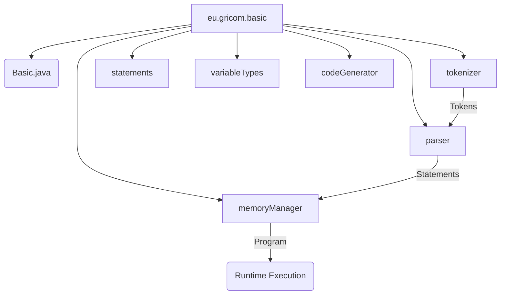
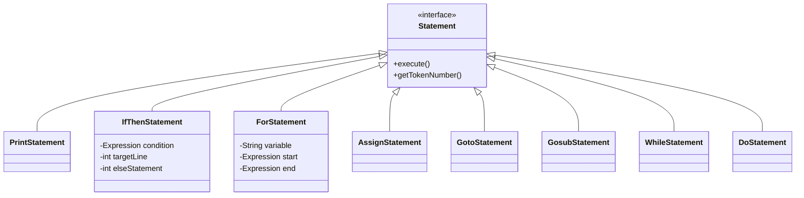
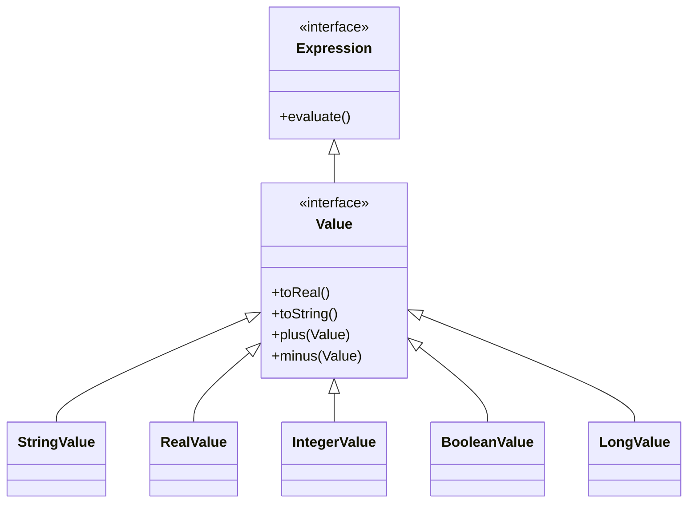
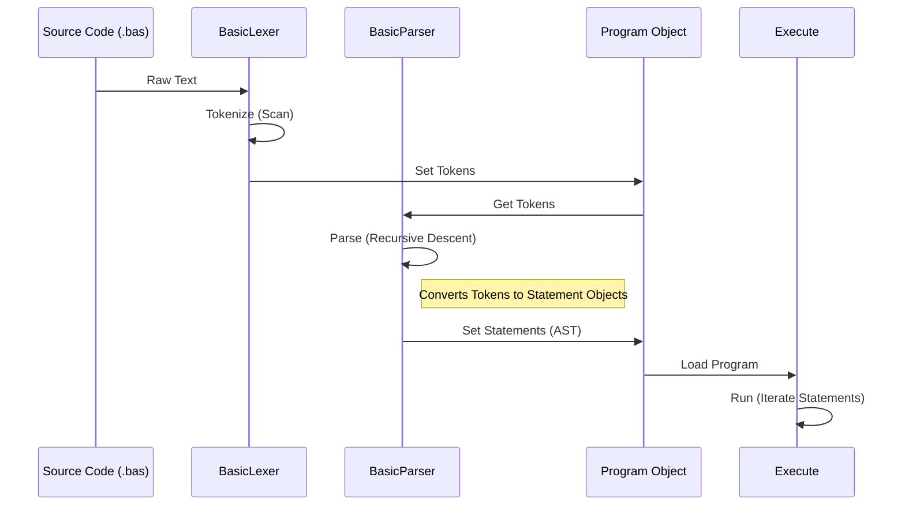

# Project Documentation: GDBI (GriCom Diminutive BASIC Interpreter)

## 1. Project Overview
**GDBI** is a Java-based interpreter for a customized dialect of the BASIC programming language. Originally based on the JASIC project by Bob Nystrom, it has been significantly refactored and expanded to include modern language features while maintaining the classic BASIC feel.

*   **Version**: 0.0.8 (File Handling Release)
*   **License**: Licensed under project-specific terms (see `LICENSE.md`).
*   **Build System**: Apache Maven.

## 2. Functionality
The core functionality includes multiple modes of operation and a rich set of BASIC commands.

### Key Language Features
*   **Typed Variables**: Strong typing enforced via variable suffixes:
    *   `$` : String
    *   `%` : Integer
    *   `#` : Real (Double)
    *   `!` : Boolean
    *   `&` : Long
*   **Control Structures**:
    *   `IF-THEN-ELSE` including block structures.
    *   `FOR-NEXT` loops (with `STEP`).
    *   `DO-UNTIL` and `WHILE-ENDWHILE` loops.
    *   `GOSUB/RETURN` for subroutines.
*   **Advanced Features**:
    *   Arrays (n-dimensional).
    *   User-defined functions (`DEF FN`).
    *   Built-in math and string functions (`SIN`, `COS`, `MID`, `LEFT`, etc.).
    *   File I/O capabilities (`READ`, `DATA`).
    *   Integration with VS Code (custom extension support).

## 3. Architecture

### 3.1. Package Structure
The project is organized into logical packages handling different stages of the interpreter pipeline.

### 3.2. Class Hierarchy

#### Statement Hierarchy
All executable BASIC commands implement the `Statement` interface.

#### Value System
The type system is built around the `Value` interface, which extends `Expression`. This allows values to be used directly in expressions.

### 3.3. Execution Flow
The interpreter follows a standard multi-pass compiler/interpreter architecture.

## 4. Coding Style Verification
The codebase was reviewed against the standards defined in `STYLEGUIDE.md`.

### Compliance
*   **Naming Conventions**:
    *   **Passed**: Classes use `UpperCamelCase`.
    *   **Passed**: Methods use `lowerCamelCase`.
    *   **Passed**: Member variables strictly follow the Hungarian notation with underscore prefixes (e.g., `_oCondition`, `_strLabel`).
*   **File Structure**:
    *   **Passed**: One class per file.
    *   **Passed**: Package names are strictly lowercase.
*   **Indentation**:
    *   **Passed**: The code uses **4 spaces** for indentation, consistent with the updated `STYLEGUIDE.md`.
